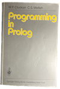
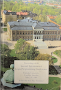
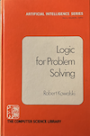

## Prolog

Prolog is a declarative programming language based on formal logic, where
programs describe relations rather than sequences of commands. Computation
is performed by attempting to satisfy logical goals through unification
and systematic search, using mechanisms such as backtracking and resolution.
This makes Prolog particularly well suited for problems involving symbolic
reasoning, pattern matching, and knowledge representation.

Unlike procedural languages, Prolog separates what is true from how it is
computed. The programmer specifies facts and rules, and the language runtime
determines how to derive solutions. This shift in perspective was central
to its appeal in artificial intelligence research, where reasoning, inference,
and problem solving could be expressed in a form close to mathematical logic.

Here you might study an example of a Prolog *interpreter*.

### Prolog .. in the Early 1980s

Prolog emerged in the late 1970s as a logic programming language grounded in
formal logic and automated theorem proving. By the early 1980s, it had transitioned
from a research curiosity to a central focus of international research communities.
One marker of this transition was the Second International Logic Programming Conference
in 1984, held at Uppsala University in Sweden, in which I participated.
At this stage, Prolog was being explored not just as a programming language,
but as a foundation for a new paradigm where computation was expressed in terms of
logical relations and inference. The conference highlighted active research in
unification algorithms, execution models, and the efficient implementation
of logic interpreters and compilers.

Simultaneously, Prolog gained spectacular visibility through the Fifth Generation Computer
Systems (FGCS) project initiated by Japan’s Ministry of International Trade and Industry
(MITI) in 1982. The FGCS program aimed to leapfrog existing computer architectures by
focusing on massively parallel hardware and knowledge-based systems. Prolog was chosen
as the principal language of the project because of its declarative semantics and natural
fit with knowledge representation and automated reasoning. Researchers in Japan proposed
that Prolog, supported by new parallel architectures, could enable expert systems, natural
language understanding, and intelligent applications far beyond the capabilities of conventional
procedural languages. FGCS thus served both as a research incubator for parallel logic
programming and as a strategic statement about the potential of Prolog and logic
programming more broadly.

The Japanese emphasis on Prolog and logic programming provoked responses in the United States
and Europe. In the U.S., research funding agencies and academic groups accelerated work
on logic programming theory, Prolog implementations, and compiler technologies. But to no
surprise a high interest in developing already established AI languages with variations of
LISP, but also harware in Lisp machines. Efforts such as the development of the
[WAM](./../am/wam/) (Warren Abstract Machine) by David H. D. Warren and others led
to much faster Prolog interpreters and compilers, making logic programming more
competitive with conventional languages. The WAM, first circulated in the early 1980s,
provided a practical abstract machine tailored to Prolog’s execution model and became
a cornerstone of efficient Prolog implementations worldwide. Eventually, an AI winter
set in, as it became clear that Prolog was not the answer, and interest in the language waned.

* Clocksin, W. F., & Mellish, C. S. (1981). *Programming in Prolog*. Springer-Verlag.

* Kowalski, R. (1979). *Logic for problem solving*. New York, NY: North-Holland.

* Tärnlund, S.-Å. (Ed.). (1984). *Proceedings of the Second International Logic Programming Conference: Uppsala University, Uppsala, Sweden, July 2–6, 1984*. Ord & Form.  [oai_citation:0‡ci.nii.ac.jp](https://ci.nii.ac.jp/ncid/BA35940414)

  

