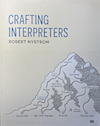

## References: Interpreters

- Abelson, H., & Sussman, G. J. (1985). *Structure and Interpretation of Computer Programs*. Cambridge, MA: MIT Press.
- Abelson, H., Sussman, G. J., & Sussman, J. (1996). *Structure and Interpretation of Computer Programs* (2nd ed.). Cambridge, MA: MIT Press.

- Friedman, D. P., & Felleisen, M. (1974). *The Little LISPer*. Chicago, IL: Science Research Associates.
- Friedman, D. P., & Felleisen, M. (1986). *The Little LISPer* (3rd ed.). New York, NY: Macmillan Publishing Company.

- Queinnec, C. (1996). *Lisp in Small Pieces*. Cambridge, UK: Cambridge University Press.

- Friedman, D. P., Wand, M., & Haynes, C. T. (1992). *Essentials of Programming Languages*. Cambridge, MA: MIT Press.
- Friedman, D. P., Wand, M., & Haynes, C. T. (2001). *Essentials of Programming Languages* (2nd ed.). Cambridge, MA: MIT Press.
- Friedman, D. P., & Wand, M. (2008). *Essentials of Programming Languages* (3rd ed.). Cambridge, MA: MIT Press.

#### Legacy

The first book that I really studied some interpreter concepts from was:
- Allen, J. (1978). *The anatomy of LISP*. McGraw-Hill.

The Anatomy of LISP gives a precise, low-level explanation of how the LISP language is implemented,
focusing on memory structures, list representation, and evaluation mechanics. It connects the abstract
semantics of LISP with concrete machine-level execution, making the language understandable as a real
computational system rather than just a notation. It is now very dated.

#### Structure and Interpretation of Computer Programs

*First Edition (1985)*

The first edition (1985) of *Structure and Interpretation of Computer Programs* by Abelson and Sussman
is one of the foundational texts in programming language interpretation and computer science education.
It is often called the "Wizard Book," a nickname derived from the wizard on its cover and to distinguish
it from other influential texts.

The first edition presents a structured introduction to programming concepts using Scheme,
a dialect of Lisp. It covers:
- Building abstractions with procedures and data
- Metalinguistic abstraction, including building evaluators (interpreters) for Scheme itself
- Streams and lazy evaluation
- Nondeterministic computing and logic programming
- Register machines and compilation (though the focus is more on interpretation)

The material emphasizes elegance, abstraction, and the idea that programs are to be read by humans as
much as executed by machines, with a strong focus on interpreters as a way to understand language semantics.

*Second Edition (1996)*

The second edition includes Julie Sussman as a co-author and updates the text to use a more standard
Scheme dialect. Every chapter was revised to reflect developments in the decade since the first edition.

In addition to the core material, the second edition includes:
- Expanded treatment of state and assignment
- Updated examples and exercises
- Discussions of concurrency and parallelism
- Continued emphasis on metacircular evaluators and variations on interpreters

JavaScript ed?

#### Crafting Interpreters

Robert Nystrom's Crafting Interpreters is a modern introductions to language implementation. It balances theory,
software engineering practice, and readability. Instead of presenting interpreters as abstract mathematical objects,
it treats them as real programs that must be designed, debugged, extended, and maintained. The book walks the
reader step by step through the construction of two complete systems: a simple tree-walk interpreter and a
more efficient bytecode virtual machine, showing how design decisions change as performance requirements grow.

What makes the book especially strong is its pedagogy. Each concept is introduced only when it becomes necessary,
and every feature of the language being built (expressions, variables, control flow, functions, classes) is
motivated by concrete implementation concerns. The code is clean, idiomatic, and heavily explained, which makes
the book approachable even for readers without a compiler background. At the same time, it never feels
superficial: core ideas such as parsing, scoping, memory management, and dispatch are handled with real rigour.

#### Lisp in Small Pieces

Christian Queinnec's *Lisp in Small Pieces* (1996) is a comprehensive exploration of Lisp
and Scheme implementation, focusing heavily on interpreters. It describes eleven interpreters
and two compilers, covering topics like evaluation, macros, continuations, reflection, and
compilation techniques. This book bridges interpretation and compilation, making it a natural
extension for those coming from SICP or EOPL, with a practical emphasis on how Lisp's
homoiconicity enables powerful metaprogramming through interpreters.

#### Essentials of Programming Languages

Daniel P. Friedman and Mitchell Wand's *Essentials of Programming Languages* series
(with Christopher T. Haynes in earlier editions) is best understood as a single book
evolving over editions, all sharing a similar structure and focus on interpreters.
Its main strength is that it guides the reader through the construction of interpreters
for increasingly complex languages, covering concepts like scope, continuations, types,
and objects. In contrast to SICP, which uses interpreters as a vehicle for broader computer
science ideas, EOPL is fundamentally about programming language semantics and design,
using interpreters as the primary tool for exploration.

In terms of approach, EOPL is hands-on and implementation-driven, using Scheme to build
small interpreters that illustrate key PL concepts. The central role of denotational-style
semantics through code, modular interpreter design, and progressive language extensions
mirrors how modern PL research and teaching approach interpretation. Even though the
books predate some contemporary tools, their structural approach remains highly relevant.

Together with SICP, these works complement each other. SICP provides breadth and philosophical
depth on computation, while EOPL offers rigor in PL theory via practical interpreter
construction. If SICP teaches why interpretation reveals the essence of programming,
EOPL shows how to use interpreters to model and understand language features systematically.
For anyone serious about interpreters, reading both gives a much more complete picture
than either alone.

