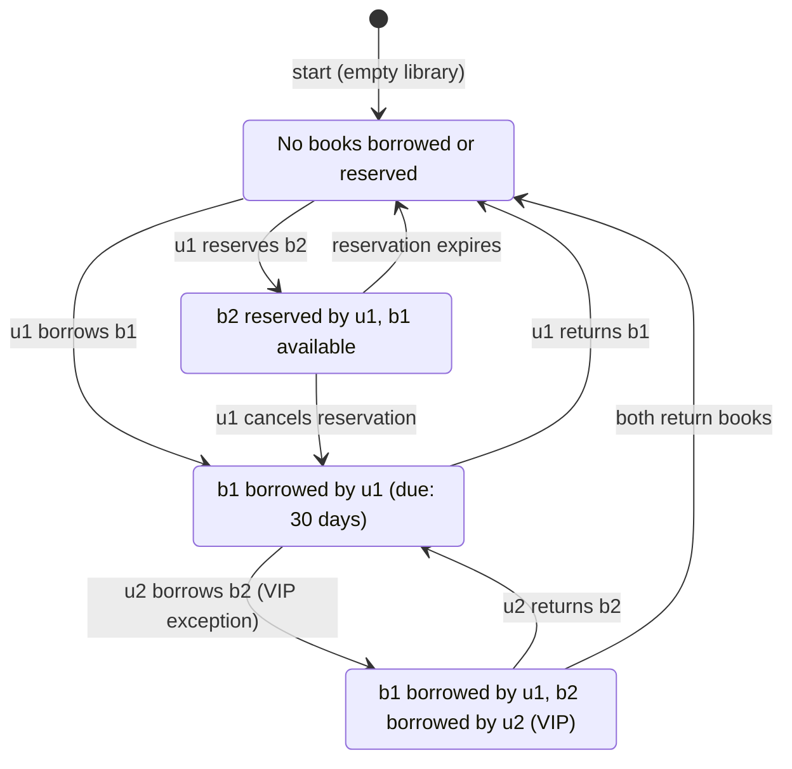

## A Semantic Foundation for Deontic Action Logic in Software Specification

### Abstract

This paper presents a semantics-first formulation of deontic action logic for
software specification and analysis. Rather than beginning with axioms, we
introduce semantic primitives—*possible worlds*, *admissibility*, *obligation*,
*permission*, and *action*—directly in first-order logic. Normative concepts
arise as constraints over structures, naturally supporting reasoning about system
behaviour.


### 1. Motivation

Software systems increasingly encode normative assumptions: what must never occur,
what must occur under conditions, what actions are permitted or forbidden.
Requirements documents express these informally; code enforces them implicitly.
This gap invites misinterpretation.

Deontic logic historically addressed similar problems in ethics and action theory.
However, axiomatic systems often obscure intended semantics and introduce unintended
commitments. We adopt a model-theoretic approach following Kanger and von Wright,
where norms constrain the set of admissible structures.

Our aim is not a complete logical calculus, but a *semantic substrate* understandable
by developers, auditable by stakeholders, and implementable by machines.


### 2. Semantic Primitives

#### 2.1 Worlds

Let $W$ be a non-empty set. Elements $w \in W$ are *worlds*. A world represents a
complete system state or execution history. No internal structure of worlds is assumed.

#### 2.2 Admissibility

Not all worlds are acceptable. Norms distinguish acceptable from unacceptable system
behaviours.

We introduce a unary predicate:
```math
A(w) \quad\text{"w is admissible"}
```

The set of admissible worlds is:
```math
A = \{ w \in W \mid A(w) \}
```

*Normativity enters the model entirely through this predicate.*

A world is admissible if the system acknowledges it as an acceptable outcome.
Admissibility is a normative filter over all logically possible
system behaviours.

#### 2.3 Propositions

Let propositional conditions be represented by unary predicates over worlds:
```math
Borrowed(w), \quad Overdue(w), \quad Reserved(w)
```

Each predicate specifies whether a condition holds in a given world.
Truth is always evaluated relative to a world.

*In practice*: This shifts focus from writing code for single actions to
*reasoning about the set of possible system states*. For example:
```math
\forall w \big( A(w) \rightarrow \neg (Overdue(w) \land Borrowed(w)) \big)
```
says: in every admissible system snapshot, no overdue book is borrowed.


### 3. Obligation, Prohibition, and Permission

With admissibility in place, we define deontic notions semantically.

#### 3.1 Obligation

A proposition $\varphi$ is *obligatory* if it holds in all admissible worlds:
```math
O(\varphi) \;\; \equiv \;\; \forall w \big( A(w) \rightarrow \varphi(w) \big)
```
This is global: obligations define system-wide constraints, not local evaluations.

#### 3.2 Prohibition

A proposition $\varphi$ is *forbidden* if it holds in no admissible world:
```math
F(\varphi) \;\; \equiv \;\; \forall w \big( A(w) \rightarrow \neg \varphi(w) \big)
```
Semantically, prohibition is obligation of negation, but we treat it as a distinct concept.

#### 3.3 Permission

A proposition $\varphi$ is *permitted* if it holds in at least one admissible world:
```math
P(\varphi) \;\; \equiv \;\; \exists w \big( A(w) \land \varphi(w) \big)
```
Permission is existential and weak; it does not imply desirability or obligation.


### 4. Conditional Norms

Most real norms are conditional. We express conditional obligation
by restricting the admissible domain:
```math
O(\varphi \mid \psi)
\;\; \equiv \;\;
\forall w \big( (A(w) \land \psi(w)) \rightarrow \varphi(w) \big)
```
This filters worlds under consideration rather than embedding
implication inside obligation.


### 5. Actions and Transitions

To reason about behaviour, not just static states, we introduce actions.

Let $Act$ be a set of actions. Introduce a ternary predicate:
```math
T(w, a, w') \quad\text{"performing action } a \text{ in world } w \text{ may lead to world } w'\text{"}
```

This gives us a transition system without committing to determinism or totality.

#### 5.1 Action Constraints

An action constraint states that all admissible executions of an
action lead to acceptable outcomes:
```math
O[a]\varphi
\;\; \equiv \;\;
\forall w \forall w'
\big( A(w) \land T(w,a,w') \rightarrow \varphi(w') \big)
```
This is a *safety condition* over transitions.


### 6. Interpretation

At this point, *nothing modal remains*. All deontic notions are reduced
to first-order quantification over explicitly represented worlds. The
expressive power lies not in axioms, but in the *structure of admissibility*.

This framework is intentionally weak proof-theoretically and strong semantically.
It is designed to describe normative assumptions, not derive all consequences automatically.


### 7. Example: A Library System

#### 7.1 Domain Predicates

Assume the following predicates over worlds:
```math
Borrowed(b,w) \quad \text{"book } b \text{ is borrowed in } w\text{"}
```
```math
Overdue(b,w) \quad \text{"book } b \text{ is overdue in } w\text{"}
```
```math
LoanedTo(b,u,w) \quad \text{"book } b \text{ is loaned to user } u \text{ in } w\text{"}
```

#### 7.2 Norms

*Norm 1*: Overdue books must not be loaned
```math
F\big( \exists b \exists u \, (Overdue(b,w) \land LoanedTo(b,u,w)) \big)
```

Expanded:
```math
\forall w \big( A(w) \rightarrow \neg \exists b \exists u \, (Overdue(b,w) \land LoanedTo(b,u,w)) \big)
```

*Norm 2*: Reserved books must not be loaned to others
```math
O\big( \forall b \forall u_1 \forall u_2 \, 
(Reserved(b,u_1,w) \land LoanedTo(b,u_2,w) \rightarrow u_1 = u_2) \big)
```

#### 7.3 Actions

Define actions:
```math
Borrow(b,u), \quad Return(b,u), \quad Reserve(b,u)
```

Each has preconditions and effects:

*Borrow(b, u)*:
- Precondition: $\neg Overdue(b,w) \land \neg Borrowed(b,w) \land (\neg Reserved(b,w) \lor Reserved(b,u,w))$
- Effect: $Borrowed(b,w') \land LoanedTo(b,u,w')$

*Return(b, u)*:
- Precondition: $LoanedTo(b,u,w)$
- Effect: $\neg Borrowed(b,w') \land \neg LoanedTo(b,u,w')$

#### 7.4 Admissible Worlds

A world $w$ is admissible if:
1. No overdue books are loaned
2. Reserved books are only loaned to the reserver
3. All transitions respect action preconditions

This defines $A$ as a subset of $W$.

#### 7.5 The Logic Auditor Role

The *Logic Auditor* is a system component that:

1. *Validates candidate implementations*: Checks if proposed code
   (human or LLM-generated) produces only admissible worlds
2. *Detects violations early*: Identifies countermodels before deployment
3. *Maintains traceability*: Links implementation to formal norms

*Example workflow*:
```
1. Stakeholder: "Overdue books cannot be borrowed"
2. Auditor formalizes: F(∃b∃u: Overdue(b,w) ∧ LoanedTo(b,u,w))
3. LLM generates: def borrow(book, user): ...
4. Auditor checks: Does implementation allow Overdue ∧ Loaned?
5. If yes → reject, show countermodel
6. If no → accept, log verification
```


### 8. Handling Exceptions via Admissibility

Library systems often encode exceptions: different loan durations by
book type, user category, special circumstances. In traditional systems,
these are scattered special-case code. From a semantic viewpoint,
exceptions are simply *constraints on admissibility*.

For instance:
- Standard textbooks: 30-day loan
- Reference books: cannot be loaned
- Rare manuscripts: 3-day loan (standard), 5-day (VIP)

Each rule defines which worlds are acceptable:
```math
LoanDuration(b,u,w) \leq MaxDuration(b,u)
```
where $MaxDuration(b,u)$ depends on book $b$ and user $u$.

The admissibility predicate combines all constraints:
```math
A(w) \;\equiv\; \bigwedge_{\text{rule } i} Rule_i(w)
```

A world violating any rule is automatically excluded from $A$. This enables:

1. *Early semantic validation*: Explore candidate worlds before code generation
2. *Unified reasoning*: Exceptions treated uniformly as constraints
3. *Simplified implementation*: Code becomes a projection of admissible worlds


### 9. State Diagram: Admissible Transitions

All combinations for a small library (2 books, 2 users, VIP exception,
borrowing/reservation rules):



*How to read*:
- Nodes represent admissible worlds (state descriptions)
- Edges represent transitions (actions)
- Only transitions producing admissible worlds are included
- Any action violating rules leads to inadmissible worlds (excluded)

This visualises the state space the Logic Auditor reasons about
*before* implementation. LLM-generated code can be checked against
these admissible transitions.


### 10. Formal Semantic Model

For completeness, enumerate admissible worlds as predicates:

*World $w_0$* — empty library:
```math
\neg Borrowed(b_1,u_1,w_0), \; \neg Borrowed(b_2,u_2,w_0), \; \neg Reserved(b_2,u_1,w_0)
```

*World $w_1$* — standard user borrows textbook:
```math
Borrowed(b_1,u_1,w_1), \; Due(b_1,u_1,30,w_1), \; \neg Borrowed(b_2,u_2,w_1)
```

*World $w_2$* — standard borrows textbook, VIP borrows rare (exception):
```math
Borrowed(b_1,u_1,w_2), \; Borrowed(b_2,u_2,w_2), \; Due(b_2,u_2,5,w_2)
```

Each world corresponds to a fully defined admissible state. LLMs propose
candidate transitions; the auditor checks $A(w)$ to ensure resulting worlds
are admissible. Countermodels are easy to see: any candidate world outside
this set violates admissibility.


### 11. Conclusion

This framework provides:
- *Explicit normative commitments* via admissibility predicates
- *Early violation detection* via semantic checking
- *Traceability* from requirements to implementation
- *LLM integration* for code generation with formal verification

It is model theory applied to normative language, designed for
systems engineering rather than philosophical completeness.


### References

- Von Wright, G. H. (1951). Deontic logic. *Mind*, 60(237), 1–15.
- Von Wright, G. H. (1963). *Norm and action: A logical enquiry*. London: Routledge & Kegan Paul.
- Kanger, S. (1957). New foundations for ethical theory.
  In R. Hilpinen (Ed.), *Deontic logic: Introductory and systematic readings* (pp. 36–58). Dordrecht: Reidel.
- Hilpinen, R. (Ed.). (1971). *Deontic logic: Introductory and systematic readings*. Dordrecht: Reidel.
