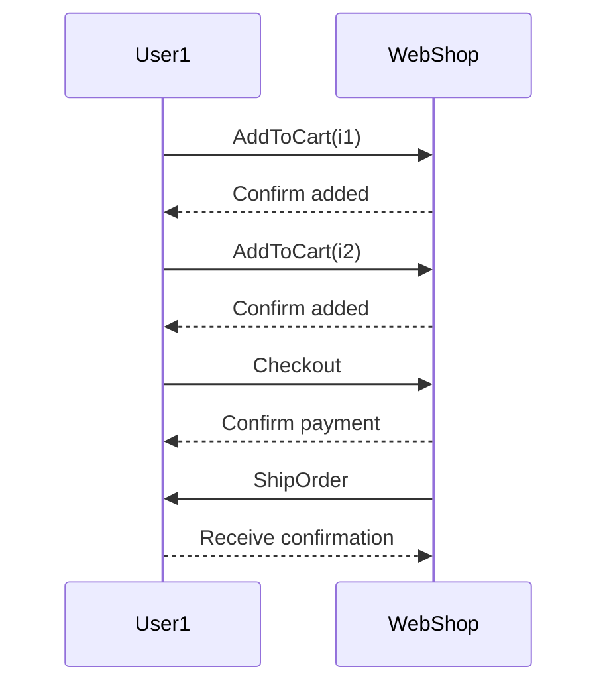
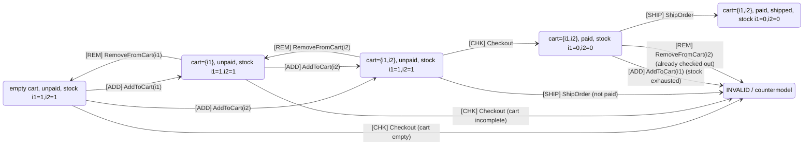

## Worked Examples: E-Commerce Cart System

Another example, besides the below, is given in a
[library system example](./../../assets/pdf/library_system_example.pdf).
Also an [SVG renderer](./../../sec6.1.2/crafting/modern/03/).


### Overview

These examples demonstrate how to model a simple e-commerce
cart system using deontic action logic semantics. We show:
1. How to define worlds as system states
2. How to model actions with preconditions and effects
3. How to identify admissible vs inadmissible worlds
4. How to detect violations (countermodels)


### Primitives

*Worlds* $w \in W$ represent the state of the system at a point in time.

*Predicates over worlds*:
- $Cart(u,i,w)$: item $i$ is in user $u$'s cart in world $w$
- $Paid(u,w)$: user $u$ has completed payment in world $w$
- $Stock(i,w)$: available quantity of item $i$ in world $w$
- $Shipped(u,w)$: user $u$'s order has been shipped in world $w$

*Actions* ($Act$): operations that change worlds.


### Example Actions

Each action $a \in Act$ has:
1. *Preconditions* $Pre(a, w)$ -- must be true for action to execute
2. *Effects* $Eff(a, w) \rightarrow w'$ -- new world after action

#### 1. AddToCart(i, u)

*Preconditions*:
```math
Pre(AddToCart(i,u), w) : Stock(i, w) > 0 \wedge \neg Cart(u,i,w)
```

*Effects*:
```math
Eff(AddToCart(i,u), w) : Cart(u,i,w') = Cart(u,i,w) \cup \{i\}, \; Stock(i,w') = Stock(i,w)
```

#### 2. RemoveFromCart(i, u)

*Preconditions*:
```math
Pre(RemoveFromCart(i,u), w) : Cart(u,i,w) = \{i\}
```

*Effects*:
```math
Eff(RemoveFromCart(i,u), w) : Cart(u,i,w') = Cart(u,i,w) \setminus \{i\}, \; Stock(i,w') = Stock(i,w)
```

#### 3. Checkout(u)

*Preconditions*:
```math
Pre(Checkout(u), w) : Cart(u, \_, w) \neq \emptyset
```

*Effects*:
```math
Eff(Checkout(u), w) : Paid(u,w') = true, \; \forall i \in Cart(u,w), Stock(i,w') = Stock(i,w)-1
```

#### 4. ShipOrder(u)

*Preconditions*:
```math
Pre(ShipOrder(u), w) : Paid(u,w) = true \wedge \forall i \in Cart(u,w), Stock(i,w) \ge 0
```

*Effects*:
```math
Eff(ShipOrder(u), w) : Shipped(u,w') = true
```


### Example 1: Valid Execution Path

*Admissible worlds* for one user $u1$ and two items $i1$, $i2$:

| World | Cart | Paid | Stock | Shipped | Notes |
|-------|------|------|-------|---------|-------|
| $w_0$ | ∅ | false | i1=1, i2=1 | false | initial state |
| $w_1$ | {i1} | false | i1=1, i2=1 | false | added i1 |
| $w_2$ | {i1, i2} | false | i1=1, i2=1 | false | added i2 |
| $w_3$ | {i1, i2} | true | i1=0, i2=0 | false | checkout completed |
| $w_4$ | {i1, i2} | true | i1=0, i2=0 | true | order shipped |

*Actions as transitions*:
- $w_0 \xrightarrow{AddToCart(i1,u1)} w_1$
- $w_1 \xrightarrow{AddToCart(i2,u1)} w_2$
- $w_2 \xrightarrow{Checkout(u1)} w_3$
- $w_3 \xrightarrow{ShipOrder(u1)} w_4$

*Sequence diagram*:



### Example 2: Countermodels (Invalid Transitions)

*Countermodel* $wX$ is reached when $Pre(a, w) = false$.

Formally:
```math
\text{if } \neg Pre(a,w) \Rightarrow Eff(a,w) = wX
```

*State diagram with invalid transitions*:



*Invalid transition examples*:

1. *Checkout with empty cart*:
   - Attempted: $w_0 \xrightarrow{Checkout(u1)} wX$
   - Violation: $Cart(u1, w_0) = \emptyset$ but $Pre(Checkout, w_0)$ requires non-empty cart

2. *Ship without payment*:
   - Attempted: $w_2 \xrightarrow{ShipOrder(u1)} wX$
   - Violation: $\neg Paid(u1, w_2)$ but $Pre(ShipOrder, w_2)$ requires payment

3. *Add to cart when stock exhausted*:
   - Attempted: $w_3 \xrightarrow{AddToCart(i1,u1)} wX$
   - Violation: $Stock(i1, w_3) = 0$ but $Pre(AddToCart, w_3)$ requires $Stock > 0$


### Admissibility Properties

A world $w \in W$ is *admissible* if:

1. *Reachable*: $\exists$ action sequence from initial world to $w$ where all preconditions hold
2. *Consistent*: All invariants hold in $w$
3. *Non-terminal* or *Goal-satisfying*: Either allows further valid actions or satisfies system goals

*Invariants* (must hold in all admissible worlds):
```math
\forall w \in A: Stock(i, w) \ge 0
\forall w \in A: Shipped(u, w) \Rightarrow Paid(u, w)
\forall w \in A: Paid(u, w) \Rightarrow Cart(u, w) \neq \emptyset
```


### Why This Matters for Programmers

Actions explicitly encode domain rules, making it easy to:

1. *Simulate scenarios*: Generate test cases from admissible world sequences
2. *Detect counterexamples*: Identify invalid transitions before deployment
3. *LLM-assisted development*: 
   - LLMs propose candidate implementations
   - Semantic checker validates against admissible worlds
   - Violations caught early

*Example LLM check*:
```python
# LLM proposes:
def checkout(user):
    process_payment(user)
    update_stock(user.cart)
    
# Auditor checks:
# - Does it verify Cart != empty? NO → countermodel w0->wX
# - Does it handle stock exhaustion? NO → countermodel w3->wX
# Reject implementation, request fixes
```

This mirrors real-world systems: checkout, reservations,
inventory management--anywhere preconditions and effects are critical.


### Formalizing Action Logic

Using the action concept from the theoretical framework:

*Act* = {AddToCart(i,u), RemoveFromCart(i,u), Checkout(u), ShipOrder(u)}

Each action has:
- Precondition function: $Pre: Act \times W \rightarrow Bool$
- Effect function: $Eff: Act \times W \rightarrow W'$

*Transition validity*:
```math
w' = Eff(a, w) \quad \text{if and only if} \quad Pre(a,w) = true
```

*Deontic constraint* (obligation over actions):
```math
O[Checkout]\neg StockExhausted
```
means: in all admissible worlds, all Checkout transitions must lead to worlds where stock is not exhausted.

Formally:
```math
\forall w \in A, \forall w' : T(w, Checkout, w') \Rightarrow \neg StockExhausted(w')
```

This is a *safety property* over the transition system.
