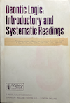

## Semantic Foundation: Deontic Action Logic as Model Theory

### I. Core Ontology

#### Worlds and Admissibility

Let $W$ be a non-empty set of possible worlds. Worlds may represent static states or complete execution trajectories.

A designated subset $A \subseteq W$ contains the *admissible* (norm-compliant) worlds.

*Key principle*: Normativity is world selection. Nothing normative exists outside this partition.

#### Deontic Operators (Syntax)

Primitive operators over propositions $\varphi$, $\psi$:
```
O φ – φ is obligatory
F φ – φ is forbidden
P φ – φ is permitted
R φ – φ is required (constitutive invariant)
```

Conditional forms:
```
O(φ | ψ) – φ is obligatory given ψ
F(φ | ψ) – φ is forbidden given ψ
```

#### Semantics

A *deontic model* is a structure:
```math
\mathcal{M} = \langle W, A, V \rangle
```
where $V : \mathsf{Prop} \rightarrow \mathcal{P}(W)$ is a valuation
function assigning each atomic proposition the set of worlds where it holds.

*Obligation*:
```math
\mathcal{M}, w \models O\varphi \iff \forall w' \in A:\ \mathcal{M}, w' \models \varphi
```
Obligation is global, not relative to $w$. Norms apply system-wide.

*Prohibition*:
```math
\mathcal{M}, w \models F\varphi \iff \forall w' \in A:\ \mathcal{M}, w' \not\models \varphi
```
Equivalently: $F\varphi \equiv O\neg\varphi$ (semantic equivalence, not axiomatic).

*Permission*:
```math
\mathcal{M}, w \models P\varphi \iff \exists w' \in A:\ \mathcal{M}, w' \models \varphi
```
Permission is existential over admissible worlds.

*Requirement* (strong invariant):
```math
\mathcal{M}, w \models R\varphi \iff (\forall w' \in A:\ \mathcal{M}, w' \models \varphi) \land (A \subset A')
```
where $A'$ is admissibility if we remove constraint $\varphi$. Requirements are constitutive, not accidental.

*Conditional Obligation*:
```math
\mathcal{M}, w \models O(\varphi \mid \psi)
\iff
\forall w' \in A:\
(\mathcal{M}, w' \models \psi \Rightarrow \mathcal{M}, w' \models \varphi)
```
This is domain restriction, not object-language implication. Essential for avoiding contrary-to-duty paradoxes.


### II. Actions and Transitions

Extend the frame to model action:
```math
\mathcal{F} = \langle W, A, Act, T \rangle
```
where:
- $Act$ is a set of actions
- $T \subseteq W \times Act \times W$ is a transition relation

Action necessity $[\alpha]\varphi$ is satisfied iff:
```math
\mathcal{M}, w \models [\alpha]\varphi
\iff
\forall w' \ (w, \alpha, w') \in T \Rightarrow \mathcal{M}, w' \models \varphi
```

Deontic action constraints:
```math
O[\alpha]\varphi \quad\text{means:}\quad \forall w \in A, \forall w' \big((w, \alpha, w') \in T \Rightarrow \mathcal{M}, w' \models \varphi\big)
```
This is a safety constraint over transitions--all admissible $\alpha$-transitions lead to $\varphi$-worlds.


### III. Priority and Non-Monotonicity

*Core departure from classical deontic logic*: We reject monotonicity.

Let $\succ$ be a strict partial order over norms.

When norms conflict, admissibility is constructed via:
```math
A = \{w \in W \mid w \text{ satisfies all norms in } Max(\succ, w)\}
```
where $Max(\succ, w)$ are the maximal (highest-priority unviolated) norms applicable at $w$.

Lower-priority norms may be dropped if inconsistent with higher-priority ones.
This is semantic conflict resolution, not syntactic.


### IV. Deliberate Exclusions

*No closure under logical consequence*:
- Even if $\varphi \rightarrow \psi$ is valid, $O\varphi$ does NOT entail $O\psi$
- We describe what's obligatory, not what follows from it

*No baked-in axioms* like:
- $O\varphi \rightarrow P\varphi$ (obligation implies permission)
- $O\varphi \rightarrow \neg O\neg\varphi$ (deontic consistency)
- $O(\varphi \land \psi) \rightarrow O\varphi$ (distributivity)

These may be semantically valid in specific models, but are not axioms.
We want a *descriptive* tool that adapts to domains.


### V. Reduction to First-Order Logic

The semantic framework above is already near-first-order. We can make this explicit.

#### First-Order Signature

Define $\mathcal{L}_{FO}$ with:
- Domain: worlds
- Unary predicates:
- $A(w)$: $w$ " is admissible"
- $P_p(w)$: "proposition $p$ holds in world $w$"
- Ternary predicate: $T(w, a, w')$ for transitions

#### Translation of Deontic Operators

*Obligation*:
```math
(O\varphi)^* \equiv \forall w' \, (A(w') \rightarrow \varphi^*(w'))
```

*Prohibition*:
```math
(F\varphi)^* \equiv \forall w' \, (A(w') \rightarrow \neg \varphi^*(w'))
```

*Permission*:
```math
(P\varphi)^* \equiv \exists w' \, (A(w') \land \varphi^*(w'))
```

*Conditional Obligation*:
```math
(O(\varphi \mid \psi))^*
\equiv
\forall w' \, \big( (A(w') \land \psi^*(w')) \rightarrow \varphi^*(w') \big)
```

*Action necessity*:
```math
([\alpha]\varphi)^*(w)
\equiv
\forall w' \ (T(w, \alpha, w') \rightarrow \varphi^*(w'))
```

*Deontic action constraints*:
```math
O[\alpha]\varphi \quad\leadsto\quad \forall w \forall w' \,
\big( A(w) \land T(w, \alpha, w') \rightarrow \varphi^*(w') \big)
```

#### Consequence

At this point:
- Worlds are first-order elements
- Norms are predicates
- Obligation is universal quantification over admissible worlds
- Permission is existential quantification over admissible worlds
- Actions are relations
- Deontic reasoning is constraint satisfaction

*There is no modal residue in the semantics.*

Modal logic was historically needed to:
- Provide syntax aligned with philosophical intuition
- Package quantification patterns compactly
- Avoid explicit world-reference in object language

But semantically, it was always first-order underneath.


### VI. Connection to Computer Science

Once deontic semantics collapses into FOL:
- Model checking becomes quantifier evaluation
- Alloy becomes bounded first-order satisfiability
- Temporal logic becomes first-order logic over traces
- "Norms" become invariants
- "Ought" becomes "for all admissible states"

Replace:
- worlds with states or executions
- admissible worlds with constraint-satisfying states
- satisfaction with model checking

and you have the semantics of Alloy, TLA+, and safety properties.

*The line from Kanger to Alloy is not metaphorical.
It is model theory waiting for machines.*


### VII. Validity and Satisfiability

A formula $\varphi$ is:
- *Satisfiable* iff there exists a model $\mathcal{M}$ and world $w$ such that $\mathcal{M}, w \models \varphi$
- *Valid* iff for all models $\mathcal{M}$ and worlds $w$, $\mathcal{M}, w \models \varphi$

Note: Many classical deontic "axioms" are *not* valid under this semantics.
This is intentional and helps us avoid paradoxes.


### VIII. Relation to Kanger and von Wright

*Alignment*:
- Possible-worlds semantics
- Norms as world restrictions
- Actions and conditions as filters
- No commitment to derivational completeness

*Departure*:
- Explicit priority handling
- Explicit invariant notion ($R$)
- Engineering-oriented admissibility
- Rejection of monotonicity

This is closer to applied action logic than ethical theory--a
semantic discipline for normatively constrained systems.


### IX. Why This Framework

This calculus is sufficient to:
- Capture client intent
- Expose contradictions
- Define forbidden futures
- Ground automated generation
- Support audit and responsibility

It is *not* sufficient for:
- Moral reasoning
- Legal interpretation
- Rich epistemic norms
- Agent beliefs

And that is a *feature*, not a flaw.


### X. Tools

*Alloy*: Relational model finder from MIT. Our norms become Alloy predicates;
admissible worlds are Alloy instances.

*TLA+*: Leslie Lamport's temporal logic specification language.
Our norms constrain which TLA+ behaviours are acceptable.

Both support formal specification and automated checking to
identify design flaws through mathematical rigor.




### References

- Von Wright, G. H. (1951). Deontic logic. *Mind*, 60(237), 1–15.
- Von Wright, G. H. (1963). *Norm and action: A logical enquiry*. London: Routledge & Kegan Paul.
- Kanger, S. (1957). New foundations for ethical theory. In R. Hilpinen (Ed.), *Deontic logic: Introductory and systematic readings* (pp. 36–58). Dordrecht: Reidel.
- Kanger, S. (1971). Formal analysis of normative concepts. *Theoria*, 37, 85–95.
- Hilpinen, R. (Ed.). (1971). *Deontic logic: Introductory and systematic readings*. Dordrecht: Reidel.
- Åqvist, L. (1984). Deontic logic. In D. Gabbay & F. Guenthner (Eds.), *Handbook of philosophical logic* (Vol. 2, pp. 605–714). Dordrecht: Reidel.
- McNamara, P. (2018). Deontic logic. In E. N. Zalta (Ed.), *The Stanford Encyclopedia of Philosophy*.
