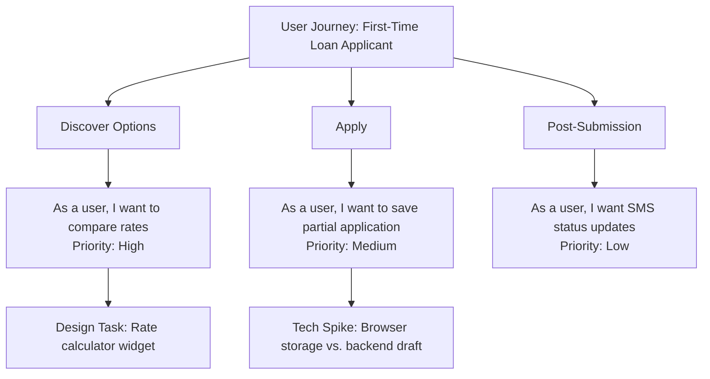

## Methodogical Evolution

Even if we do not intend here to go deep into the vast history of methodology, some
remarks might help to illuminate the context of, for example, "crafting".

*Software methodology is the disciplined heartbeat beneath the digital revolution--a
choreography of human intellect and machine logic.* It emerges from the tension between
structured process and creative problem-solving, between repeatable practices and adaptive
innovation. At its core, *methodology is the art of making invisible cognitive labor
visible, repeatable, and improvable*--transforming ephemeral insights into enduring
workflows that survive individual genius.

The history of computing methodology reads like a pendulum swinging between chaos and control.
The 1940s ENIAC programmers, all female "computers," established ad-hoc techniques for wiring
boards--methodology as physical craft. The 1960s "software crisis" birthed the Waterfall model,
Winston Royce's 1970 paper codifying linear phases that soon hardened into dogma. The 1980s
saw Barry Boehm's Spiral Model reintroduce iteration, while Total Quality Management borrowed
Deming's statistical rigor for software. The 1990s RAD (Rapid Application Development) and 2000s
Agile Manifesto revolted against documentation-heavy processes, valuing "individuals and interactions
over processes and tools." Today's landscape blends DevOps pipelines, AI pair programmers, and
quantum computing paradigms--each methodology layer sedimented atop prior revolutions like geological
strata.


### Tenets of Modern Methodcraft

| Methodology | Focus | Scope | Artifacts | Tools |
|-------------|-------|-------|-----------|-------|
| *Waterfall* | Predictive Planning | Large Projects | Gantt Charts | MS Project |
| *Agile* | Adaptive Delivery | Team-Level | Sprint Backlogs | Jira |
| *DevOps* | Deployment Continuity | Organization | CI/CD Pipelines | Jenkins |
| *TDD* | Code Correctness | Module | Unit Tests | JUnit |
| *Pair Programming* | Knowledge Sharing | Individual | Shared Codebases | VS Live Share |
| *Design Thinking* | User Empathy | Product | Personas | Miro Boards |
| *CRISP-DM* | Data Workflows | Analytics | Model Cards | MLflow |
| *ITIL* | Service Management | Enterprise | SLAs | ServiceNow |
| *Six Sigma* | Defect Reduction | Processes | Control Charts | Minitab |
| *Shape Up* | Cycle Management | Product | Pitch Documents | Basecamp |
| *GitFlow* | Version Control | Codebase | Branch Diagrams | Git |

This taxonomy represents the *ritual instruments* of software creation--each row a battle-tested
protocol forged in the fires of project failures. *Waterfall*, born from 1950s aerospace megaprojects,
codifies the hubris (ὕβρις) that complex systems can be fully specified upfront--a cautionary tale
now taught in universities. *Agile* carries the DNA of 2001's Snowbird retreat, where 17 rebels
distilled XP, Scrum, and Crystal into twelve principles that became Silicon Valley's catechism.
*DevOps* inherits the trauma of 2010's "Flickr deploys 10+ times a day" awakening, operationalising
Gene Kim's Three Ways: flow, feedback, experimentation.

*TDD* (Test-Driven Development) actualises Dijkstra's 1972 provocation that "testing shows presence,
not absence of bugs" into red-green-refactor cycles--a feedback ritual making Kent Beck's 2002
intuition systemic. *Pair Programming* revives Christopher Alexander's 1977 "quality without a name"
through driver-navigator dyads--social methodology combating Fred Brooks' "mythical man-month" isolation.
*GitFlow* encodes Linus Torvalds' 2005 distributed version control philosophy into branch naming
conventions, transforming commit histories from chaos to narrative.


### Methodological Alchemy


__Scrum__

A typical two-week Scrum sprint in Jira:

```markdown
Sprint 15: Payment Gateway Integration (2024-03-01 to 2024-03-14)

Epic: PCI-DSS Compliance
- Story [PPL-102] Tokenize credit card data (8 points)
  - Subtask: Implement Vault API client
  - Subtask: Write encryption tests
- Story [PPL-103] Audit logging (5 points)
  - Subtask: Design log schema
  - Subtask: Integrate with Splunk

Daily Standup Template:
1. Yesterday: <What I delivered>
2. Today: <What I'm coding>
3. Blockers: <Impediments>
```

This structure operationalises the Agile Manifesto's "working software over comprehensive
documentation" into executable lists--a digital-age translation of 1986's Scrum rugby metaphor.
The points system distills Mary Poppendieck's lean principles into story sising poker.
The daily standup ritual, while often parodied, enacts Weinberg's 1971 "egoless programming"
by surfacing blockers early.


__DevOps__

A GitLab CI/CD configuration embodies deployment methodology in YAML:

```yaml
stages:
  - test
  - build
  - deploy

unit_tests:
  stage: test
  image: python:3.9
  script:
    - pip install -r requirements.txt
    - pytest --cov=app

docker_build:
  stage: build
  rules:
    - if: $CI_COMMIT_BRANCH == "main"
  script:
    - docker build -t myapp:$CI_COMMIT_SHA .

prod_deploy:
  stage: deploy
  environment: production
  only:
    - main
  script:
    - kubectl rollout restart deployment/myapp
```

This YAML file codifies the "paved path" methodology--automating what Google's Site
Reliability Engineers call "toil." The three-stage flow mirrors 1950s Deming cycles
(Plan-Do-Check-Act), compressed from months to minutes. The `rules` clauses enact
Jez Humble's "continuous delivery" principle of keeping mainline deployable--a
methodology born from 2000s Flickr and Etsy postmortems.


__Design Thinking__

A user story mapping session in Miro:



This virtual whiteboard applies Herb Simon's 1969 "sciences of the artificial" to
software--methodology as externalised cognition. The prioritisation mirrors MoSCoW
(Must/Should/Could/Won't) from 1994 DSDM. The "tech spike" terminology carries over
from 2000s Extreme Programming, a reminder that methodology hybridises across eras.


### The Unseen Currents

Beneath these visible artifacts flow methodological undercurrents:

1. *Ceremony vs. Pragmatism*: The RUP (Rational Unified Process) collapse taught that
   over-ritualized methods fossilize. Modern "lightweight SAFe" adapts scaled agile
   while resisting 1980s ISO-9000 bureaucracy.

2. *Ethics by Methodology*: GDPR-compliant design processes bake privacy impact
   assessments into sprint planning--operationalising Latanya Sweeney's 2000s
   "data tagging" into CI/CD gates.

3. *AI's Methodological Disruption*: GitHub Copilot challenges pair programming
   norms--when AI becomes the navigator, does Kent Beck's "test-first" still hold?

4. *Sustainability Metrics*: Green software methodologies now track CO2 per API
   call--a carbon accounting layer atop 2010s DevOps dashboards.

Methodology, like architecture, faces the innovator's dilemma: When does a practice
transition from cutting-edge to legacy? We have to notice here: architecture defines
the form, while methodology defines the process. The 2020s "No-Code" movement threatens
to commoditise what 1990s CASE tools failed to automate. Yet as Margaret Hamilton's
1960s Apollo error prevention methods resurface in SpaceX's CI/CD pipelines, we're
reminded that methodology is less about newness than about *rediscovery through recurrence*.

The wise methodologist understands that today's SCRUM board echoes 1940s Kanban
shop-floor signals. That GitFlow branches mirror 1970s SCCS version trees. That
Agile retrospectives reincarnate 1950s quality circles. In this endless recurrence
lies methodology's true nature: not the tools du jour, but the human need to
ritualise progress amidst chaos--to impose narrative on the entropy of innovation.

So maybe the evolution turns out to be a circular revolution?
