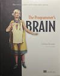
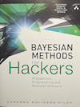
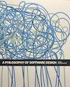
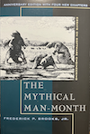
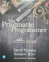
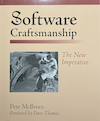

* Hermans, F. (2021). *The programmer's brain: What every programmer needs to know about cognition*. Manning Publications.
* Davidson-Pilon, C. (2015). *Bayesian methods for hackers: Probabilistic programming and Bayesian inference*. Addison-Wesley Professional.
* Ousterhout, J. (2021). *A philosophy of software design* (2nd ed.). Yaknyam Press.
* McBreen, P. (2002). *Software craftsmanship: The new imperative*. Addison-Wesley.
* Brooks, F. P., Jr. (1995). *The mythical man-month: Essays on software engineering* (Anniversary ed.). Addison-Wesley.
* Thomas, D., & Hunt, A. (2019). *The pragmatic programmer: Your journey to mastery* (20th anniversary ed.). Addison-Wesley Professional.

