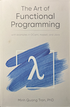

## Functional Design Patterns

> *Recurring solutions to recurring problems--applied to state, effects,
composition, and concurrency.*

Design patterns are named, reusable solutions to problems that appear again
and again in software. The original GoF patterns addressed object-oriented
design: how to organise classes, delegate responsibility, and manage change
without breaking existing code.

This series describes a different catalogue. The problems it addresses are
older and more fundamental: how to handle *state*, *effects*, *composition*,
and *concurrency* in a way that keeps programs correct, testable, and
understandable as they grow.

The solutions come from functional programming--a style of programming
that treats functions as first-class values and avoids mutation as a
default. They originated in mathematics (lambda calculus, category theory)
and were developed into practical tools by languages like ML, Haskell,
Erlang, and Clojure. They are now standard vocabulary in Python, Rust,
Swift, Kotlin, Scala, and modern C++.

This series treats them as patterns: named, motivated, illustrated with
runnable code, and honestly costed.

### What Is a Functional Pattern?

A functional pattern is a recurring structural solution to a recurring
problem in programs that emphasise:

- *Immutability* -- data is not changed after construction.
- *Pure functions* -- output depends only on input; no hidden reads or writes.
- *Explicit effects* -- side effects (I/O, state, errors) are made
  visible in types or structure, not hidden in global state.
- *Composition* -- large programs are built from small, independently
  testable pieces that combine without interfering.

These are not rules that must always be followed. They are tools that solve
specific problems. The patterns in this series show what those problems are
and when the tools fit.

### Where These Patterns Belong

#### Concurrent and parallel programs

Shared mutable state is the root cause of data races. A race requires three
conditions: shared memory, at least one write, and concurrent access. Pure
functions and immutable data eliminate the "at least one write" condition
and remove the race by construction -- not by careful locking. This
connection runs through every section of the series.

#### Data transformation pipelines

Map, filter, fold, and compose are the natural vocabulary for pipelines that
take data in one shape and produce it in another. Each transformation is a
pure function; the pipeline is a composition of those functions. Steps can
be tested independently, reordered, parallelised, and profiled in isolation.

#### Error handling and control flow

Monadic patterns (Result, Maybe, async/await) make failure explicit without
scattering early-return checks through every call site. The type system or
the binding structure carries the "did something go wrong?" context from one
step to the next.

#### Configuration and versioning

Persistent data structures give you cheap "undo" and multi-version access.
Every "update" produces a new version that shares the unchanged parts with
the old one. The old version is never invalidated. This is the basis of
transactional databases, undo stacks, and lock-free reader sharing.

#### Anywhere reasoning matters

Pure functions support *equational reasoning*: you can substitute a function
call with its result anywhere in your program, and the meaning does not
change. This is what makes them safe to memoize, to hoist out of loops,
and to call from multiple threads. It also makes tests trivial: given the
same input, the output is always the same.

### Where These Patterns Do Not Belong

Functional patterns are tools, not laws. There are situations where they
are the wrong tool.

#### Performance-critical device code

A systems routine that reads sensor registers, performs memory-mapped I/O,
or drives hardware interrupts is inherently stateful and side-effectful.
Imposing a functional wrapper around it adds overhead without adding safety.
Write those routines imperatively, contain them behind a clean interface,
and apply functional patterns above the interface.

#### When mutation is the model

An in-place sort is faster than building a new sorted list. A mutable
ring buffer is more cache-friendly than a linked list of persistent nodes.
If you have measured that mutation is the bottleneck, use mutation in
that component. The functional patterns remain useful in the surrounding
code, which is usually where correctness matters most.

#### When the team is unfamiliar with the vocabulary

A monad, a functor, and a referentially transparent function are not
difficult ideas, but they are unfamiliar ones if your team's background is
purely imperative. Introducing three new abstract patterns at once into a
production codebase creates more confusion than it solves. Adopt the
patterns one at a time, starting with the ones that deliver the most obvious
benefit: pure functions and explicit error handling.

#### When you need the simplest possible solution

A single flag variable and an if-statement may be clearer than a State
monad for a straightforward two-state system. The patterns in this series
manage complexity. If the complexity is not there, neither is the benefit.

### The Two-Language Strategy

Each section in this series is presented in two languages.

*Python* is the exposition language. It is readable without prior knowledge
of a functional language, runs immediately, and has built-in support for
most of the patterns (generators, closures, higher-order functions,
decorators, `functools`). The Python code shows what the pattern does and
why it is useful.

*C* is the implementation language. It shows what the pattern costs: how
it translates to memory layout, function pointers, allocation, and atomic
operations. C cannot hide the machine. What you see in C is what the
hardware executes. The C code answers the question every systems programmer
will ask: "but what does this actually do?"

The series is not prescriptive about language. These patterns appear in
every language that supports first-class functions. Python and C are chosen
to span the widest possible range: from the most abstract (Python) to the
most concrete (C).

### The Twelve Sections

| # | Pattern | Core idea |
|---|---------|-----------|
| 1 | [First-Class Functions](./firstclass/README.md) | Functions as values; pass behaviour, not data |
| 2 | [Closures](./closure/README.md) | Functions that capture their environment |
| 3 | [Immutability](./immutability/README.md) | Data that never changes after construction |
| 4 | [Higher-Order Functions](./higher/README.md) | Functions that accept or return functions |
| 5 | [Function Composition](./composition/README.md) | Chaining small functions into larger ones |
| 6 | [Lazy Evaluation](./lazy/README.md) | Deferred computation; infinite sequences |
| 7 | [Functors](./functors/README.md) | Mapping over values inside a context |
| 8 | [Monads](./monads/README.md) | Composing computations with explicit effects |
| 9 | [Referential Transparency](./transparency/README.md) | Same input, same output -- always |
| 10 | [Persistent Data Structures](./persistent/README.md) | Structural sharing instead of mutation |
| 11 | [Cost Model](./cost/README.md) | What abstraction actually costs |
| 12 | [Functional Style as Concurrency Discipline](./integrative/README.md) | How every pattern contributes to concurrent safety |

The sections build on each other. First-class functions are a prerequisite
for closures; closures are a prerequisite for higher-order functions; all of
them appear in the later sections on monads and persistence. Reading in order
is recommended.

### The Thread That Runs Through All Twelve

Every section ends with a concurrency observation. This is not accidental.

The original motivation for most functional patterns was not elegance or
mathematical purity--it was the need to reason about programs that do many
things at once. A pure function is safe to call from any thread. An
immutable value is safe to share between threads. A persistent data
structure needs no lock for readers. A referentially transparent computation
can be distributed across machines.

The functional patterns are, at bottom, a discipline for managing *who
reads what* and *who writes what*. When the discipline is applied
consistently, the answers are: any function reads only its arguments, and
nothing writes after construction. Under those conditions, concurrent
execution is safe by construction.

