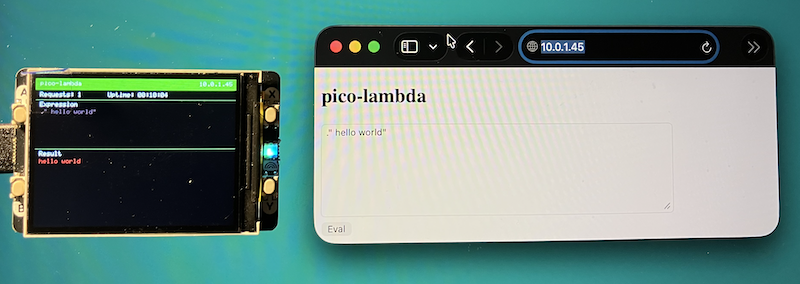

## pico-lambda

A stateless Forth HTTP dispatcher for the Raspberry Pi Pico 2W.
POST a Forth expression to `/eval`, get the output back as plain text.
If the IP is e.g. 10.0.1.45:

```shell
curl -X POST http://10.0.1.45/eval -d "2 3 + ."
5
```


### Lambda on Bare Metal

AWS Lambda is Amazon's serverless compute service. You upload a function,
a piece of code, and AWS runs it on demand whenever a request comes in.
You pay only for the time the function is actually running, and you never
manage a server yourself.

The key property that makes it work is *statelessness*. AWS guarantees that
every invocation gets a *fresh execution environment*: a new container, a
clean memory space, no leftover state from previous calls. Two back-to-back
requests may land in entirely different containers on entirely different
physical machines. A variable you set in one invocation is gone before the
next one starts. This is not a side effect--it is the contract. Functions
that respect it scale horizontally to thousands of parallel invocations
without any locking, coordination, or shared-memory hazards.

In practice, AWS enforces this by spinning up a container per invocation
(or reusing a warm one--but the function cannot tell the difference and
must not rely on reuse). The container provides a clean filesystem, a
fresh process, and isolated memory. When the response is sent, the environment
is discarded.

pico-lambda applies that same contract to a Forth interpreter running on a
microcontroller with no operating system:

| AWS Lambda | pico-lambda |
|------------|-------------|
| Cold-start a new container per invocation | Call `forth_init()` before every request |
| Execute the function handler | Run `forth_eval_string(body)` |
| Return the response, discard the environment | Send the output buffer, reset the interpreter |
| Next invocation cannot see previous state | No shared dictionary, stack, or variables |

The mechanism is four lines in `dispatch.c`:

```c
forth_init();        // wipe dictionary, stacks, variable pool
sandbox_install();   // apply word whitelist
forth_set_output_fn(output_cb);
forth_eval_string(src);
```

`forth_init()` tears down everything: the dictionary, the data stack, the return stack,
all variables. The next request starts with a completely empty interpreter: exactly as if
it were the first request ever. A word you define in one POST to `/eval` does not exist in the next.

Calling `forth_init()` on every request is what makes it stateless. It is a design choice,
not an accident: there is a comment in the code to that effect.

This is also why the project is interesting as a teaching example. Lambda-style statelessness
is usually explained in terms of containers, VMs, and cloud billing dashboards. Here you can
read the entire implementation and see exactly where and why the state is discarded:
it is a single function call on a chip with no OS.


### Architecture

```
main.c          WiFi connect, event loop (cyw43_arch_poll)
  │
  └── net.c     lwIP raw TCP, port 80
        │         GET  /      -> static HTML form
        └──────── POST /eval  -> dispatch_eval()
                    │
                    ├── forth_init()        fresh interpreter
                    ├── sandbox_install()   whitelist safe words only
                    ├── forth_eval_string() run the source
                    └── -> result buffer -> HTTP 200 text/plain

display.c / ui.c    Pimoroni Display Pack 2.0 status screen
                      IP address, request counter, last expression + result
```


### Forth vocabulary

The sandbox whitelists a safe subset. Everything else is hidden.

| Group | Words |
|-------|-------|
| Arithmetic | `+` `-` `*` `/` `MOD` |
| Stack | `DUP` `DROP` `SWAP` `OVER` `ROT` |
| Comparison | `=` `<>` `<` `>` `<=` `>=` |
| Logic | `AND` `OR` `NOT` |
| Control flow | `IF` `ELSE` `THEN` `BEGIN` `WHILE` `REPEAT` `UNTIL` |
| Output | `.` `.S` `EMIT` `CR` `."` |
| Definitions | `:` `;` `CONSTANT` `VARIABLE` |
| Memory | `@` `!` |
| Comments | `(` `\` |

An execution step counter (100,000 steps) prevents infinite loops from stalling the HTTP server.


### Usage

*Monitor*

```sh
screen $(ls /dev/tty.usbmodem* | head -1) 115200
```

The device prints its IP address on boot and repeats it every 2 seconds.

*Browser*: open `http://<ip>/` for a textarea form.

*curl*

```sh
# Basic arithmetic
curl -X POST http://<ip>/eval -d "2 3 + ."

# Define a word and use it
curl -X POST http://<ip>/eval -d ": SQUARE DUP * ; 7 SQUARE ."

# String output
curl -X POST http://<ip>/eval -d '.\" hello from pico\"'

# Variables
curl -X POST http://<ip>/eval -d "VARIABLE X  42 X !  X @ ."

# Fibonacci
curl -X POST http://<ip>/eval -d "
: FIB
  DUP 2 < IF DROP 1 EXIT THEN
  DUP 1 - RECURSE SWAP 2 - RECURSE + ;
10 FIB ."
```

Each request is independent. A word defined in one request does not exist in the next.


### File map

| File | Purpose |
|------|---------|
| `CMakeLists.txt` | Build system |
| `lwipopts.h` | lwIP configuration (polling mode, raw API) |
| `config.h.example` | WiFi credentials template |
| `main.c` | Entry point, WiFi, event loop |
| `net.c` / `net.h` | HTTP server (lwIP raw TCP) |
| `forth.c` / `forth.h` | Token-threaded Forth interpreter |
| `sandbox.c` / `sandbox.h` | Word whitelist |
| `dispatch.c` / `dispatch.h` | Stateless eval bridge |
| `display.c` / `display.h` | Pimoroni Display Pack 2.0 driver |
| `ui.c` / `ui.h` | Status screen (IP, request count, last eval) |
| `font.h` | 5 x 8 bitmap font |


