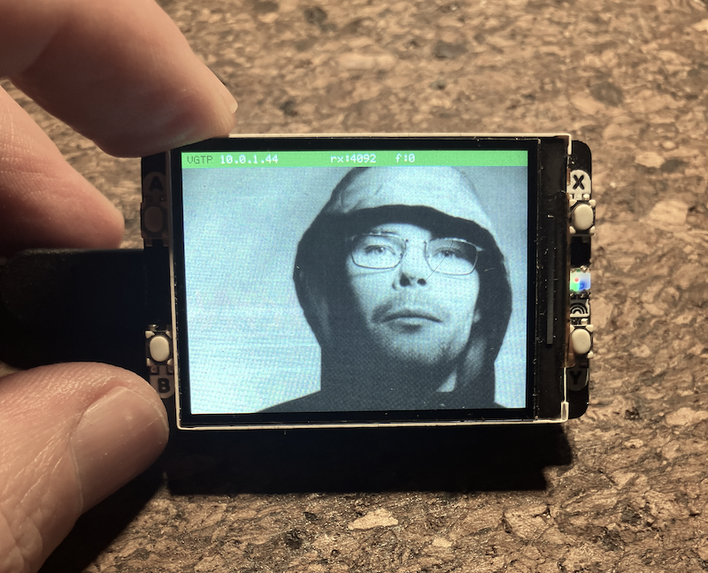
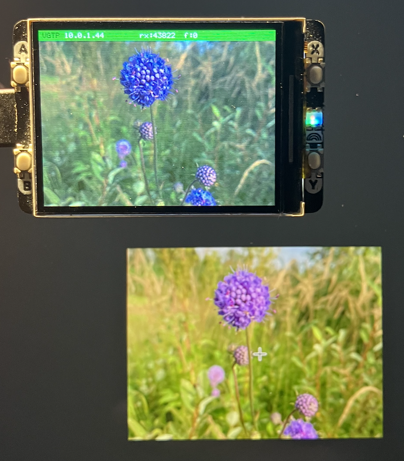

Photo: Pelle Kronstedt (cropped from Internetguiden, no. 9, 1995).

## Pico 2W VGTP Display Receiver

This sample is intended to show a bit on how communication over UDP can work.

A wireless vector graphics display terminal running on the Raspberry Pi Pico 2W.
A Python script on any host machine sends drawing commands over UDP; the Pico
renders them live on a 320x240 colour display at ~30 fps.

The custom protocol--*VGTP* (Vector Graphics Transport Protocol)--is a compact
binary UDP protocol designed for constrained embedded receivers. It supports
primitives (rectangles, lines, text, circles, bitmaps), double-buffered frame
assembly, reliable delivery, and a persistent canvas mode for full-screen images
of any size.


### Hardware Requirements

| Component | Detail |
|-----------|--------|
| Board | Raspberry Pi Pico 2W |
| MCU | RP2350, dual Cortex-M33 @ 150 MHz, 512 KB SRAM |
| Display | [Pimoroni Display Pack 2.0](https://shop.pimoroni.com/products/pico-display-pack-2-0) |
| Display spec | 320x240 pixels, ST7789V2 controller, SPI0 |
| Network | CYW43439 WiFi (built-in to Pico 2W) |
| Connection | Same WiFi network as the host running the Python script |

NOTE: The Infineon CYW43439 Wi-Fi/Bluetooth chip used in the Raspberry Pi
Pico 2W is designed for low-bandwidth IoT communication rather than high-throughput
networking (e.g., Wi-Fi 6 router). It should/can not be used for bandwidth-heavy
applications such as streaming, large file transfers, or high-rate data feeds.

The Display Pack 2.0 plugs directly onto the Pico 2W header pins--no wiring
required. It also provides four buttons (A/B/X/Y) that the firmware reads.

*WiFi credentials* are compiled into the firmware. Edit `wifi_config.h`
before building:

```c
#define WIFI_SSID     "YourNetwork"
#define WIFI_PASSWORD "YourPassword"
```


### How Communication Works

```
  Host machine (Python)                     Pico 2W
  ---------------------                     --------------------------------
  vgtp_send.py                              net_task  (Core 0, prio 3)
     |                                         |
     |  UDP port 1234 - DATA channel           |
     | --------------------------------------> | udp_recv_cb()
     |                                         |   copies raw bytes into
     |                                         |   pkt_ring[64]
     |                                         |
     |                                     protocol_task (Core 0, prio 2)
     |                                         |   pops from ring buffer
     |                                         |   parses VGTP header
     |                                         |   assembles primitives into
     |                                         |   build_scene (or canvas_buf)
     |                                         |   on FRAME_END -> scene_swap()
     |                                         |
     |  UDP port 1235 - CONTROL channel        |
     | <-------------------------------------- | sends ACK after each frame
     |                                         | sends HEARTBEAT every 500 ms
     |                                      Core 1 - display loop
     |                                         |   reads render_scene
     |                                         |   copies canvas_buf background
     |                                         |   blits framebuffer to display
     |                                         |   ~30 fps
```


#### Two UDP Channels

| Channel | Port | Direction | Purpose |
|---------|------|-----------|---------|
| DATA | 1234 | host -> Pico | Drawing commands, images |
| CONTROL | 1235 | Pico -> host (and host -> Pico) | ACKs, flow control, heartbeat |

The DATA channel carries all drawing. The CONTROL channel carries ACKs (after
each FRAME_END) and heartbeat packets (every 500 ms in both directions). The
Python script uses the heartbeat to detect connection loss and the Pico uses it
to show a red "SIGNAL LOST" banner on screen if nothing arrives within 2 seconds.


#### Packet Format

Every DATA packet has a 14-byte header followed by a type-specific payload:

```
Offset  Size  Field
------  ----  ------------------------------------------------------
0       1     version       always 0x01
1       1     type          VGTP_TYPE_* (see below)
2       2     seq           monotonic 16-bit counter (wraps)
4       2     frame_id      groups packets into one rendered frame
6       2     payload_len   bytes of payload after the header
8       4     timestamp     sender ms tick (informational)
12      2     crc           CRC16-CCITT over full packet (crc field = 0 during calc)
14      *     payload       type-specific
```

All multi-byte fields are *little-endian* (native to both RP2350 and e.g., x86).


#### Packet Types

| Type | Value | Description |
|------|-------|-------------|
| `VGTP_TYPE_DRAW` | 0x01 | One drawing primitive (rect, text, line, bitmap, circle) |
| `VGTP_TYPE_CLEAR` | 0x02 | Fill background with colour |
| `VGTP_TYPE_FRAME_END` | 0x03 | Swap build buffer -> display; triggers ACK |
| `VGTP_TYPE_HEARTBEAT` | 0x04 | Keep-alive; no payload |
| `VGTP_TYPE_CANVAS` | 0x05 | Write a tile directly into the persistent canvas buffer |
| `VGTP_TYPE_CANVAS_CLEAR` | 0x06 | Fill the canvas buffer with a colour |


#### Drawing Primitives (DRAW payload)

Each DRAW packet contains exactly one primitive, identified by the first payload byte:

```
RECT:    prim=0x01  x(i16) y(i16) w(u16) h(u16) color(u16)           - 11 bytes
TEXT:    prim=0x02  x(i16) y(i16) fg(u16) bg(u16) len(u8) text[len]  - 10+len bytes
LINE:    prim=0x03  x0(i16) y0(i16) x1(i16) y1(i16) color(u16)       - 11 bytes
BITMAP:  prim=0x04  x(i16) y(i16) w(u8) h(u8) dw(u16) dh(u16) px[]   - 11+w*h*2 bytes
CIRCLE:  prim=0x05  cx(i16) cy(i16) r(u16) color(u16)                - 9 bytes
```

Colours are RGB565, 16-bit. Maximum 64 primitives per frame. Maximum bitmap
tile size is 115 pixels (packet size budget: 256 bytes - 14 header - 11 prim header = 231 bytes / 2).


#### Frame Assembly

The Pico assembles a complete frame from multiple packets sharing the same
`frame_id`. The build buffer accepts primitives until `FRAME_END` arrives, at
which point the display pointer is swapped atomically (with a memory barrier)
and Core 1 picks up the new frame on its next render tick.

```
host sends:                    Pico state:
-----------------------------  ---------------------------------
CLEAR  (frame_id=5)         -  build_scene: clear_color set
DRAW RECT (frame_id=5)      -  build_scene: prim[0] = rect
DRAW TEXT (frame_id=5)      -  build_scene: prim[1] = text
DRAW LINE (frame_id=5)      -  build_scene: prim[2] = line
FRAME_END (frame_id=5)      -  scene_swap() - Core 1 now renders frame 5
                               ACK sent back on port 1235
```


#### Canvas Mode (large images)

The scene buffer holds at most 64 primitives per frame. For larger images, the
*canvas buffer* is a persistent 320x240 framebuffer in RAM (~150 KB) that
tiles write into directly - no frame boundary, no limit. Core 1 copies the
canvas as the background every frame, with scene primitives rendered on top.

```
host sends (any order, no FRAME_END needed):
-----------------------------------------------------------------------------------
CANVAS_CLEAR (black)         ->  canvas_buf filled with black
CANVAS tile (0,0, 10x11)     ->  canvas_buf[0,0..10,11] updated -> appears on screen
CANVAS tile (10,0, 10x11)    ->  canvas_buf[10,0..20,11] updated -> appears on screen
..                               tiles appear progressively as they arrive
CANVAS tile (310,230, ..)    ->  last tile, image complete
```


### Python Requirements

```bash
pip install Pillow    ## only needed for vgtp_image.py
```

Python 3.8+ is sufficient. No other dependencies.


### Quick Start

In the following the IP 10.0.1.44 serves as sample IP.
Replace with your own address.

#### Animated demo

```bash
python3 vgtp_send.py 10.0.1.44 demo
```

Sends a continuous animation: radiating lines, pulsing circles, a colour tile,
and a live status readout. Press Ctrl-C to stop cleanly.

#### Draw individual primitives

```python
from vgtp_send import connect, send_frame, pkt_rect, pkt_text, pkt_line, pkt_circle

connect("10.0.1.44")

# One frame: clear to dark blue, draw a white rectangle and a label
send_frame([
    pkt_rect(1, 0, 0, 320, 240, 0x000F),                   # dark blue background
    pkt_rect(1, 60, 80, 200, 80, 0xF800),                  # red rectangle
    pkt_text(1, 90, 115, "Hello Pico!", 0xFFFF, 0xF800),
])
```

#### Send an image (BITMAP mode, up to ~64 tiles)

```bash
# Preview what it will look like (saves icon.preview.png)
python3 vgtp_image.py icon.png --preview

# Send at 1:1 scale
python3 vgtp_image.py icon.png 10.0.1.44

# Scale to fill the display, centred
python3 vgtp_image.py photo.png 10.0.1.44 --size 64 64 --display 256 256 --center

# Pre-build packet file, send later
python3 vgtp_image.py icon.png --save icon.vti
python3 vgtp_send.py 10.0.1.44 image icon.vti
```

#### Send a large image (canvas mode, any size)

```bash
# Full 320x240 photo - builds progressively (~1.4 s at default 2 ms/tile)
python3 vgtp_image.py photo.png 10.0.1.44 --canvas

# With a black background cleared first
python3 vgtp_image.py photo.png 10.0.1.44 --canvas --clear 0x000000

# Scaled down to 160x120, centred
python3 vgtp_image.py photo.png 10.0.1.44 --canvas --size 160 120 --center

# Full-screen stretch in ~1 packet (bilinear scaled on Pico)
python3 vgtp_image.py photo.png 10.0.1.44 --canvas --size 10 8 --display 320 240
```


### Python Script Reference

#### `vgtp_send.py`

```
python3 vgtp_send.py <pico-ip> demo
python3 vgtp_send.py <pico-ip> image <file.vti>
```

| Function | Description |
|----------|-------------|
| `connect(ip)` | Send HELLO handshake, start heartbeat and ACK listener |
| `send_frame(pkts)` | Send a list of packets followed by FRAME_END |
| `pkt_rect(fid, x, y, w, h, color)` | Filled rectangle |
| `pkt_text(fid, x, y, text, fg, bg)` | Text string (5x8 font) |
| `pkt_line(fid, x0, y0, x1, y1, color)` | Anti-aliased line |
| `pkt_circle(fid, cx, cy, r, color)` | Anti-aliased circle outline |
| `pkt_bitmap(fid, x, y, w, h, pixels, dw, dh)` | Scaled bitmap tile (max 115 px) |
| `pkt_clear(fid, color)` | Fill background |
| `VGTPSender(reliable=True)` | Sender with retransmit on packet loss |

#### `vgtp_image.py`

```
python3 vgtp_image.py <image> [<pico-ip>] [options]
```

| Option | Description |
|--------|-------------|
| `--canvas` | Use canvas mode (persistent buffer, any image size) |
| `--size W H` | Scale source image to WxH pixels before tiling |
| `--display W H` | Destination area on display (tiles scale to fill it) |
| `--tile TW TH` | Override tile dimensions (BITMAP max 115 px, canvas max 116 px) |
| `--pos X Y` | Top-left corner on display (default: 0 0) |
| `--center` | Centre the image on the display |
| `--clear COLOR` | Send clear before image (hex RGB888, e.g. `0x000000`) |
| `--delay MS` | Inter-packet delay in ms (default: 1 BITMAP, 2 canvas) |
| `--preview` | Save and show a simulated 320x240 preview image |
| `--save FILE` | Save packets to `.vti` file for later sending |


### Packet Size Budget

```
PKT_MAX_SIZE  = 256 bytes
VGTP header   =  14 bytes
-------------------------
Payload room  = 242 bytes

BITMAP prim header  = 11 bytes  -> 231 / 2 = 115 pixels max
CANVAS tile header  = 10 bytes  -> 232 / 2 = 116 pixels max
TEXT payload        = 10 bytes  -> 232 chars max (capped at 47 by scene buffer)

PKT ring buffer: 64 slots x 258 bytes = ~16 KB  (safe for 64-tile image bursts)
Scene buffer:    64 primitives max per frame
Canvas buffer:   320 x 240 x 2 = 150 KB persistent BSS
```


### Build and Flash

*Requirements:* Pico SDK 2.x, `arm-none-eabi-gcc`, CMake 3.13+.

```bash
# First time only
mkdir build && cd build
cmake ..

# Build
make -C build -j$(nproc)                     # Linux
make -C build -j$(sysctl -n hw.logicalcpu)   # macOS
```

*Flash:* hold BOOTSEL on the Pico while connecting USB, then:

```bash
cp build/hello_usb.uf2 /Volumes/RP2350/      # macOS
cp build/hello_usb.uf2 /media/$USER/RP2350/  # Linux
```

The board reboots automatically. The display shows "connecting..." until WiFi
associates, then shows the IP address and a packet counter in the status bar.


### Architecture

```
Core 0 - RTOS                         Core 1 - display loop
------------------------------        ------------------------------
net_task (prio 3, 10 ms poll)         display_pack_init()
  CYW43/lwIP event loop               while (1):
  udp_recv_cb -> pkt_ring                if g_canvas_used:
                                           memcpy(canvas_buf -> framebuf)
protocol_task (prio 2)                  else:
  pkt_ring -> parse VGTP                   fb_clear(framebuf, black)
  canvas tiles -> canvas_buf            render scene primitives on top
  draw prims -> build_scene             draw status overlay
  FRAME_END -> scene_swap()             display_blit_full(framebuf)
  send ACK on port 1235                 display_wait_for_dma()
                                        sleep_ms(33)   // ~30 fps
idle_task (prio 0)
  // wait for interrupt ..
  WFI - halts CPU until SysTick
```

The two scene buffers (`build_scene`, `render_scene`) are swapped with a DMB
instruction to ensure Core 1 never sees a partially-written frame.
`canvas_buf` is written tile-by-tile by `protocol_task`; Core 1 reads it under
the same `volatile` guarantee (no explicit locking needed on RP2350's shared
SRAM for simple pixel writes).


### Project Structure

```
.
|-- main.c          - Core entry, RTOS tasks, display render loop
|-- protocol.c/h    - VGTP packet parser, frame assembler, canvas handler
|-- net.c/h         - CYW43 WiFi init, lwIP UDP, control channel
|-- scene.c/h       - Double-buffered scene + persistent canvas_buf
|-- display.c/h     - ST7789V2 SPI driver + framebuffer rendering API
|-- vgtp.h          - Wire protocol structs and constants
|-- vgtp.c          - CRC16-CCITT implementation
|-- rtos.c/h        - Custom preemptive RTOS (SysTick + PendSV)
|-- font.h          - 5x8 ASCII bitmap font
|-- wifi_config.h   - SSID / password (EDIT before building!)
|-- vgtp_send.py    - Python demo client and drawing API
|-- vgtp_image.py   - PNG -> VGTP converter / sender
+-- CMakeLists.txt
```


### Display Colour Format

The display uses *RGB565* (5 red, 6 green, 5 blue bits) packed into a 16-bit
value. The DMA transfer sends bytes low-byte-first, but the ST7789V2 expects
high-byte-first, so every colour in the framebuffer is byte-swapped:

```python
# Python - send this colour value on the wire:
RED = 0xF800   # RGB565 red

# Pico - stored in framebuffer as:
RED_FB = 0x00F8   # byte-swapped for 8-bit DMA
```

`color_for_fb()` in `protocol.c` handles this swap for all incoming wire
colours automatically. Python scripts send standard RGB565 values with no
manual swapping required.

A quick RGB888 -> RGB565 conversion for Python:

```python
def rgb(r, g, b):
    return ((r & 0xF8) << 8) | ((g & 0xFC) << 3) | (b >> 3)

RED    = rgb(255, 0,   0)    # 0xF800
GREEN  = rgb(0,   255, 0)    # 0x07E0
WHITE  = rgb(255, 255, 255)  # 0xFFFF
```


You might reflect on how to get the colours right ..



> [!NOTE] 
> As the effort to write and update code decreases--thanks to modern tools,
> automation, frameworks, and LLMs--the developer's focus increasingly shifts
> from individual *code changes* to *system architecture*. In this context,
> the real challenge is no longer churning out functions or modules, but
> designing, evolving, and maintaining the structure of the system.
> Poor architectural decisions have far-reaching consequences, so while *code*
> becomes "cheap," the ongoing task becomes continuously shaping and adapting
> the *architecture* to meet evolving requirements.
> You could say that, in such projects, the work becomes more about testing,
> evolving, and refining the architecture than about writing individual lines of code.
> Please go ahead with a project that uses *another* architecture to solve the
> same problem as the above!


### UDP display: sender and receiver

The UDP Display is a deliberate architectural contrast to the [TCP stream](./../tcpdisplay/).
Where the TCP version maintains one persistent connection and lets the transport layer handle
reliability, the UDP version discards that safety net entirely and builds its own application-level
protocol (VGTP) here on top of raw datagrams. This makes the networking code more complex,
but gives precise control over every tradeoff.

#### The sender side

`vgtp_send.py` opens two ordinary UDP sockets--no `connect()`, no handshake, no state on the
sender before the first packet goes out. Port 1234 carries DATA (drawing commands flowing host: Pico)
and port 1235 carries CONTROL (ACKs and heartbeats flowing in both directions).

Each logical frame is broken into multiple independent datagrams. A `CLEAR` packet sets the
background colour, then one `DRAW` packet per primitive follows, and finally a `FRAME_END`
packet signals that the frame is complete. Because UDP gives no ordering guarantee, the sender
assigns a monotonic `seq` counter and a shared `frame_id` to every packet, so the receiver
can detect gaps and group packets that belong together.

The Python `VGTPSender(reliable=True)` wrapper listens for ACKs on port 1235. If a `FRAME_END`
is not acknowledged within the timeout, it retransmits--something the TCP version never needed
to think about because the transport layer did it automatically. For the simpler animated demo
this retransmit layer is optional; for image delivery where a missing tile leaves a visible hole,
it becomes essential.

The heartbeat is sent every 500 ms in both directions. The sender uses it to detect a silent
Pico (rebooted, out of range); the Pico uses it to detect a silent sender and show a "SIGNAL LOST"
banner. TCP would have detected the same condition through its own keepalive and timeout mechanism
at no application cost. Here the application must implement it manually.

#### The receiver side

On the Pico, the UDP stack is even simpler than the TCP stack. There is no connection lifecycle--no
`connect()`, no `SS_CONNECTED` state machine, no ring buffer scan for a frame delimiter. `lwip`'s
`udp_bind()` and `udp_recv()` register `udp_recv_cb`, and every arriving datagram is a self-contained
unit. The callback copies the raw bytes into a 64-slot packet ring (`pkt_ring`) and returns immediately.

A dedicated `protocol_task` (priority 2, one below `net_task`) drains the ring. It validates the
14-byte VGTP header--version byte, type, CRC16-CCITT--and dispatches on packet type. `CLEAR` sets a
colour. `DRAW` appends a primitive to `build_scene`. `FRAME_END` calls `scene_swap()`, atomically
publishing the finished frame to Core 1 behind a `__dmb()`, then sends an ACK back on port 1235.
`HEARTBEAT` updates the last-seen timestamp. `CANVAS` tiles write directly into the persistent
150 KB `canvas_buf` without waiting for a frame boundary at all.

This split between `net_task` (owns the WiFi/lwIP poll loop) and `protocol_task` (owns parsing and
assembly) is a structural difference from the TCP version, where a single `net_task` handled both
network polling and frame extraction. The UDP version's separation makes sense because parsing is
now heavier--each packet carries a binary header, a CRC, a primitive type byte, and packed
little-endian fields--whereas the TCP version parsed plain ASCII in a single `sscanf`.

#### Frame assembly without a stream

The most instructive contrast is how each project reconstructs a "frame" from what the network delivers.

In the TCP version, the network delivers an ordered byte stream. The frame boundary is a 7-byte
ASCII sentinel (`\nFRAME\n`). The ring buffer scan is a simple substring search, and the only
failure mode is a partial frame at the tail of the buffer--handled by waiting for more bytes.

In the UDP version, there is no stream, only independent datagrams that may arrive out of order or
not at all. The frame boundary is the `FRAME_END` packet type, not a pattern in a byte stream.
If a `DRAW` packet for `frame_id=5` is dropped, `FRAME_END` for `frame_id=5` still arrives;
the Pico swaps the scene with one primitive missing and the frame renders silently wrong.
The `reliable=True` retransmit layer in Python is the answer, but it requires the application
to track what has and has not been acknowledged--work the TCP stack does for free.

#### Canvas mode and why UDP suits it

Canvas mode is the one case where UDP's lack of ordering is turned into an advantage. The persistent
`canvas_buf` is a 320x240 framebuffer that tiles write into independently, with no frame boundary
and no ordering requirement. Core 1 copies it as the background on every render tick, so each tile
appears on screen the moment it arrives--the image builds progressively and visibly rather than
waiting for the last byte of a complete frame. A TCP stream could deliver the same bytes in order,
but the display would still show nothing until the entire image was received and parsed.
Canvas mode exploits UDP's datagram-per-tile model to make partial delivery a feature rather than a failure.

#### Why the added complexity is a conscious choice

The VGTP protocol adds roughly the same reliability that TCP provides for free--sequence numbers,
acknowledgements, retransmission, connection liveness--but at the application layer where it can
be tailored to the use case. A `FRAME_END` ACK is coarser than TCP's per-segment ACK; the sender
does not need to know which individual primitive was lost, only whether the whole frame was accepted.
A 500 ms heartbeat is tuned to the display's tolerance for stale content, not to the OS's general
TCP keepalive timer. And for canvas tiles, the application deliberately omits reliability--a dropped
tile (ouch!) is preferable to stalling the entire image while waiting for a retransmit.

That is the architectural lesson the project makes explicit: UDP forces you to design the reliability
policy that fits your problem, while TCP imposes a one-size-fits-all policy. On a low-bandwidth
CYW43439 over a home LAN, the difference in raw throughput is negligible. The difference is in
control--and in how much of the networking stack you end up writing yourself.

