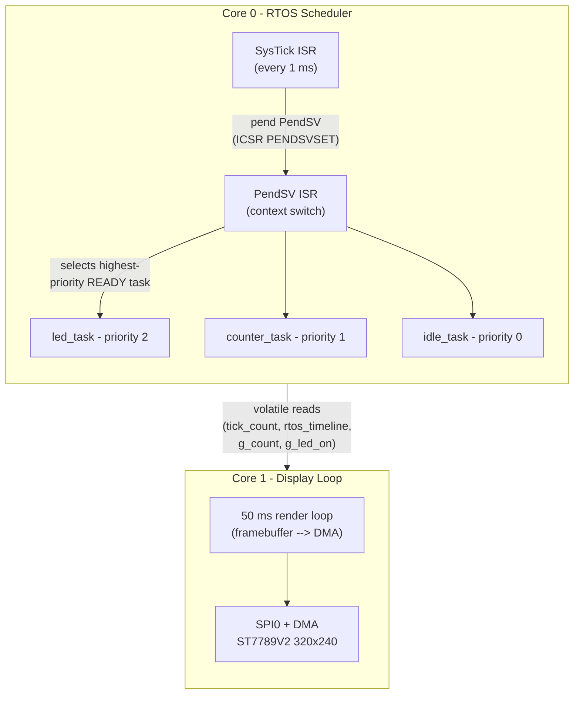
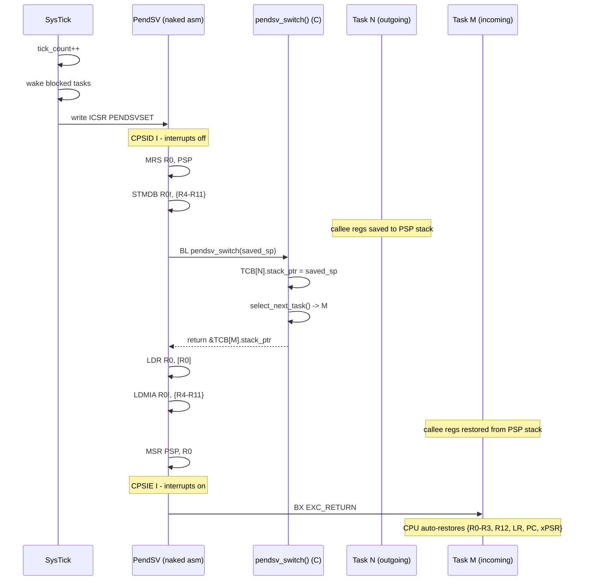
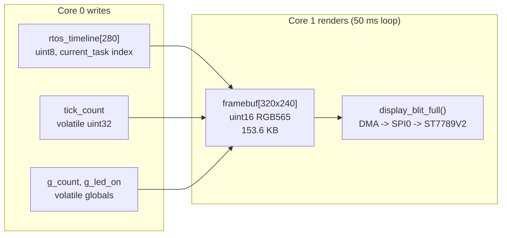
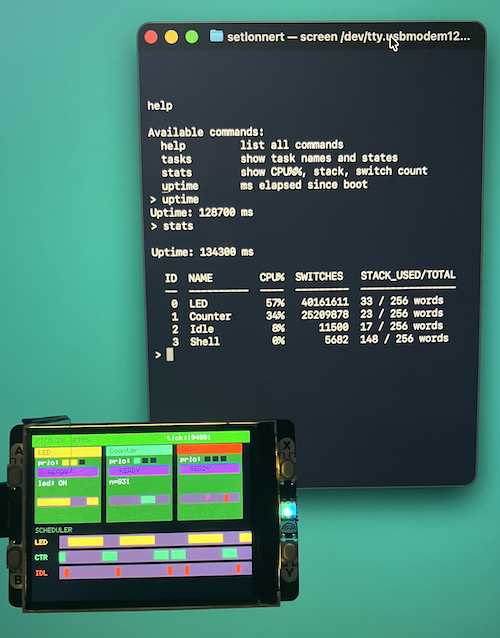

## Pico 2W RTOS w/API

This is a reused project to show what an API could look like. But first some basics.
This is a preemptive RTOS built from scratch for the Raspberry Pi Pico 2W (RP2350 / Cortex-M33),
with a live visual display that makes the scheduler's decisions visible in real time.

The primary goal is *educational*: every core concept: context switching, priority preemption,
task blocking, round-robin tie-breaking. These can be watched happening on screen (rather
than inferred from blinking LEDs or serial logs). The codebase is also designed as a
*clean API foundation* for higher-level task management built on top.


### Display


*Task cards (top half)* - one 96x110 card per task:
- Name bar in the task's accent colour
- Priority dots (filled = has that level)
- State badge: `>>RUNNING<<` (green) / `READY` (yellow) / `BLOCKED` (orange)
- Live data: LED on/off, counter value, or `wfi`
- Wake countdown in ms when blocked
- Mini activity bar - last ~350 ms of execution

**Scheduler timeline (bottom half)** - three rows scrolling left:
- Each pixel = one 4 ms sample
- Coloured pixel = that task owned the CPU; dark = blocked or preempted
- Window: 280 samples x 4 ms = **1120 ms of history**

```
time --------------------------------------------------------->

LED  ████████████████████░░░░░░░░░░░░░░░░░░░░░░████████████████
CTR  ░░░░░░░░░░░░░░░░░░░░████░░░░████░░░░████░░░░░░░░░░░░░░░░░░
IDL  ░░░░░░░░░░░░░░░░░░░░░░░░████░░░░████░░░░░░░░░░░░░░░░░░░░░░
     <-------------------------------------------------------->
                              1120 ms window
```


### Architecture

#### System overview




Core 0 runs the entire RTOS. Core 1 owns the SPI bus and DMA channel. It
*never writes* to the task control blocks. The shared globals are declared
`volatile`; on RP2350 shared SRAM this is sufficient for flag-style one-writer
/ one-reader sharing without spinlocks.


#### Task state machine

```mermaid
stateDiagram-v2
    direction LR

    [*] --> READY : task_create()

    READY --> RUNNING : PendSV selects task\n(highest priority wins;\nround-robin on tie)

    RUNNING --> READY : task_yield()\n- or preempted by\nhigher-priority task

    RUNNING --> BLOCKED : task_delay(ms)\nmutex / semaphore contention

    BLOCKED --> READY : SysTick: tick_count >= wake_time\nor semaphore signalled

    RUNNING --> SUSPENDED : future API
    SUSPENDED --> READY : future API
```


#### Context switch sequence

Every SysTick fires PendSV, which performs the actual register save/restore:



Hardware exception stacking saves `{R0-R3, R12, LR, PC, xPSR}` automatically.
PendSV manually saves/restores the remaining callee-saved registers `{R4-R11}`,
giving a complete 16-register context switch.


#### Display pipeline



The framebuffer is owned by Core 1 and is never touched by Core 0. `display_blit_full()`
is *synchronous*--it starts a DMA transfer and blocks until it completes before returning,
so no separate `display_wait_for_dma()` call is needed after it.


### RTOS Concepts

#### Priority-based preemption

Each task has a numeric priority (`0` = lowest). When a higher-priority task becomes READY,
it immediately displaces whatever is running. Watch the timeline: the LED row pushes the
Counter row dark the instant the LED task wakes from `task_delay`.

### Context switching

Switching tasks requires saving the complete CPU register state of the outgoing task and
restoring the state of the incoming task, so each continues exactly where it left off on
its own private stack.

On Cortex-M33 the `PendSV` exception is used for this. The CPU auto-saves `{R0–R3, R12, LR, PC, xPSR}`
on exception entry; PendSV manually handles `{R4–R11}`.

#### SysTick - the heartbeat

SysTick fires every 1 ms. It:
1. Increments `tick_count`
2. Unblocks any task whose `wake_time <= tick_count`
3. Pends PendSV to trigger the next context switch

#### The `active_ms()` pattern

Instead of blocking, tasks can *hold* the CPU for a timed window while remaining preemptable:

```c
static void active_ms(uint32_t ms) {
    uint32_t end = tick_count + ms;
    while ((int32_t)(end - tick_count) > 0)
        task_yield();   /* re-schedule each tick, but stay READY */
}
```

A higher-priority task will immediately preempt a task inside `active_ms()` on the very next tick.
This makes preemption visually striking on the timeline.

#### Idle task

When no other task is READY, the idle task runs. It executes `WFI` (Wait For Interrupt), halting
the CPU until the next SysTick fires--saving power rather than spinning.


### RTOS API

#### Lifecycle

```c
void rtos_init(void);
void rtos_start(void);   /* configures SysTick + PendSV, never returns */
```

#### Task management

```c
void task_create(task_function_t fn,
                 const char     *name,
                 task_priority_t priority,  /* 0 = lowest */
                 void           *param);

void task_yield(void);          /* stay READY, request reschedule */
void task_delay(uint32_t ms);   /* block for N milliseconds       */
```

#### Synchronisation

```c
/* Mutex - non-re-entrant, no priority inheritance */
void rtos_mutex_init(rtos_mutex_t *m);
void rtos_mutex_lock(rtos_mutex_t *m);    /* blocks with task_delay(1) on contention */
void rtos_mutex_unlock(rtos_mutex_t *m);

/* Counting semaphore */
void rtos_semaphore_init(rtos_semaphore_t *s, uint32_t initial, uint32_t max);
void rtos_semaphore_wait(rtos_semaphore_t *s);   /* blocks if count == 0 */
void rtos_semaphore_signal(rtos_semaphore_t *s);
```

#### Queries

```c
uint32_t rtos_get_tick_count(void);   /* milliseconds since rtos_start() */
```

#### Scheduler state (for display / introspection)

```c
extern task_control_block_t  tasks[MAX_TASKS];    /* all TCBs             */
extern uint8_t               current_task;         /* index of running task */
extern volatile uint32_t     tick_count;           /* ms counter           */
extern volatile uint8_t      rtos_timeline[RTOS_TIMELINE_LEN]; /* 280 samples */
extern volatile uint16_t     rtos_timeline_pos;    /* ring-buffer write head */
```


### Display API

#### Initialisation and blit

```c
display_error_t display_pack_init(void);   /* init SPI, DMA, ST7789V2 */
display_error_t display_blit_full(const uint16_t *pixels); /* DMA full frame, synchronous */
void            display_wait_for_dma(void);
```

#### Direct-draw (immediate, pixel-by-pixel SPI)

```c
display_error_t display_clear(uint16_t color);
display_error_t display_fill_rect(uint16_t x, uint16_t y, uint16_t w, uint16_t h, uint16_t color);
display_error_t display_draw_pixel(uint16_t x, uint16_t y, uint16_t color);
display_error_t display_draw_char(uint16_t x, uint16_t y, char c, uint16_t fg, uint16_t bg);
display_error_t display_draw_string(uint16_t x, uint16_t y, const char *str, uint16_t fg, uint16_t bg);
display_error_t display_set_backlight(bool on);
```

#### Framebuffer helpers (draw into RAM, blit once per frame)

```c
void fb_clear(uint16_t *fb, uint16_t color);
void fb_draw_pixel(uint16_t *fb, int x, int y, uint16_t color);
void fb_fill_rect(uint16_t *fb, int x, int y, int w, int h, uint16_t color);
void fb_draw_char(uint16_t *fb, int x, int y, char c, uint16_t fg, uint16_t bg);
void fb_draw_string(uint16_t *fb, int x, int y, const char *str, uint16_t fg, uint16_t bg);
void fb_draw_line_aa(uint16_t *fb, float x0, float y0, float x1, float y1, uint16_t color);
void fb_blit_scaled(uint16_t *fb,
                    const uint16_t *src, int sw, int sh,
                    int dx, int dy, int dw, int dh);
```

#### Color transforms (Flash-style per-channel)

```c
/* out_channel = clamp(in_channel * mul/256 + add, 0, 255) */
void fb_apply_color_transform(uint16_t *fb, const fb_color_transform_t *cx);
void fb_apply_color_transform_rect(uint16_t *fb, const fb_color_transform_t *cx,
                                   int x, int y, int w, int h);

fb_color_transform_t fb_cx_identity(void);
fb_color_transform_t fb_cx_dim(uint8_t level);          /* 0=black, 255=full */
fb_color_transform_t fb_cx_tint(uint8_t r, uint8_t g, uint8_t b);
```

#### Buttons

```c
display_error_t buttons_init(void);
void            buttons_update(void);       /* call regularly; debounce 50 ms */
bool            button_pressed(button_t b);
bool            button_just_pressed(button_t b);
bool            button_just_released(button_t b);
display_error_t button_set_callback(button_t b, button_callback_t cb);
```


### Demo Tasks

| Task    | Priority | Period   | Behaviour                                                                             |
|---------|----------|----------|---------------------------------------------------------------------------------------|
| LED     | 2 (high) | 700 ms   | 200 ms active (LED on) -> 200 ms blocked -> 200 ms active (LED off) -> 100 ms blocked |
| Counter | 1 (med)  | 100 ms   | Increments `g_count`, holds CPU 80 ms (`active_ms`), blocks 20 ms                     |
| Idle    | 0 (low)  | -        | Executes `WFI` forever; runs only when both higher-priority tasks are blocked         |


### Hardware

| Component | Detail                                                          |
|-----------|-----------------------------------------------------------------|
| Board     | Raspberry Pi Pico 2W                                            |
| MCU       | RP2350, dual Cortex-M33 @ 150 MHz                               |
| Display   | Pimoroni Display Pack 2.0 - 320x240 ST7789V2, SPI0 at 31.25 MHz |
| SPI pins  | CLK=GPIO18, MOSI=GPIO19, CS=GPIO17, DC=GPIO16                   |
| Control   | RESET=GPIO21, Backlight=GPIO20                                  |
| Buttons   | A/B/X/Y on GPIO 12-15 (pulled up, active low)                   |

#### Key RP2350 specifics

- Pico SDK ISR names are *`isr_systick`* and *`isr_pendsv`* - not the CMSIS names
  `SysTick_Handler` / `PendSV_Handler`. Using the wrong names compiles silently
  but the handlers are never called.
- PendSV priority must be set to `0xFF` - the field is full 8 bits on Cortex-M33 (vs 2 bits on M0+).
- `DMA_IRQ_0` must be registered from *Core 1* (the core that calls `display_pack_init`).
  Registering it from Core 0 would prevent the interrupt from reaching Core 1.


### Project Structure

```
.
|-- main.c          RTOS demo tasks, display render loop, shared state
|-- rtos.c          Kernel: PendSV/SysTick handlers, scheduler, sync primitives
|-- rtos.h          Public RTOS API, TCB definition, timeline buffer
|-- display.c       ST7789V2 SPI driver + DMA + framebuffer rendering
|-- display.h       Display API, color constants, framebuffer helpers
|-- font.h          5x8 ASCII bitmap font + 8x8 block graphics
+-- CMakeLists.txt  Build configuration (Pico SDK 2.2.0)
```


### Build and Flash

Requires [Pico SDK 2.x](https://github.com/raspberrypi/pico-sdk) and `arm-none-eabi-gcc`.

```bash
mkdir build && cd build
cmake ..
~/.pico-sdk/cmake/v3.31.5/CMake.app/Contents/bin/cmake --build .
```

To flash, hold BOOTSEL while connecting USB - the board mounts as a drive - then copy the UF2:

```bash
cp build/rtos.uf2 /Volumes/RP2350/        # macOS
cp build/rtos.uf2 /media/$USER/RP2350/    # Linux
```

The board reboots and the display shows the live RTOS visualisation within 500 ms.


### Known Limitations

| Limitation | Detail |
|------------|--------|
| No FPU context save | S16-S31 / FPSCR are not saved. Tasks must not use floating-point arithmetic. |
| Fixed task count | `MAX_TASKS = 8`, statically allocated 256-word stacks. No dynamic creation or deletion. |
| No priority inheritance | A high-priority task spinning on a mutex held by a low-priority task will starve mid-priority tasks. The mutex uses `task_delay(1)` to yield, which mitigates but does not solve priority inversion. |
| Display byte order | DMA uses 8-bit transfers, sending the low byte of each RGB565 word first. The ST7789V2 expects the high byte first. Colours in source are pre-byte-swapped to compensate. Fix: switch to 16-bit DMA with the `BSWAP` flag. |
| Single-core RTOS | The scheduler and all tasks run on Core 0 only. |


### Roadmap

#### Near-term

- *FPU context save* - save/restore `S16-S31` and `FPSCR` in PendSV to allow floating-point in tasks
- *16-bit DMA with BSWAP* - eliminate the colour byte-swap workaround
- *Task deletion* - add a TERMINATED state and stack reclamation

#### MPU-backed task isolation

The RP2350's Cortex-M33 includes an 8-region MPU.
Three progressive phases would bring hardware-enforced memory protection to this RTOS:

__Phase 1 - Stack overflow guard__
Place a no-access guard region at the bottom of each task's stack. A stack overflow immediately
triggers a MemFault rather than silently corrupting adjacent TCBs.

```c
/* sketch: in task_create(), after task_stack_init() */
mpu_set_guard(tcb->stack, 32);   /* 32-byte no-access region at stack bottom */
```

__Phase 2 - Per-task stack isolation__
On every context switch, reconfigure the MPU so the incoming task has read-write access to
its own stack and read-only (or no) access to all others. A dangling pointer into another task's
stack faults immediately.

__Phase 3 - MemFault handler + display integration__
Capture `SCB->MMFAR` (faulting address) and the task's PC from the exception frame on PSP.
Identify the culprit task, mark it SUSPENDED, and display a fault report while other tasks keep running:

```
+-----------------------------------+
|  !! MEMFAULT                      |
|  task:    Counter  (prio 1)       |
|  fault:   stack overflow          |
|  PC:      0x100034A8              |
|  addr:    0x2003FF00              |
+-----------------------------------+
```


#### Relevant MPU registers

| Register     | Address      | Purpose                                                  |
|--------------|--------------|----------------------------------------------------------|
| `MPU_TYPE`   | `0xE000ED90` | Number of supported regions (read; expect 8 on RP2350)   |
| `MPU_CTRL`   | `0xE000ED94` | Enable MPU; enable default background region             |
| `MPU_RNR`    | `0xE000ED98` | Select region to configure (0-7)                         |
| `MPU_RBAR`   | `0xE000ED9C` | Region base address + access permissions                 |
| `MPU_RLAR`   | `0xE000EDA0` | Region limit address + enable                            |
| `SCB->SHCSR` | `0xE000ED24` | Enable MemFault handler (bit 16)                         |
| `SCB->MMFAR` | `0xE000ED34` | Address that caused the MemFault                         |
| `SCB->CFSR`  | `0xE000ED28` | Fault type flags; bit 7 = MMFAR valid                    |

Reference: *ARM Cortex-M33 Generic User Guide*, Chapter 4 (MPU) and Chapter 4.3 (Fault handling).



