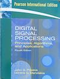

## Signal Processing

> [!IMPORTANT]
> *About this additional section:* This section fills a gap in the main
  text by introducing the fundamentals of signal processing: what signals
  are, how they are sampled and represented digitally, how to analyse them
  in the frequency domain, and how to filter them. Each concept is paired
  with working code in Python, C, and (where applicable) JavaScript so
  you can experiment immediately.

Before diving in, here is the thread that runs through the whole section.
A physical signal--a sound wave, a sensor reading, a photograph--exists
in the continuous world. To process it on a computer we must first *sample*
it: capture its value at discrete instants and store those numbers. The
Nyquist theorem tells us how often we must sample to avoid distortion.
Once we have a sequence of samples we can ask: which *frequencies* does
this signal contain? The Fourier Transform answers that question, and the
FFT algorithm makes the answer fast enough to use in real time. Knowing
the frequency content, we can design *filters* that remove unwanted
components. The projects at the end of the section make each of these
ideas tangible with runnable code.

> [!NOTE]
> It is recommended to work in a virtual environment when using Python.


### 1. Introduction

#### 1.1 What is a Signal?

A *signal* is any quantity that varies and carries information. The
variation can be over time, space, or any other independent variable;
what matters is that a receiver can extract meaning from the variation.

*Time-domain signals* change with time. A microphone converts air pressure
variations into a voltage that fluctuates thousands of times per second--
that voltage waveform is a time-domain signal. An electrocardiogram records
the heart's electrical activity as a function of time. A gyroscope in a
phone reports angular velocity moment by moment.

*Spatial signals* vary across position rather than (or in addition to)
time. A digital photograph is a two-dimensional spatial signal: each pixel
encodes light intensity (and colour) at a particular $(x, y)$ location. A
seismic survey maps reflected sound energy across a field of sensors buried
in the ground.

*Continuous signals* are defined at every instant, with no gaps.
Mathematically we write $x(t)$ to mean the signal value at time $t$,
where $t$ is a real number. Physical signals--sound, light, temperature--
are continuous.

*Discrete signals* are defined only at specific, regularly spaced instants.
We write $x[n]$ to mean the value at sample index $n$, where $n$ is an
integer. Every digital system works with discrete signals: computers cannot
store a value for every real-numbered instant, only for a countably
infinite (or finite) sequence of moments.

The table below gives a sense of how broad the domain is:

| Domain     | Signal                   | Independent variable |
|------------|--------------------------|----------------------|
| Audio      | Pressure wave / voltage  | Time                 |
| Image      | Pixel intensity          | Space `(x, y)`       |
| Radar      | Reflected pulse envelope | Time / range         |
| Finance    | Stock price              | Time                 |
| Biology    | Neuron firing rate       | Time                 |
| Geophysics | Seismic wave             | Space and time       |

The central task of signal processing is to extract useful information from
these varying quantities--removing noise, detecting patterns, compressing
data, or transforming representations so that downstream algorithms can work
more easily.


#### 1.2 Why Signal Processing Matters

It is easy to think of signal processing as a narrow speciality. In
practice it underpins an enormous range of everyday technology. The four
areas below are chosen because they illustrate very different applications
of the same underlying ideas.

*Audio processing.* Every phone call, music stream, and voice assistant
relies on signal processing. Noise cancellation in headphones uses adaptive
filters to subtract an estimate of background noise from the microphone
signal in real time. MP3 and AAC compression apply psychoacoustic models
that discard frequency content the human ear cannot perceive, achieving
10:1 compression with minimal audible loss. Speech recognition first
converts audio to a spectrogram--a time-frequency map--before feeding
it to a neural network.

*Communications.* Amplitude modulation (AM), frequency modulation (FM),
and modern schemes like OFDM (used in Wi-Fi, 4G, and 5G) all work by
shifting information-bearing signals to carrier frequencies suitable for
transmission. At the receiver, a matched filter recovers the original
signal from noise. The acoustic OFDM project in Section 6 is a
browser-based demo of exactly this idea, and the FSK modem project
recreates the modulation scheme used by dial-up modems.

*Machine learning.* Raw signals are rarely fed directly to a classifier.
A common pre-processing pipeline converts a time-series into a frequency
representation (spectrogram or mel-frequency cepstral coefficients),
applies normalisation, and possibly applies a learned filter bank.
Convolutional neural networks are themselves a form of adaptive signal
processing: their learnable kernels are filters optimised for a particular
task.

*Embedded systems.* Microcontrollers in industrial sensors, medical
devices, and consumer electronics all perform signal processing under
tight constraints of memory and compute budget. A digital filter that
smooths a noisy ADC reading, a PID controller that cancels vibration,
an encoder that detects a zero crossing--these are signal processing
tasks executed in real time, often without an operating system, in a few
kilobytes of RAM.


### 2. Mathematical Foundations

The mathematics here is kept to what you will actually need in the rest of
the section. If an equation looks unfamiliar, focus on what it *does* rather
than proving it--the code examples will make the behaviour concrete.


#### 2.1 Continuous vs Discrete Signals

A continuous signal $x(t)$ assigns a real (or complex) number to every
real-valued time $t$. This is the natural model for physical phenomena.
We can differentiate it, integrate it, and reason about its behaviour at
any instant.

A discrete signal $x[n]$ assigns a value only at integer indices $n
\in \mathbb{Z}$. It arises whenever we *sample* a continuous signal--measuring
its value at regular intervals.

*Notation summary:*
- Continuous signal: $x(t)$, $t \in \mathbb{R}$
- Discrete signal: $x[n]$, $n \in \mathbb{Z}$
- Sampling period: $T$ (seconds between samples)
- Sampling rate: $f_s = 1/T$ (samples per second, Hz)

The relationship between the two is:

```math
x[n] = x(n \cdot T) = x(n / f_s)
```

Each discrete sample is simply the continuous signal evaluated at time
$t = nT$. Nothing subtle is happening: we are reading the value of the
continuous signal at regular clock ticks and writing those numbers down.

*Why discrete signals are necessary.* Storing a continuous signal requires
infinite precision and infinite storage--both impossible. Discrete
sampling reduces the representation to a finite (or countably infinite)
sequence of numbers, which computers can store, transmit, and process. The
key question--addressed in the next section--is how fast we must sample
to avoid losing information.


#### 2.2 Sampling and the Nyquist-Shannon Theorem

Reducing a continuous signal to a sequence of numbers raises an obvious
question: have we thrown away important information between the samples?
The Nyquist-Shannon sampling theorem gives a precise and reassuring answer,
provided one condition is met.

> A continuous signal whose highest frequency component is $f_m$ can be
> perfectly reconstructed from discrete samples taken at a rate $f_s$,
> provided: $f_s \ge 2 \cdot f_m$

In other words, as long as you sample at *at least twice* the highest
frequency present in the signal, the continuous waveform can be recovered
perfectly from the discrete samples. No information is lost.

The frequency $f_s / 2$ is called the *Nyquist frequency* (or folding
frequency). It is the highest frequency that can be faithfully represented
at a given sampling rate.

*Aliasing* is what happens when this condition is violated. If the signal
contains components above the Nyquist frequency and we sample below
$2 f_m$, those high-frequency components are *folded* back into the
representable range and appear as phantom low-frequency components. The
corruption is irreversible--once aliased, the original high-frequency
content cannot be recovered.

A classic visual example: a wheel spinning at 24 revolutions per second
filmed at 24 frames per second appears stationary. The sampling rate (24 fps)
is exactly equal to the rotation frequency, pushing it right at--and in
practice beyond--the Nyquist limit, which causes the aliased "stationary"
appearance. The aliasing project in Section 6 makes this quantitative.

*Anti-aliasing filters.* In practice, a low-pass filter is applied to the
continuous signal *before* sampling to remove any content above $f_s / 2$.
This is called an anti-aliasing filter, and it is present in every
analogue-to-digital converter front end.

```math
f_s \ge 2 \cdot f_m
```

*See the [sampling](./sampling/) folder.*


#### 2.3 Fourier Transform

The central insight of Fourier analysis is that *any* periodic signal--
and, with a suitable extension, any signal with finite energy--can be
expressed as a sum of sinusoids[^sinusoids] of different frequencies,
amplitudes, and phases. This is not just a mathematical curiosity; it
reveals which frequencies are present in a signal and in what proportion,
turning a time-domain waveform into a *frequency-domain spectrum*.

[^sinusoids]: A sinusoid is the sine or cosine function--a continuous,
smooth oscillation at a single fixed frequency. In signal processing,
sinusoids are the fundamental building blocks: any complicated waveform
can be built up from (or broken down into) a collection of sinusoids at
different frequencies and amplitudes.

*Intuition.* Imagine a chord played on a piano. The pressure waveform at
your ear is a messy, oscillating curve. Yet your auditory system immediately
resolves it into individual notes--A, C, E--each at its own frequency
and loudness. Fourier analysis is the mathematical version of that
decomposition: it asks, "for each possible frequency $f$, how much of that
frequency is present in the signal?"

*The Fourier Transform* of a continuous signal $x(t)$ is:

```math
X(f) = \int_{-\infty}^{+\infty} x(t) \cdot e^{-i 2\pi f t} \, dt
```

$X(f)$ is a complex-valued function of frequency. Its magnitude $|X(f)|$
is the *amplitude spectrum* (how strong each frequency is), and its
argument $\angle X(f)$ is the *phase spectrum* (the phase offset of each
sinusoidal component).

The *inverse Fourier Transform* recovers the time-domain signal:

```math
x(t) = \int_{-\infty}^{+\infty} X(f) \cdot e^{+i 2\pi f t} \, df
```

These two transforms form a perfect pair: going to the frequency domain
loses no information, and coming back gives back the original signal exactly.

*Key properties to know:*

| Property            | Statement                                                         |
|---------------------|-------------------------------------------------------------------|
| Linearity           | $\mathcal{F}\{ax + by\} = aX + bY$                                |
| Time shift          | Shifting $x(t)$ by $\tau$ multiplies $X(f)$ by $e^{-i2\pi f\tau}$ |
| Convolution theorem | Convolution in time $\leftrightarrow$ multiplication in frequency |
| Parseval's theorem  | Energy is preserved: $\int\|x\|^2 dt = \int\|X\|^2 df$            |

The *convolution theorem* is particularly important for filtering: applying
a filter $h$ to a signal $x$ by convolution in the time domain is
*equivalent* to multiplying their Fourier transforms $H(f) \cdot X(f)$ in
the frequency domain. This is why frequency-domain filtering is often
computationally cheaper, and it is the reason the FFT matters so much.


#### 2.4 Discrete Fourier Transform (DFT)

The Fourier Transform defined above works on continuous, infinite signals.
In practice we always have a finite sequence of samples. The *Discrete
Fourier Transform* (DFT) is the version that works on exactly that: a
block of $N$ numbers in, $N$ complex frequency coefficients out.

For a finite sequence $x[0], x[1], \ldots, x[N-1]$:

```math
X[k] = \sum_{n=0}^{N-1} x[n] \cdot e^{-i 2\pi k n / N}, \quad k = 0, 1, \ldots, N-1
```

Each output bin $X[k]$ corresponds to the frequency $f_k = k \cdot f_s / N$.
The magnitude $|X[k]|$ tells you how strongly that frequency is present in
the block of samples.

*Computational cost.* Evaluating the sum naively requires $O(N^2)$
operations: for each of the $N$ output bins $k$, we sum over all $N$
input samples. For $N = 10{,}000$ this is $10^8$ multiply-add operations--
feasible but slow for interactive use. The FFT, introduced next, reduces
this dramatically.

*See the [DFT](./dft/) folder on discrete Fourier transforms.*


#### 2.5 Fast Fourier Transform (FFT)

The FFT is not a different transform--it is an efficient *algorithm* for
computing exactly the same DFT result. The standard Cooley-Tukey radix-2
FFT exploits the fact that a DFT of size $N$ can be recursively split into
two DFTs of size $N/2$:

```math
X[k]       = E[k] + W^k \cdot O[k]
X[k + N/2] = E[k] - W^k \cdot O[k]
```

where $W = e^{-i 2\pi / N}$ is called the *twiddle factor*, $E[k]$ is the
DFT of the even-indexed samples, and $O[k]$ is the DFT of the odd-indexed
samples. Applying this split all the way down to length-1 DFTs (which are
trivial) reduces the total work from $O(N^2)$ to $O(N \log_2 N)$.

*Complexity comparison:*

| N      | DFT (N²)  | FFT (N log₂ N) | Speedup  |
|--------|-----------|----------------|----------|
| 64     | 4 096     | 384            | 10.7×    |
| 1 024  | 1 048 576 | 10 240         | 102×     |
| 65 536 | 4.3 × 10⁹ | 1 048 576      | 4 096×   |

This dramatic improvement is what makes real-time frequency analysis
practical. The benchmark project in Section 6 measures this speedup
directly on your machine.

*See folder on [FFT](./fft/).*


### 3. Convolution and Filtering

#### 3.1 Convolution

Convolution is the mathematical operation that describes how a filter
transforms a signal. Before looking at the formula, consider the intuition:
a filter slides a small *kernel* (a short sequence of weights) along the
signal, and at each position it computes a weighted sum of the nearby
signal values. The output is a new signal of the same length, where each
sample is a local weighted average of the input.

The discrete convolution of $x$ and $h$ is:

```math
(x * h)[n] = \sum_{k=-\infty}^{+\infty} x[k] \cdot h[n - k]
```

For a finite-length kernel of length $M$, this becomes:

```math
y[n] = \sum_{k=0}^{M-1} h[k] \cdot x[n - k]
```

Read this as: "to compute the output at position $n$, take the last $M$
input samples, weight each one by the corresponding filter coefficient,
and sum the results." The filter *remembers* a window of past inputs.

*Why convolution matters for filtering:*

- A *low-pass* filter has a kernel whose coefficients are all positive and
  roughly equal--it computes a running average, smoothing out rapid
  fluctuations.

- A *high-pass* filter has a kernel with positive and negative coefficients
  that sum to zero--it subtracts a smoothed version of the signal from
  itself, emphasising edges and rapid changes.

- The Convolution Theorem means we can implement convolution by multiplying
  Fourier transforms instead of sliding a kernel--often much faster for
  long kernels.

*See the folder [convolution](./conv/).*


#### 3.2 Filters

A filter is a system that selectively attenuates (reduces) certain
frequencies while passing others. Rather than thinking of filters as
opaque "black boxes", it helps to think of each type as answering a
specific question about the signal.

##### 3.2.1 Low-Pass Filter

A low-pass filter (LPF) asks: *what is the slow-varying trend?* It passes
frequencies *below* a cutoff frequency $f_c$ and attenuates frequencies
above it. The result in the time domain is a smoothing effect: rapid,
high-frequency fluctuations are suppressed while slow trends are preserved.

*Typical applications:* noise smoothing in sensor data, removing hiss from
audio, anti-aliasing before downsampling, blurring in image processing.


##### 3.2.2 High-Pass Filter

A high-pass filter (HPF) asks: *what changed quickly?* It passes
frequencies *above* $f_c$ and attenuates those below it. It removes
slow-varying baselines and drift, leaving only rapid changes.
Mathematically, a high-pass filter is the complement of a low-pass:
$HPF = 1 - LPF$.

*Typical applications:* removing DC offset from audio or sensor data,
detecting edges in images (edges correspond to high spatial frequencies),
removing low-frequency mains interference (50/60 Hz hum) from biomedical
signals.


##### 3.2.3 Band-Pass Filter

A band-pass filter (BPF) asks: *what is happening in this frequency range?*
It passes only the frequencies within a specified range $[f_\text{low},
f_\text{high}]$, attenuating both lower and higher content. It can be
constructed by cascading a high-pass and a low-pass filter, or designed
directly.

*Typical applications:* radio tuning (selecting one station's frequency
band), isolating a physiological rhythm in biosignals (e.g. the alpha band
8--12 Hz in EEG), equaliser bands in audio processing.

*See folder on [filters](./filters/).*


### 4. Practical Examples

#### 4.1 Signal Generation

Understanding how to construct synthetic signals with known properties is
core both for testing algorithms and for building intuition about the
frequency domain. If you generate a signal yourself, you know exactly what
frequencies it contains--so you can immediately check whether your
analysis code finds them correctly.

A pure sinusoid at frequency $f$ with amplitude $A$ and phase $\varphi$ is:

```math
x(t) = A \cdot \sin(2\pi f t + \varphi)
```

Real signals are almost always *multi-frequency*: a musical note contains a
fundamental frequency and its harmonics; a speech vowel has formant peaks;
a machine vibration spectrum reveals bearing defects. Building a signal by
summing several sinusoids, then checking that the FFT recovers exactly those
frequencies, is an excellent first exercise.

*See folder [generate](./generate/) on generating and combining signals.*


#### 4.2 Frequency Analysis

Computing the FFT of a signal gives you a spectrum, but reading that
spectrum is a skill in itself. Here is what to look for.

- *Peaks* indicate dominant frequency components. The height of a peak
  (after normalisation) gives the amplitude; its position on the frequency
  axis gives the frequency.

- *DC component* (bin $k = 0$) represents the signal mean. A non-zero DC
  bin means the signal has a constant offset added to it.

- *Noise floor*--if the spectrum has many small bins rather than a few
  clear peaks, the signal is noisy in a spectrally broad sense.

- *Harmonics* appear as evenly spaced peaks at integer multiples of a
  fundamental. They indicate non-linear distortion, clipping, or a
  naturally harmonic source like a plucked string.

- *The symmetric half*--for a real-valued signal, the FFT output above
  $N/2$ is the conjugate mirror of the lower half. Use `np.fft.rfft` to
  work with just the unique positive-frequency half; this halves the output
  size and avoids confusion.

*Interpreting FFT output in folder [analysis](./analysis/).*


#### 4.3 Audio Processing

Audio signals are time-varying pressure waves, digitised at rates typically
between 8 kHz (telephone quality) and 48 kHz (professional audio). Signal
processing techniques are central to nearly every stage of an audio
pipeline.

*A common task: removing broadband noise from a recording.*

The simplest approach is *spectral subtraction*: estimate the noise spectrum
from a segment where only noise is present (no speech or music), then
subtract that estimate from every frame of the recording. More sophisticated
methods include Wiener filtering and deep neural network denoisers, but
spectral subtraction is a good introduction to the idea because it directly
uses the FFT and its inverse.

*See more on loading, filtering, and denoising audio in folder [denoise](./denoise/).*


#### 4.4 Image Processing (2D Signals)

An image is a two-dimensional discrete signal: the value at position
$(x, y)$ is the pixel intensity (or a colour triplet). All the concepts
developed for 1-D signals extend naturally to 2-D: sampling, Fourier
transforms, and convolution all have direct two-dimensional counterparts,
and the intuition transfers.

The 2-D convolution of an image $I$ with a kernel $K$ is:

```math
(I * K)[m, n] = \sum_i \sum_j I[m - i, n - j] \cdot K[i, j]
```

The kernel is now a small 2-D grid of weights (e.g. $3 \times 3$) that
slides over the image. Different kernels produce very different effects:

| Kernel                             | Effect               | Use                   |
|------------------------------------|----------------------|-----------------------|
| All-positive, sums to 1            | Blurring / smoothing | Noise reduction       |
| Positive centre, negative surround | Sharpening           | Enhancing fine detail |
| Asymmetric gradients               | Edge detection       | Feature extraction    |

The image filter toolkit project in Section 6 lets you apply a library of
such kernels to a real image and compare the results side by side.

*Blur, sharpen, and edge detection on an image in folder [process](./process/).*


### 5. Advanced Topics

#### 5.1 Windowing and Spectral Leakage

When we compute the DFT of a finite block of $N$ samples, we are implicitly
assuming the signal is periodic with period $N$. If the signal is not
exactly periodic within the block--which is almost always true for real
data--there is a discontinuity at the block boundaries (the end of the
block does not join smoothly back to the beginning). This discontinuity
causes energy to *leak* from the true frequency bins into neighbouring ones.
The effect is called *spectral leakage*.

*Illustration.* Take a 1-second sine wave at exactly 50 Hz sampled at
1000 Hz: the FFT produces a single clean spike at 50 Hz. Now take the same
wave at 50.3 Hz: the signal no longer completes an integer number of cycles
in 1 second, so the ends of the block do not match up, and the FFT shows a
smeared blob rather than a sharp spike.

*Window functions* reduce leakage by tapering the signal smoothly to zero
at both ends of the block. This eliminates the artificial discontinuity,
at the cost of slightly widening the spectral peak (a small loss of
frequency resolution). The choice of window is a trade-off between two
competing goals:

- *Main-lobe width*--how narrow the spectral peak is (frequency resolution)
- *Side-lobe level*--how much energy leaks into distant bins (leakage suppression)

*Common windows:*

| Window       | Main-lobe                   | Peak side-lobe        | Best for                                |
|--------------|-----------------------------|-----------------------|-----------------------------------------|
| Rectangular  | Narrowest                   | -13 dB (high leakage) | Signals with exact-bin frequencies      |
| Hann         | Wider                       | -31 dB                | General-purpose audio/vibration         |
| Hamming      | Slightly narrower than Hann | -41 dB                | Speech processing                       |
| Blackman     | Widest                      | -57 dB                | Detecting weak signals near strong ones |
| Flat-top     | Widest                      | -93 dB                | Precise amplitude measurement           |

*Rule of thumb:* use a Hann window as the default for audio and vibration
analysis. Use a flat-top window when you need to measure amplitudes
precisely. Use rectangular only when you know the signal frequency aligns
exactly with a DFT bin.

*Leakage and window comparison in folder [window](./window/).*


#### 5.2 The Z-Transform

The Z-Transform is a generalisation of the Discrete-Time Fourier Transform
(DTFT) to the complex plane. Where the DTFT evaluates the spectrum only on
the unit circle $|z| = 1$, the Z-Transform evaluates everywhere in the
complex plane. This broader view is the principal tool for *analysing and
designing* digital filters, because it exposes properties--stability in
particular--that are not visible on the unit circle alone.

*Definition:*

```math
X(z) = \sum_{n=-\infty}^{+\infty} x[n] \cdot z^{-n}, \quad z \in \mathbb{C}
```

Evaluating on the unit circle $z = e^{i2\pi f/f_s}$ recovers the DTFT.

*Why the z-plane matters:*

The *poles* and *zeros* of a filter's transfer function $H(z)$ completely
determine its frequency response and stability:

- A *zero* at $z = z_0$ means the filter completely cancels the frequency
  corresponding to the angle of $z_0$.
- A *pole* at $z = p_0$ means the filter strongly amplifies frequencies
  near the angle of $p_0$.
- For a *stable* filter, all poles must lie *strictly inside* the unit
  circle. A pole on or outside the unit circle means the filter output
  will grow without bound.

*Transfer function and difference equation.*

A causal linear filter is described by a rational transfer function:

```math
H(z) = \frac{B(z)}{A(z)} = \frac{b_0 + b_1 z^{-1} + \cdots + b_M z^{-M}}{1 + a_1 z^{-1} + \cdots + a_N z^{-N}}
```

This corresponds directly to the difference equation implemented in code:

```math
y[n] = b_0 x[n] + b_1 x[n-1] + \cdots - a_1 y[n-1] - a_2 y[n-2] - \cdots
```

*Pole-zero plot and filter stability in folder [z](./z/).*


#### 5.3 FIR vs IIR Filters

Digital filters fall into two fundamental families, and the choice between
them is one of the first decisions when designing a filtering stage.

*FIR (Finite Impulse Response)* filters have only feedforward paths--the
output depends only on current and past *inputs*, never on past outputs.
Their impulse response is finite (it dies out in exactly $M$ steps for an
$M$-tap filter).

```math
y[n] = \sum_{k=0}^{M-1} b_k \cdot x[n - k]
```

*IIR (Infinite Impulse Response)* filters have feedback paths--the output
depends on past *outputs* as well as past inputs. Their impulse response is
theoretically infinite, though it decays exponentially for a stable filter.

```math
y[n] = \sum_{k=0}^{M} b_k \cdot x[n-k] - \sum_{k=1}^{N} a_k \cdot y[n-k]
```

*Comparison:*

| Property              | FIR                             | IIR                                               |
|-----------------------|---------------------------------|---------------------------------------------------|
| Stability             | Always stable (no feedback)     | Possible instability if poles outside unit circle |
| Phase response        | Exactly linear phase achievable | Non-linear phase (introduces waveform distortion) |
| Computational cost    | Higher (needs many taps)        | Lower (fewer coefficients for same sharpness)     |
| Frequency selectivity | Moderate per tap                | High (matches analogue filter prototypes)         |
| Typical design method | Windowed sinc, Parks-McClellan  | Butterworth, Chebyshev, Elliptic                  |
| Suited for            | Audio (phase-critical), sensors | Communications, real-time systems                 |

*When to choose FIR:* audio processing, biomedical signal analysis, any
application where linear phase matters. Phase distortion can cause waveform
dispersion or ear-fatiguing artefacts in audio.

*When to choose IIR:* real-time systems with tight computational budgets,
communications receivers, control loops--anywhere the non-linear phase
is acceptable and efficiency is paramount.

*Comparing FIR and IIR for the same specification in folder [firiir](./firiir/).*


### 6. Projects

The four projects below each take a concept from the preceding sections and
turn it into a runnable, observable experiment. None of them require any
setup beyond a browser or a standard Python environment (`numpy`,
`matplotlib`, `scipy`). Run each one, look at what it produces, and try
changing the parameters--that is where the real understanding comes from.


#### 6.1 Real-Time Spectrum Analyser

*File:* [spectrum.html](./projects/spectrum.html)

*What it does.* Open this file in a browser and click *Start Microphone*.
The page captures audio from your microphone using the Web Audio API, feeds
it through the browser's built-in FFT, and displays a live frequency
spectrum updated many times per second. You can switch between a bar chart
and a line plot, and change the FFT size from 512 to 4096 bins.

*What to observe.* Try speaking, whistling, or playing music near the
microphone. Watch which frequency bands light up. Speak a sustained vowel
and notice the harmonic peaks at integer multiples of the fundamental pitch.
Change the FFT size: a larger size gives finer frequency resolution but
takes more time to fill a single window, which makes the display slightly
less responsive.

*Concepts exercised.* Section 2.4 (DFT), Section 2.5 (FFT), Section 4.2
(reading a spectrum). The status bar shows the sample rate and number of
frequency bins, connecting the live display to the notation introduced in
the text.

*Requirements.* Any modern browser. No installation needed.


#### 6.2 Aliasing Demonstration

*File:* [aliasing.py](./projects/aliasing.py)

*What it does.* This script generates a 17 Hz sine wave and samples it
at three different rates: 100 Hz (well above Nyquist, so correct), 25 Hz
(just above Nyquist, so marginal), and 14 Hz (below Nyquist, so aliased).
For each rate it plots the sampled points overlaid on the true continuous
waveform, and draws the alias frequency as a dashed curve where aliasing
occurs. It also prints a summary table of alias frequencies to the console.
The result is saved as `aliasing_full_demo.png`.

*What to observe.* In the bottom panel (14 Hz sampling), the sampled
points land on a slow-moving curve that has nothing to do with the original
17 Hz signal--that is the alias. Notice how the FFT spectrum on the right
shows a peak at the wrong frequency. In the top panel (100 Hz sampling)
the spectrum shows a clean peak right at 17 Hz.

*Concepts exercised.* Section 2.2 (Nyquist theorem and aliasing). The
function `alias_frequency` in the script implements the folding formula
analytically, which you can compare to the visual result.

*Requirements.* Python with `numpy` and `matplotlib`.

```bash
python aliasing.py
```


#### 6.3 Image Filter Toolkit

*File:* [toolkit.py](./projects/toolkit.py)

*What it does.* This script loads a standard greyscale test image
(scipy's built-in staircase photograph) and applies eight different 2-D
convolution kernels to it, displaying all results in a single figure saved
as `image_filter_toolkit.png`. The kernel library includes two box blurs,
a Gaussian blur at two different widths, a sharpening filter, two Laplacian
edge detectors, a Sobel edge magnitude map, and an emboss effect.

*What to observe.* Compare the Gaussian blur at sigma=2 versus sigma=5:
the larger sigma removes more detail. Compare the Laplacian-4 and
Laplacian-8 edge detectors: the 8-connected version picks up diagonal edges
that the 4-connected version misses. The Sobel edge magnitude combines
horizontal and vertical gradient images into a single edge strength map--
look at how it outlines the staircase structure.

*Concepts exercised.* Section 3.1 (convolution), Section 4.4 (2-D signal
processing). The `KERNELS` dictionary at the top of the file is worth
reading: each entry is a small numpy array whose shape and sign pattern
determine the effect.

*Requirements.* Python with `numpy`, `scipy`, and `matplotlib`.

```bash
python toolkit.py
```


#### 6.4 FFT Benchmark: Naive DFT vs FFT

*File:* [benchmark.py](./projects/benchmark.py)

*What it does.* This script implements the naive $O(N^2)$ DFT using
NumPy broadcasting, then measures the wall-clock time of both that
implementation and NumPy's built-in FFT across signal lengths from 8 to
1024 samples. It prints a table of times and speedup factors to the
console, then plots measured times alongside the theoretical $O(N^2)$ and
$O(N \log N)$ complexity curves on a log-log scale. The plot is saved as
`fft_benchmark.png`.

*What to observe.* On the log-log plot, the naive DFT follows the
steeper $N^2$ line while the FFT follows the shallower $N \log N$ line.
The gap between them widens as $N$ increases, making the theoretical
speedup visible in measured time. The console table shows the actual
speedup factor at each size.

*Concepts exercised.* Section 2.4 (DFT definition), Section 2.5 (FFT
algorithm and complexity). The `dft_naive` function is a direct
implementation of the DFT sum formula from Section 2.4--tracing through
it line by line is a useful exercise.

*Requirements.* Python with `numpy` and `matplotlib`.

```bash
python benchmark.py
```


#### 6.5 Acoustic OFDM: Sender and Receiver

*Files:* [ofdm_sender.html](./projects/ofdm_sender.html) and
[ofdm_receiver.html](./projects/ofdm_receiver.html)

*What it does.* This two-part project is a working acoustic data link:
the sender encodes a text message as audible tones and plays them through
your speakers; the receiver listens through a microphone, runs an FFT, and
decodes the tones back into text. No network connection is involved--the
data travels as sound through the air.

The encoding scheme is a simplified version of *OFDM (Orthogonal
Frequency-Division Multiplexing)*, the same technique used in Wi-Fi and
4G/5G. The character set is mapped to 6-bit indices, and each bit of a
symbol is carried by one of six fixed subcarrier frequencies (1000, 1200,
1400, 1600, 1800, and 2000 Hz). A bit value of 1 means that subcarrier is
*on* for the symbol duration (300 ms); a 0 means it is silent. Six
simultaneous tones therefore transmit 6 bits--one character--every
300 ms. The subcarriers start at 1000 Hz rather than a lower frequency to
stay clear of low-frequency room rumble and HVAC noise that would otherwise
contaminate the lowest bin.

Before the data, the sender transmits a *preamble*--all six tones on
simultaneously for 900 ms--so the receiver knows a message is coming.
A 400 ms silence (gap) follows to mark the end of the preamble and give
the receiver time to align to the first symbol. The receiver uses a state
machine (WAITING --> PREAMBLE --> READING) to stay synchronised.

Several engineering details matter for reliable operation across a room:

- *FFT window size.* The receiver uses `FFT_SIZE = 2048`, giving a
  46 ms analysis window at 44 100 Hz. This is short enough to resolve
  individual 300 ms symbols clearly. An earlier version used 8192 (186 ms
  window), which smeared across symbol boundaries and caused decoding errors.

- *Echo cancellation.* The browser's built-in echo cancellation
  specifically suppresses any audio from the local speakers heard by the
  microphone--exactly the signal we want. It must be disabled with
  `echoCancellation: false` in the `getUserMedia` call or the receiver
  hears nothing.

- *Symbol timing.* The receiver schedules each symbol read at an absolute
  time (`firstReadAt + n × SYMBOL_MS`) rather than chaining `setTimeout`
  calls. Chained timeouts accumulate ±10–50 ms of jitter per symbol; for
  a ten-character message this can reach 500 ms of drift, putting sample
  points outside their symbol windows entirely.

- *Gap detection robustness.* The gap between preamble and data is
  detected by requiring all tone bins to fall silent. One noisy bin is
  allowed before the silence is disqualified, which prevents a single
  acoustic spike from blocking the gap detector and delaying the first
  symbol read.

*How to use it.*

1. Open `ofdm_receiver.html` first. Click *Start Microphone* and wait for
   the spectrum display to appear.
2. Adjust the detection threshold slider until the yellow line sits just
   above the ambient noise floor. The cyan subcarrier bars should be flat
   when the room is quiet.
3. Open `ofdm_sender.html`. Type a message (uppercase letters, digits, and
   `.!?` are supported) and press *Send (loops)*.
4. Watch the receiver's tone grid: boxes light up for each subcarrier that
   is on in the current symbol. After the message, decoded text appears in
   the blue panel.

*What to observe.* During the preamble all six tone boxes light up green
simultaneously. During the gap all go dark. Then each character lights up
its own pattern of boxes. Notice that some characters use many tones
(large index, high bits set) while others use few.

Try increasing room noise or moving the devices apart. The receiver will
start misreading bits; adjusting the threshold slider can partially
compensate. This reproduces in miniature the sensitivity trade-offs that
engineers tune in real communications receivers.

*Concepts exercised.* Section 1.2 (communications and OFDM), Section 2.5
(FFT for frequency detection), Section 4.2 (reading a spectrum), Section
3.2 (band-pass detection at specific frequencies), Section 5.1
(windowing--why FFT window size affects temporal resolution).

*Requirements.* Any modern browser with microphone access. Open both files
directly from the filesystem (no server needed). Works best with two
laptops. One using the built-in speakers, and the other the microphones.


#### 6.6 FSK Modem: Sender and Receiver

*Files:* [modem_sender.html](./projects/modem_sender.html) and
[modem_receiver.html](./projects/modem_receiver.html)

*What it does.* This pair of pages simulates the acoustic modems of the
1970s-1990s. Where OFDM sends many frequencies simultaneously, FSK sends
only *one frequency at a time* and encodes information in *which* frequency
is playing. The sender uses *Frequency Shift Keying* (FSK) in the Bell 202
style: a MARK tone at 1200 Hz represents a binary 1, and a SPACE tone at
2200 Hz represents a binary 0. Each character is wrapped in a *UART frame*
--one start bit (SPACE), eight data bits sent LSB-first, and one stop bit
(MARK). This 8N1 framing is exactly how serial ports and dial-up modems
worked: the receiver detects the falling edge from MARK to SPACE as the
start of a new character, then samples the line at bit-centre intervals to
recover each bit.

Before data, the sender transmits a short calibration sequence of
alternating MARK/SPACE tones so that the receiver can hear both frequencies,
followed by a long MARK guard tone (~2800 ms at 5 baud) that the receiver
uses to synchronise. Only after the receiver has heard at least 500 ms of
continuous MARK does it enter the IDLE state and begin watching for start
bits.

The receiver uses the *Goertzel algorithm* for tone detection. Unlike
comparing FFT bins across the whole spectrum, Goertzel computes the DFT at
exactly two frequencies--MARK and SPACE--and ignores everything else.
Room resonances, speaker harmonics, and background noise at other pitches
do not register. The detected tone switches from MARK to SPACE only when
the SPACE energy exceeds MARK energy by at least the ratio set by the
slider; this prevents ambiguous transition periods from triggering false
start bits.

Bit timing uses the audio hardware clock (`event.playbackTime` from a
`ScriptProcessorNode`) rather than `setTimeout`. Each bit centre is
sampled at `startBitTime + BIT_MS × (1.5 + n)`, where `startBitTime` is
the audio-clock timestamp at the MARK→SPACE edge. This avoids the
cumulative jitter of chained `setTimeout` calls.

*How to use it.*

1. Open `modem_receiver.html` first. Click *Start Mic*. The state box
   should read WAITING.
2. Open `modem_sender.html`. Leave baud (5), MARK (1200 Hz), and SPACE
   (2200 Hz) at their defaults--sender and receiver must match.
3. Type a message and click *Send*. You will hear alternating tones during
   calibration, then a sustained low tone (the MARK guard), then the data.
4. Watch the receiver: the sync bar fills during the guard phase, the state
   transitions to IDLE, and each start bit triggers a READING flash. Decoded
   characters appear in the terminal.

*What to observe.* At 5 baud (200 ms per bit) the two tones are clearly
audible as distinct pitches--you can hear each bit. At 10 baud they merge
into the rapid warble characteristic of a dial-up modem. The Goertzel VU
bars (M: and S:) show the relative energy at each frequency in real time;
during MARK the left bar dominates, during SPACE the right bar dominates.
The ratio slider controls how decisive that dominance must be before the
receiver commits to a reading.

*Concepts exercised.* Section 1.2 (FSK and communications), Section 2.2
(Nyquist--the bit rate must stay well below the carrier frequencies),
Section 2.4 (DFT and the Goertzel algorithm as a single-bin DFT),
Section 4.2 (reading a spectrum). The UART framing shows how a serial
protocol sits on top of a physical modulation layer--exactly the layering
used in real telecommunications.

*Requirements.* Any modern browser with microphone access. Open both files
directly from the filesystem (no server needed). Works best with the
laptop's built-in speakers and microphone. Echo cancellation is disabled
in the `getUserMedia` call--this is essential; the browser's default
processing would otherwise suppress the speaker output before the
microphone ever sees it. (It has been tested with two MacBook Pro laptops,
one sender and the other receiver.)


### Conclusion

This section introduced signal processing from first principles through to
practical implementation.

1. *Signals* are information-carrying quantities that vary over time,
   space, or any other independent variable. Digital systems work with
   *discrete* samples of underlying *continuous* physical signals.

2. *Sampling* converts a continuous signal to a discrete one. The
   Nyquist-Shannon theorem sets the minimum sampling rate at twice the
   highest frequency component. Violating this limit causes *aliasing*--
   an irreversible corruption where high-frequency content appears as
   phantom low-frequency artefacts.

3. *The Fourier Transform* decomposes a signal into its constituent
   sinusoids, revealing the frequency content invisible in the time domain.
   The DFT is the discrete version; the FFT computes it in $O(N \log N)$
   time, making real-time frequency analysis practical.

4. *Convolution* is the operation underlying all linear filtering. Choosing
   different kernels produces smoothing (low-pass), sharpening (high-pass),
   edge detection, and more. The convolution theorem makes
   frequency-domain filtering efficient.

5. *FIR filters* are unconditionally stable and can achieve exactly linear
   phase. *IIR filters* are more efficient but introduce phase distortion
   and require care to ensure stability--checked via pole location in the
   z-plane.

6. *Windowing* reduces spectral leakage when analysing finite-length
   signals, at the cost of slightly reduced frequency resolution.

The six projects in Section 6 tie these ideas together into runnable
programs: a live spectrum analyser, an aliasing visualiser, an image filter
toolkit, a complexity benchmark, an acoustic OFDM data link
(`ofdm_sender.html` / `ofdm_receiver.html`), and a Bell 202-style FSK
modem (`modem_sender.html` / `modem_receiver.html`). Each one can be
extended. Add a waterfall spectrogram to the spectrum analyser. Experiment
with non-integer frequencies in the aliasing demo to see how the alias
formula behaves. Swap in a custom image in the toolkit. Implement the
Cooley-Tukey recursion from scratch to see exactly how the $O(N \log N)$
splitting works. Add Reed-Solomon error correction to the OFDM link and
observe how it recovers from single-symbol errors. Add parity bits to the
FSK modem and watch how error detection changes reliability as you increase
the baud rate.


### Reference



* Digital Signal Processing: Principles, Algorithms, and Applications
  John G. Proakis, J. G., & Dimitris G. Manolakis, D. G. (2007).
  *Digital signal processing: Principles, algorithms, and applications*
  (4th ed.). Pearson Education.
