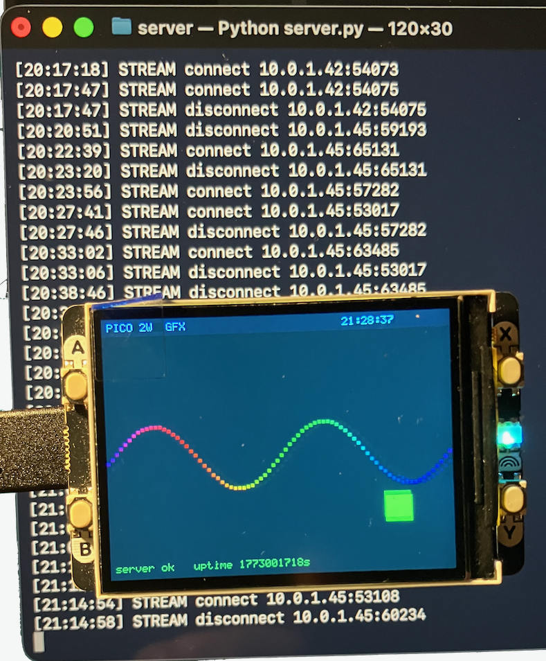

 
## Pico 2W RTOS + GFX Client

A bare-metal, dual-core RTOS on the Raspberry Pi Pico 2W (RP2350) that streams
animated graphics from a Python server on a Mac/PC/Linux over WiFi and renders
them on a 320 x 240 ST7789V2 display in real time.


### Overview

```
Mac (Python server)                    Pico 2W (RP2350)
--------------------                   ----------------------------------------
server.py                              Core 0 - preemptive RTOS
  generates GFX commands   --TCP-->    net_task (prio 3)
  pushes at 30 fps                       v double-buffer
  port 8081                            Core 1 - display loop
                                         render_gfx() -> DMA blit -> ST7789V2
```


### Hardware

| Component | Detail |
|-----------|--------|
| MCU | RP2350 (Cortex-M33, 150 MHz, dual-core) |
| Board | Raspberry Pi Pico 2W |
| WiFi | CYW43439 on-chip (via CYW43 driver) |
| Display | 320 x 240 ST7789V2, SPI0 at 62.5 MHz |


### Software architecture

#### Core 0 - RTOS

A custom preemptive RTOS runs four tasks on Core 0, scheduled with a 1 ms
SysTick interrupt and PendSV context switch (Cortex-M33 hardware-stacked frames,
callee-saved R4-R11 saved manually).

| Task | Priority | Role |
|------|----------|------|
| `net_task` | 3 (highest) | TCP stream client, fills GFX buffer |
| `led_task` | 2 | LED blink demo |
| `counter_task` | 1 | Counter demo |
| `idle_task` | 0 | `WFI` power gate |

`net_task` calls `task_delay(1)` between polls so lower-priority tasks always
get at least 1 ms per cycle, while still polling the network ~1000 times/second.

#### Core 1 - display

Core 1 runs independently of the RTOS. It loops continuously:

1. If a new GFX frame is available -> call `render_gfx()` -> DMA blit.
2. If no GFX data yet -> render the RTOS scheduler visualiser (task cards + scrolling timeline).

There is no sleep in the display loop; the ~20 ms DMA blit at 62.5 MHz
naturally rate-limits it to ~50 fps.


### Networking

Networking is the core of the project. The Pico connects to a regular home WiFi
network type, and maintains a *persistent TCP stream* to a Mac/PC/Linux as server.
The server pushes complete frames continuously; the Pico consumes the latest frame available.

#### Stack

```
Application (net_task)
      |
   lwIP raw TCP API  (NO_SYS=1, poll mode)
      |
   CYW43 driver  (pico_cyw43_arch_lwip_poll)
      |
   CYW43439 WiFi chip  (PIO SPI, on-chip Pico 2W)
      |
   802.11  -->  home router  -->  Mac/PC/Linux server
```

`pico_cyw43_arch_lwip_poll` is used: there are *no background threads or
interrupts* for networking. The entire WiFi + lwIP stack is driven by explicit
`cyw43_arch_poll()` calls inside `net_stream_poll()`, which is called from
`net_task` ~1000 times/second.

#### Connection lifecycle

```c
// 1. Initialise WiFi (called from main(), before RTOS starts)
net_init();   // cyw43_arch_init() + connect to SSID

// 2. net_task: open persistent TCP stream to server:8081
net_stream_connect();

// 3. net_task main loop
while (1) {
    int len = net_stream_poll(buf, BUF_SIZE);  // drives cyw43_arch_poll()
    if (len > 0) render(buf);                  // complete frame received
    task_delay(1);                             // yield 1 ms
}
```

*`net_stream_connect()`* creates a lwIP TCP PCB, registers `recv_cb` and
`err_cb`, calls `tcp_connect()`, then spins calling `cyw43_arch_poll()` until
`connected_cb` sets the state to `SS_CONNECTED` (or times out after 5 s).

*`net_stream_poll()`* calls `cyw43_arch_poll()` which drives lwIP. Any
incoming TCP data triggers `recv_cb`, which appends raw bytes to a 16 KB ring
buffer and calls `tcp_recved()` to keep the TCP window open.

#### Frame framing and ring buffer

The server sends a continuous byte stream. Individual GFX frames are delimited
by the 7-byte ASCII sequence *`\nFRAME\n`*.

```
...TEXT 4 226 33BB55 server ok\nFRAME\nCLEAR 001428\nRECT 0 0 320 16...
                     ---------
                     end-of-frame marker
```

`net_stream_poll()` scans the ring buffer for the *rightmost* occurrence of
`\nFRAME\n` so the display always gets the newest available frame, never an
old one. Once found it extracts the frame body and advances `s_ring_rd`.

```
ring:  [old partial][  frame N-1  ][  frame N  \nFRAME\n][partial N+1...]
                                    |- frame_start       |- frame_end
                                    +-- body returned ---+
```

Ring buffer indices (`s_ring_wr`, `s_ring_rd`) grow monotonically as `size_t`;
wrapping into the 16 KB array is handled by `i % RING_SIZE`. No locking is
needed because `recv_cb` and `net_stream_poll()` both run on Core 0 inside
`cyw43_arch_poll()`.

#### Double-buffering to Core 1

Two 8 KB command string buffers are shared between Core 0 and Core 1:

```c
char         g_gfx_buf[2][8192];   // ping-pong buffers
volatile int g_gfx_write_idx;      // index of the slot net_task just finished
```

`net_task` writes into the *inactive* slot (`1 - g_gfx_write_idx`), issues a
data-memory-barrier (`__dmb()`), then atomically updates `g_gfx_write_idx`.
Core 1 reads `g_gfx_write_idx` once per display tick, also behind a `__dmb()`,
and renders whichever slot is newest. No mutex is required.

#### GFX protocol

Commands are plain ASCII, one per line, UTF-8:

| Command | Syntax | Action |
|---------|--------|--------|
| `CLEAR` | `CLEAR RRGGBB` | Fill screen with colour |
| `RECT` | `RECT x y w h RRGGBB` | Filled rectangle |
| `TEXT` | `TEXT x y RRGGBB message` | Draw string |
| `NOP` | `NOP` | No-op / keep-alive |

Colours are 6-digit RGB888 hex. The Pico converts them to RGB565 and
byte-swaps for SPI DMA:

```c
uint16_t parse_color(const char *hex6) {
    // strtoul -> r, g, b
    uint16_t c = fb_rgb(r, g, b);      // pack to RGB565
    return __builtin_bswap16(c);       // swap for SPI little-endian DMA
}
```

The byte-swap is necessary because the RP2350 DMA sends the low byte of each
`uint16_t` first, but the ST7789V2 expects the high byte first over SPI.

#### Python server (`server/server.py`)

The server runs two listeners:

| Port | Protocol | Role |
|------|----------|------|
| 8080 | HTTP GET `/next` | Single-frame polling fallback |
| 8081 | Persistent TCP | Streaming at `TARGET_FPS = 30` |

Each connected client gets its own thread. The thread loops at 30 fps:

```python
while True:
    data = ("\n".join(generate_frame()) + "\nFRAME\n").encode()
    conn.sendall(data)
    time.sleep(max(0, interval - elapsed))
```

`generate_frame()` produces a dark background, a header bar, a bouncing ball
with HSV colour cycling, a scrolling sine-wave, and a status line - roughly
2 KB of ASCII per frame.


### Key configuration (`config.h`)

```c
#define WIFI_SSID        "your-network"
#define WIFI_PASSWORD    "your-password"
#define SERVER_HOST      "10.0.1.42"   // Mac IP on the same network
#define STREAM_PORT      8081
#define NET_TIMEOUT_MS   5000          // TCP connect timeout
```


### Build

```bash
# Configure (first time only)
mkdir build && cd build
~/.pico-sdk/cmake/v3.31.5/CMake.app/Contents/bin/cmake .. \
    -DPICO_BOARD=pico2_w \
    -DPICO_SDK_PATH=~/.pico-sdk/sdk/2.2.0 \
    -DCMAKE_MAKE_PROGRAM=~/.pico-sdk/ninja/v1.12.1/ninja \
    -G Ninja

# Build
~/.pico-sdk/cmake/v3.31.5/CMake.app/Contents/bin/cmake --build build

# Flash (Pico must be in BOOTSEL mode -> mounts as /Volumes/RP2350)
cp build/rtos.uf2 /Volumes/RP2350/
```

Start the server:

```bash
python3 server/server.py
```


### Lessons learned

- *`pico_cyw43_arch_lwip_poll` requires explicit polling.* Call
  `cyw43_arch_poll()` frequently (we do it inside `net_stream_poll()` on every
  net_task iteration). If it is not called, TCP data never arrives at the
  application.

- *lwIP callbacks run synchronously inside `cyw43_arch_poll()`.* No mutexes
  are needed between `recv_cb` and the code that reads the ring buffer, as long
  as both run on the same core.

- *Frame marker search off-by-one.* The backward scan for the _previous_
  frame marker must start at `frame_end - MLEN - 1`, not `frame_end - MLEN`.
  Starting at `frame_end - MLEN` immediately re-matches the marker just found,
  which sets `frame_start = frame_end` and produces `body_len = 0` - frames
  are silently discarded.

- *High-priority tight loops starve the scheduler.* A `task_yield()` in the
  highest-priority task re-selects the same task immediately. Use
  `task_delay(1)` to give lower-priority tasks at least 1 ms per cycle.

- *Display sleep and DMA overlap.* `sleep_ms(33)` stacked on top of the
  ~39 ms DMA blit gave ~14 fps. Removing the sleep and increasing SPI from
  31.25 MHz to 62.5 MHz gave ~50 fps headroom, matching the 30 fps server rate.




