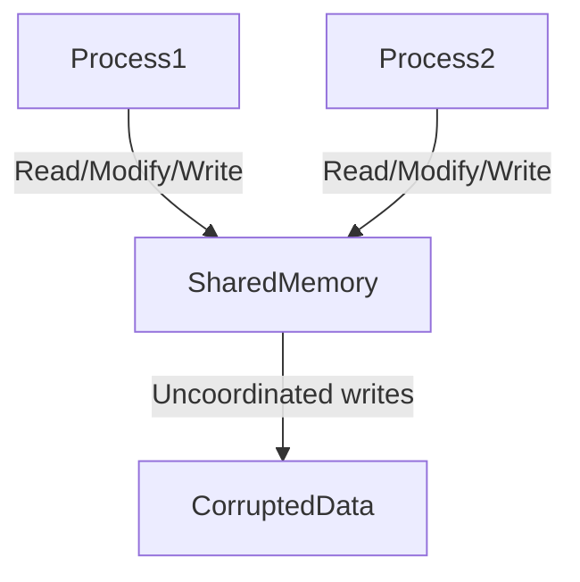
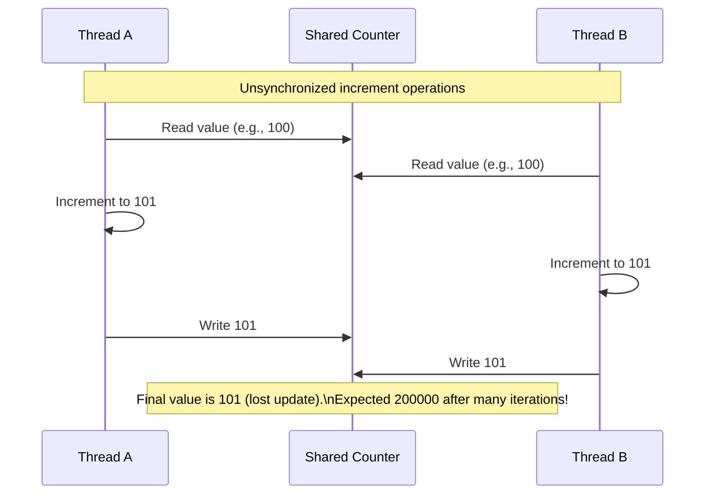
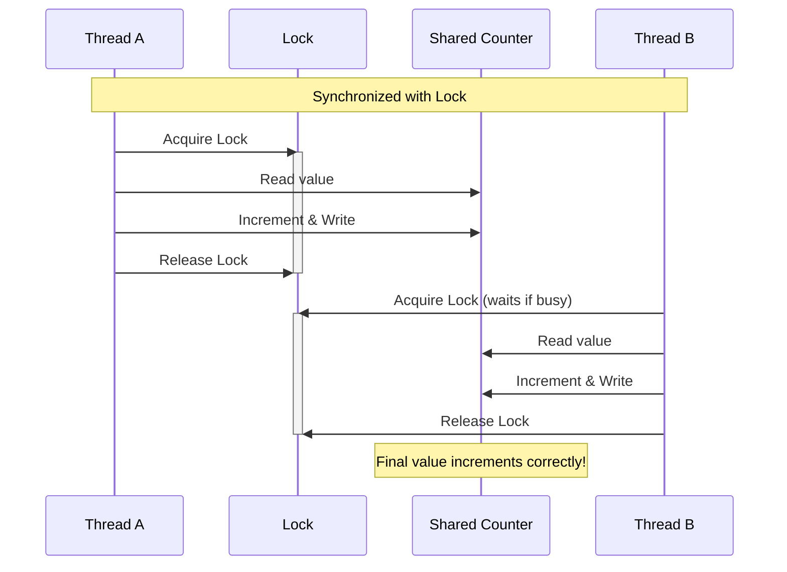
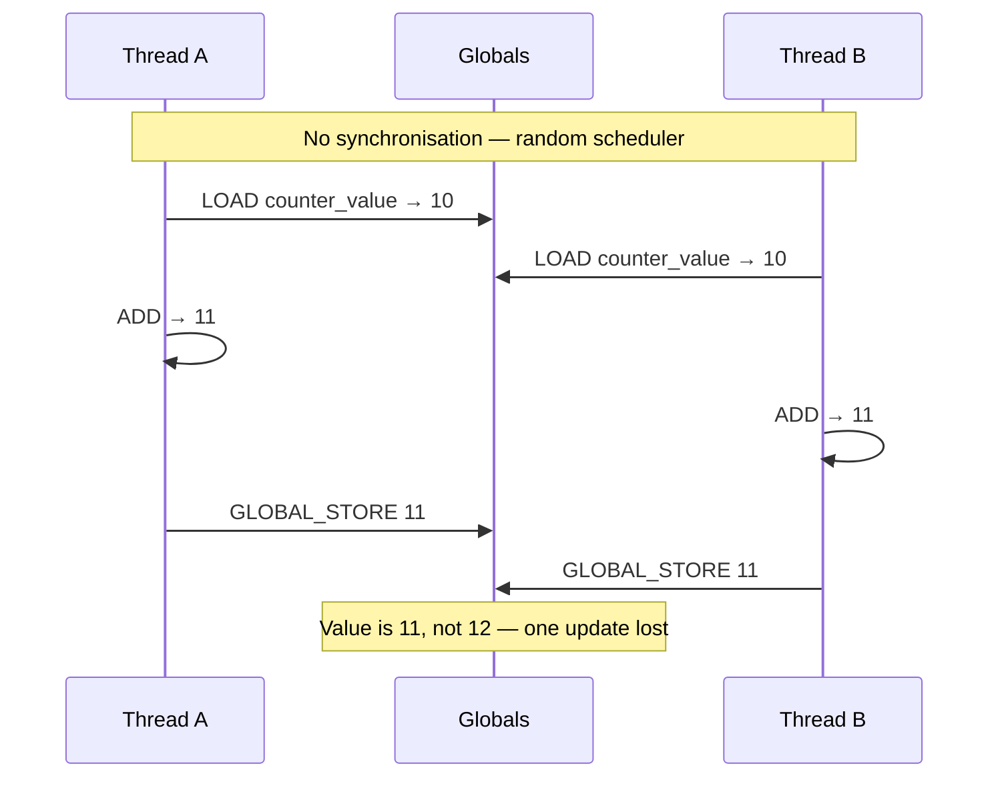
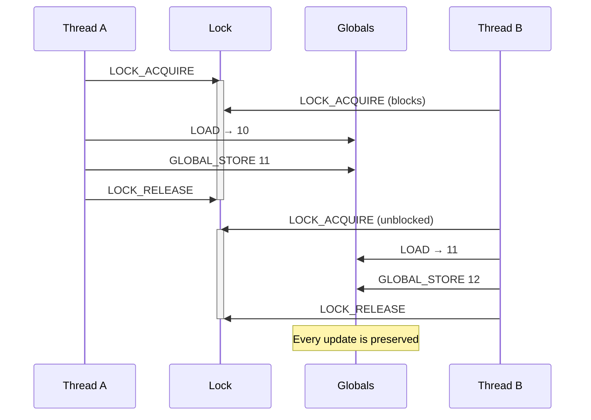
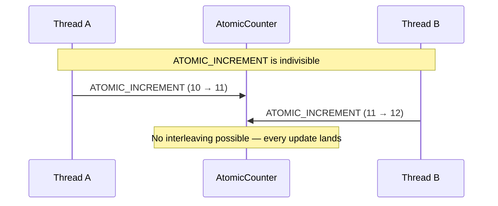

## Race Conditions

A race condition arises when multiple threads or processes access and modify a shared resource
simultaneously, leading to unpredictable results. The core issue is the non-atomic nature of
operations: even simple actions like incrementing a counter involve multiple steps (read, modify, write),
and if these steps are interrupted by another thread or process, data corruption occurs. This problem
is especially insidious in shared memory environments, where threads or processes directly manipulate
the same memory space.

To illustrate, consider a Python program using *threads* to increment a shared counter. Here, threads
share *the same memory* by default:

```python
import threading

counter = 0  # Shared variable in memory

def increment():
    global counter
    for _ in range(100000):
        temp = counter  # Read
        temp += 1       # Modify
        counter = temp  # Write

# Launch two threads
thread1 = threading.Thread(target=increment)
thread2 = threading.Thread(target=increment)
thread1.start()
thread2.start()
thread1.join()
thread2.join()

print(f"Expected 200000, got {counter}")  # Outputs less than 200000
```

When two threads read the counter simultaneously (e.g., both read `100`), they increment
their local copies to `101` and both write back `101`, losing one increment. Over thousands
of iterations, this discrepancy compounds, resulting in a final value smaller than expected.




#### Shared Memory in Processes

Now, let's extend this to *shared memory in processes*. Unlike threads, processes have separate
memory spaces by default. To share data, we use explicit shared memory objects like `multiprocessing.Value`.
Even here, race conditions persist without synchronisation:

```python
import multiprocessing

def increment(shared_counter):
    for _ in range(100000):
        # Read-modify-write is not atomic
        shared_counter.value += 1

if __name__ == "__main__":
    shared_counter = multiprocessing.Value('i', 0)  # Shared integer
    process1 = multiprocessing.Process(target=increment, args=(shared_counter,))
    process2 = multiprocessing.Process(target=increment, args=(shared_counter,))
    process1.start()
    process2.start()
    process1.join()
    process2.join()
    print(f"Expected 200000, got {shared_counter.value}")  # Incorrect result
```

Despite using shared memory across processes, the same problem occurs: overlapping read-modify-write
operations corrupt the value. The shared memory allows processes to interact with the same data,
but without coordination, the result is still wrong.




#### Fixing the Race Condition

The solution is to enforce atomicity using synchronisation primitives. For threads, a `threading.Lock`
ensures only one thread enters the critical section at a time:

```python
def increment():
    global counter
    for _ in range(100000):
        with threading.Lock():  # Acquire lock
            counter += 1
```

For processes with shared memory, we use `multiprocessing.Lock`:

```python
def increment(shared_counter, lock):
    for _ in range(100000):
        with lock:  # Acquire process-safe lock
            shared_counter.value += 1

if __name__ == "__main__":
    shared_counter = multiprocessing.Value('i', 0)
    lock = multiprocessing.Lock()  # Process-specific lock
    process1 = multiprocessing.Process(target=increment, args=(shared_counter, lock))
    process2 = multiprocessing.Process(target=increment, args=(shared_counter, lock))
    # ... rest of code
```

In both cases, the lock acts as a gatekeeper, ensuring that only one thread or process can execute
the critical section (the increment operation) at any time. This restores the expected result of `200000`.




### Observations

Race conditions are not limited to counters or threads. They appear in file operations, database transactions,
and distributed systems--anywhere shared resources are accessed concurrently. The unpredictability stems
from the timing of operations, which is influenced by system load, scheduling, and even slight code changes
(e.g., adding a `print` statement might mask the bug). Debugging such issues is challenging because they
may not reproduce consistently.

Shared memory amplifies these risks because it allows direct interaction between concurrent entities
(threads/processes). While threads inherently share memory, processes require explicit mechanisms
(like `multiprocessing.Value`), but the core problem remains: without synchronisation, concurrent modifications
corrupt data. Tools like locks, semaphores, or atomic operations (e.g., `queue.Queue` for thread-safe data exchange)
are essential to avoid these pitfalls.


### Demonstrating Race Conditions at the Instruction Level with ToyVM

The Python examples above illustrate race conditions at the language level, but the problem actually
originates one layer deeper: in the individual machine instructions that a high-level statement compiles
down to. To make this concrete, `vm.py` implements a simple stack-based virtual machine — **ToyVM** —
with its own scheduler, threads, global memory, and synchronisation primitives. `race_examples.py` then
runs the same counter experiment directly in ToyVM bytecode, exposing the race at the instruction level
rather than relying on Python's GIL behaviour.

#### The ToyVM

ToyVM executes sequences of named opcodes (tuples like `("LOAD", "counter_value")`) across multiple
cooperative `Thread` objects. A configurable scheduler — round-robin, priority, or random — picks which
thread runs each step. Because every opcode is a discrete, interruptible step, the scheduler can switch
between threads at *any* point, including between the `LOAD`, `ADD`, and `GLOBAL_STORE` that together
form a single counter increment. This makes the race condition not just probable but fully observable and
reproducible.

The VM provides four synchronisation primitives out of the box:

| Primitive | Opcodes | Purpose |
|---|---|---|
| `Lock` | `LOCK_CREATE`, `LOCK_ACQUIRE`, `LOCK_RELEASE` | Mutual exclusion (mutex) |
| `Semaphore` | `SEMAPHORE_CREATE`, `SEMAPHORE_ACQUIRE`, `SEMAPHORE_RELEASE` | Counting semaphore |
| `MessageQueue` | `QUEUE_CREATE`, `QUEUE_SEND`, `QUEUE_RECEIVE` | Thread-safe message passing |
| `AtomicCounter` | `ATOMIC_CREATE`, `ATOMIC_INCREMENT`, `ATOMIC_DECREMENT`, `ATOMIC_GET` | Indivisible integer operations |


#### Example 1 — The Race at Bytecode Level

Two ToyVM threads share a global `counter_value`, each incrementing it 20 times. The increment is
three separate opcodes, so the scheduler can interleave them:

```
PC 6   LOAD  counter_value    ← thread A reads 10
                               ← scheduler switches to thread B
PC 6   LOAD  counter_value    ← thread B also reads 10
PC 7   PUSH  1
PC 8   ADD                    ← thread B computes 11
PC 9   GLOBAL_STORE ...       ← thread B writes 11
                               ← scheduler switches back to thread A
PC 7   PUSH  1
PC 8   ADD                    ← thread A computes 11 (stale read!)
PC 9   GLOBAL_STORE ...       ← thread A overwrites 11 — one update lost
```

With a random scheduler this manifests reliably:

```
Final counter value: 35        ← expected 40; 5 updates were lost
WRONG  — race condition! Expected 40, got less.
```




#### Example 2 — Fixed with LOCK

Wrapping the critical section in `LOCK_ACQUIRE` / `LOCK_RELEASE` ensures only one thread can
execute the read-modify-write at a time. The other thread blocks at `LOCK_ACQUIRE` until the lock
is released:

```python
# Worker bytecode (abbreviated)
("LOAD", "the_lock"),
("LOCK_ACQUIRE",),           # blocks if another thread holds the lock
("LOAD", "counter_value"),   # ← critical section: safe
("PUSH", 1),
("ADD",),
("GLOBAL_STORE", "counter_value"),
("LOAD", "the_lock"),
("LOCK_RELEASE",),           # wakes the next waiting thread
```

```
Final counter value: 40
CORRECT — mutex prevented the race condition!
```




#### Example 3 — Fixed with SEMAPHORE(1)

A semaphore initialised with a count of `1` behaves identically to a mutex for this use-case.
`SEMAPHORE_ACQUIRE` decrements the count (blocking if it reaches zero); `SEMAPHORE_RELEASE`
increments it and wakes the next waiting thread:

```python
# Main thread setup
("PUSH", 1),
("SEMAPHORE_CREATE",),       # count = 1  →  only one thread may proceed at a time
("DUP",),
("GLOBAL_STORE", "the_sem"),

# Worker bytecode (abbreviated)
("LOAD", "the_sem"),
("SEMAPHORE_ACQUIRE",),
("LOAD", "counter_value"),
("PUSH", 1),
("ADD",),
("GLOBAL_STORE", "counter_value"),
("LOAD", "the_sem"),
("SEMAPHORE_RELEASE",),
```

```
Final counter value: 40
CORRECT — semaphore(1) prevented the race condition!
```

A semaphore with count > 1 would allow that many threads to enter the critical section
simultaneously — useful for rate-limiting access to a pool of resources rather than enforcing
strict mutual exclusion.


#### Example 4 — Fixed with ATOMIC_INCREMENT

The cleanest solution is to replace the three-opcode sequence with a single `ATOMIC_INCREMENT`
instruction. Because the VM treats this as one indivisible step, the scheduler cannot interleave
it with anything:

```python
# Worker bytecode — no lock needed
("LOAD", "the_atomic"),
("ATOMIC_INCREMENT",),       # read + increment + write in one uninterruptible step
("POP",),                    # discard the returned new value
```

```
Final counter value: 40
CORRECT — ATOMIC_INCREMENT prevented the race condition!
```



This mirrors language-level atomics (`std::atomic` in C++, `Interlocked` in .NET, or
`threading.local` combined with queue-based patterns in Python) where the hardware or runtime
guarantees that the operation completes without interruption.


#### Choosing the Right Primitive

| Situation | Recommended primitive |
|---|---|
| Protect a short critical section (one writer at a time) | `Lock` or `Semaphore(1)` |
| Limit concurrent access to N resources | `Semaphore(N)` |
| Single integer that many threads increment/decrement | `AtomicCounter` |
| Pass data between threads without shared state | `MessageQueue` |

The ToyVM examples make one thing especially clear: a race condition is not a Python quirk or an
OS scheduling detail — it is a consequence of any system where multi-step operations on shared state
can be interrupted between steps. The fix is always the same in principle: either make the operation
truly indivisible (atomic), or use a synchronisation primitive to enforce that only one actor performs
it at a time.
