## Object-Oriented Languages

We will use Java to illustrate key object-oriented (OO) principles.
Java exemplifies a class-based approach to OO design, in contrast
to prototype-based systems such as JavaScript. The example presented
here is not intended to demonstrate how expression parsing should be
implemented (in Java or any other language). Rather, it highlights
foundational OO concepts, including inheritance, polymorphism, and
object instantiation. For comparison, a more modern yet conceptually
equivalent implementation is also provided in Python.

Because Java code is generally explicit and structured, our emphasis
will be on how the language is applied rather than how it is internally
implemented. Readers interested in lower-level mechanics may consult
the accompanying section outlining a simplified approach to
[JVM](./../../sec7.5/jvm/) construction.

The historical transition from the procedural dominance of the mid-20th
century to the widespread adoption of object-oriented programming in 
he 1990s marks one of the most influential paradigm shifts in computing.
This evolution reflects a change in perspective: from viewing programs
primarily as *sequences of instructions* to understanding them as *models
of interacting entities*. Object orientation encourages developers to 
structure systems around behaviour, state, and collaboration, providing
abstractions that better align with how complex domains are conceptualised.

### The Genesis: Simula 67 (1967)

While many credit the 80s for OO, the architectural DNA was written
in the late 60s at the Norwegian Computing Center by
*Ole-Johan Dahl and Kristen Nygaard*.

* *The Problem:* They were building simulations (like ship movements
  or queueing systems). Procedural languages (ALGOL 60) struggled to
  represent "entities" that had both state and behavior.
* *The Breakthrough:* They introduced the *Class* and the *Object*.
  In Simula, you didn't just have data; you had "processes" that
  could be instantiated.
* *Legacy:* Simula introduced *inheritance* and *virtual procedures*.
  However, it was still syntactically an extension of ALGOL,
  making it "OO within a procedural shell."

### The Pure Vision: Smalltalk (1970s)

If Simula invented the "class," *Alan Kay, Dan Ingalls, and Adele Goldberg*
at Xerox PARC invented the "philosophy."

* *The Biological Metaphor:* Kay viewed objects not as data structures,
  but as *biological cells* communicating via chemical signals.
  This led to the concept of *Message Passing*.
* *"Everything is an Object":* Unlike Simula, Smalltalk-80 was recursive.
  An integer was an object. A class was an object. The compiler was an object.
* *The Environment:* Smalltalk wasn't just a language; it was a graphical
  operating system (the precursor to the Mac and Windows GUI). It introduced
  the *MVC (Model-View-Controller)* pattern,
  which remains the standard for UI development today.

### The Hybrid Bridge: C with Classes & C++ (1980s)

By the early 80s, the industry was locked into C for performance.
Smalltalk was seen as "magical but slow." *Bjarne Stroustrup* at
Bell Labs sought to combine the efficiency of C with the
organisational power of Simula.

* *Evolutionary, not Revolutionary:* C++ (originally "C with Classes")
  succeeded because it allowed developers to keep their C code and
  gradually adopt OO features.
* *The Shift:* It brought OO to the "systems level." Suddenly, you could
  write operating systems, drivers, and high-performance graphics using classes.
* *The Trade-off:* C++ introduced significant complexity (multiple inheritance,
  manual memory management), leading to the "bloat" critiques of the 90s.

### The Heydays: The 1990s OO Explosion

The 90s were the era of "Enterprise OO." The software crisis
(projects becoming too large to manage) led the industry to
embrace OO as a silver bullet for *reuse*.

### 1. The Browser & Java (1995)

James Gosling at Sun Microsystems designed Java to be
"C++ without the guns, knives, and clubs."
* It simplified OO (no multiple inheritance, automatic garbage collection).
* The "Write Once, Run Anywhere" mantra made it the darling of the burgeoning internet era.

### 2. The Rise of Design Patterns (1994)

The publication of *Design Patterns: Elements of Reusable Object-Oriented Software*
by the *"Gang of Four" (GoF)* marked the peak of OO maturity. It provided a shared
vocabulary (Singleton, Factory, Observer) that allowed developers to discuss
architecture abstractly.

### 3. Visual Basic & Delphi

On the desktop, the 90s saw "Rapid Application Development" (RAD). Languages like
Delphi (Object Pascal) and Visual Basic 4.0 made "dragging and dropping" objects
onto a form a standard way to build software. The visuals of objects here came
very close to the conceptual, even though it might not always hold as a parallel.

### The "Peak" and the Critique

By the late 90s, OO became so dominant that it bordered on dogma. This led to:
* *Deep Inheritance Hells:* Programmers created 10-level deep hierarchies
  that were impossible to debug.
* *The "Banana/Gorilla" Problem:* (As Joe Armstrong famously said):
  "You wanted a banana but what you got was a gorilla holding the
  banana and the entire jungle."[^banana]

[^banana]: The "banana" quote illustrates how tight coupling in object-oriented programming forces you to inherit a massive web of dependencies just to access a small piece of functionality. Instead of getting a self-contained component (the banana), you are burdened with its entire hierarchical lineage (the gorilla) and every environmental resource it touches (the jungle).

This saturation paved the way for the *Functional Programming* resurgence we see today,
where "Composition over Inheritance" has become the new guiding light.

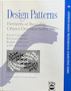
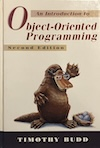
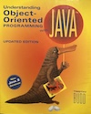
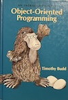
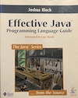
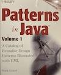
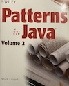
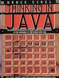
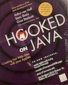
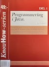
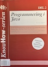
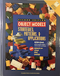
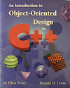
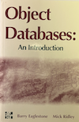

