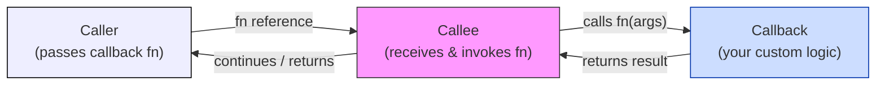

## Callback

A *callback* is a function passed as an argument to another function, which
is then invoked ("called back") at a specific time or after a particular
operation completes. Callbacks enable *asynchronous behaviour*, *event-driven programming*,
and *customisable logic* without modifying the original function. They
are widely used for handling I/O operations, events, or asynchronous tasks.

Historically, callbacks originated in low-level systems programming and
early event-driven models, where they were used to defer execution or handle
asynchronous events--such as interrupts in C or function pointers in procedural
APIs. These early callbacks were manual and error-prone, often lacking type
safety or structured error handling. As programming paradigms evolved,
particularly with object-oriented and functional languages, callbacks
became more formalised through constructs like interfaces, delegates, and lambdas.

Today, in modern environments like JavaScript, Python, and asynchronous frameworks,
callbacks are integrated into promises, async/await syntax, and reactive streams,
offering more composable, readable, and error-resilient approaches to asynchronous
and event-driven programming.

*Purpose*:
  - *Inversion of Control*: Let the callee decide when to execute your code.
  - *Asynchrony*: Continue execution without blocking (e.g., waiting for a
    file read to finish).
  - *Reusability*: Decouple logic (e.g., a sorting algorithm letting you define
    how to compare items).

*Use Cases*: Event handling, asynchronous operations (HTTP requests, timers),
and customising library/framework behaviour.


### Callbacks in C

C implements callbacks using *function pointers*, as it lacks built-in support
for closures or objects.

*Example 1: Custom Sort (ascending and descending)*

The same `custom_sort` function can sort in either direction simply by swapping the callback.
No changes to the sorting logic are needed--only the comparison strategy changes.

```c
#include <stdio.h>
#include <stdlib.h>

int ascending(const void* a, const void* b) {
    return (*(int*)a - *(int*)b);
}

int descending(const void* a, const void* b) {
    return (*(int*)b - *(int*)a);
}

void custom_sort(int* arr, size_t count, int (*cmp)(const void*, const void*)) {
    for (size_t i = 0; i < count - 1; i++)
        for (size_t j = 0; j < count - i - 1; j++)
            if (cmp(&arr[j], &arr[j + 1]) > 0) {
                int tmp = arr[j]; arr[j] = arr[j+1]; arr[j+1] = tmp;
            }
}
```

*Example 2: `apply_to_each` -- a map-style transform*

A general-purpose iterator that applies any transformation callback to every element
of an array. This separates the "how to walk the array" concern from "what to do with each element".

```c
void apply_to_each(int* arr, size_t count, void (*fn)(int*, size_t)) {
    for (size_t i = 0; i < count; i++)
        fn(&arr[i], i);
}

void double_it(int* val, size_t idx) { *val *= 2; }
void print_it(int* val, size_t idx)  { printf("[%zu] = %d\n", idx, *val); }

int main() {
    int arr[] = {1, 2, 3, 4, 5};
    size_t n = sizeof(arr) / sizeof(arr[0]);
    apply_to_each(arr, n, double_it);   // {2, 4, 6, 8, 10}
    apply_to_each(arr, n, print_it);
    return 0;
}
```

*Example 3: Pipeline -- chaining transforms*

Callbacks can be stored in an array and executed in sequence--a simple pipeline.

```c
typedef void (*transform_fn)(int*, size_t);

void run_pipeline(int* arr, size_t count,
                  transform_fn* pipeline, size_t stages) {
    for (size_t s = 0; s < stages; s++)
        for (size_t i = 0; i < count; i++)
            pipeline[s](&arr[i], i);
}

void add_ten(int* val, size_t idx) { *val += 10; }

int main() {
    int arr[] = {1, 2, 3};
    transform_fn steps[] = { double_it, add_ten, print_it };
    run_pipeline(arr, 3, steps, 3);
    // prints: [0]=12  [1]=14  [2]=16
    return 0;
}
```

*Limitations*:
- No closures: state must be passed via `void*` parameters or global variables.
- Function pointers have strict, fixed signatures.


### Callbacks in Python

Python treats functions as first-class objects, making callbacks natural and clean.

*Example 1: `transform` -- a reusable map/filter helper*

```python
def transform(items, fn):
    return [fn(x) for x in items]

print(transform([1, 2, 3, 4], lambda x: x ** 2))   # [1, 4, 9, 16]
print(transform(["hello", "world"], str.upper))    # ['HELLO', 'WORLD']
```

*Example 2: Retry with a success predicate callback*

A `retry` utility keeps calling an operation until the predicate callback is satisfied
or retries are exhausted. The caller decides what "success" means.

```python
import random

def retry(operation, is_success, max_attempts=5):
    for attempt in range(1, max_attempts + 1):
        result = operation()
        print(f"  attempt {attempt}: got {result}")
        if is_success(result):
            return result
    raise RuntimeError("Max attempts reached")

result = retry(
    operation=lambda: random.randint(1, 6),
    is_success=lambda x: x == 6          # "succeed" only on a 6
)
print(f"Rolled a 6! result={result}")
```

*Example 3: Event bus (publish/subscribe)*

A minimal event system built entirely on callbacks--any code can subscribe to
named events without the publisher knowing who's listening.

```python
class EventBus:
    def __init__(self):
        self._handlers = {}

    def on(self, event, callback):
        self._handlers.setdefault(event, []).append(callback)

    def emit(self, event, *args, **kwargs):
        for handler in self._handlers.get(event, []):
            handler(*args, **kwargs)

bus = EventBus()
bus.on("login",  lambda user: print(f"Welcome, {user}!"))
bus.on("login",  lambda user: print(f"Logging login for {user}"))
bus.on("logout", lambda user: print(f"Goodbye, {user}"))

bus.emit("login",  "Alice")
bus.emit("logout", "Alice")
```

*Example 4: Middleware chain*

Callbacks can be arranged as middleware--each step receives the request and a `next`
callback it must call to continue the chain. This mirrors frameworks like Flask or
Express.

```python
def logger(request, next_fn):
    print(f"[LOG] handling: {request}")
    return next_fn(request)

def auth(request, next_fn):
    if request.get("user") != "admin":
        return {"error": "Forbidden"}
    return next_fn(request)

def handler(request, _next):
    return {"status": "OK", "data": "secret payload"}

def run_middleware(request, middlewares, final):
    def build(index):
        if index == len(middlewares):
            return lambda req: final(req, None)
        return lambda req: middlewares[index](req, build(index + 1))
    return build(0)(request)

response = run_middleware(
    {"user": "admin", "path": "/data"},
    [logger, auth],
    handler
)
print(response)  # {'status': 'OK', 'data': 'secret payload'}
```

*Note*: Python increasingly favours coroutines (via `async/await`) over raw callbacks for async code,
but the callback pattern remains widely used for synchronous customisation and event systems.


### Callbacks in JavaScript (pure HTML + JS)

JavaScript uses callbacks extensively for asynchronous operations and event handling due
to its single-threaded, non-blocking nature. The examples below all run in a plain HTML
file--no build step needed.

*Example 1: `once` -- a callback that fires only on the first event*

```html
<button id="btn">Click me (once only)</button>
<script>
  function once(fn) {
    let called = false;
    return function(...args) {
      if (!called) { called = true; fn(...args); }
    };
  }

  const btn = document.getElementById("btn");
  btn.addEventListener("click", once(() => {
    btn.textContent = "Already clicked!";
    btn.disabled = true;
  }));
</script>
```

*Example 2: `debounce` -- delay a callback until input settles*

Wraps any callback so it only fires after the user stops triggering events for a given delay.
Useful for search inputs, resize handlers, etc.

```html
<input id="search" placeholder="Type to search .." />
<p id="result"></p>
<script>
  function debounce(fn, delay) {
    let timer;
    return function(...args) {
      clearTimeout(timer);
      timer = setTimeout(() => fn(...args), delay);
    };
  }

  const output = document.getElementById("result");
  document.getElementById("search").addEventListener(
    "input",
    debounce(e => { output.textContent = `Searching for: "${e.target.value}"`; }, 400)
  );
</script>
```

*Example 3: `pipeline` -- transform a value through a chain of callbacks*

Each function in the array receives the result of the previous one. The callback array
acts as a declarative recipe.

```html
<script>
  const pipeline = (...fns) => x => fns.reduce((v, f) => f(v), x);

  const process = pipeline(
    x  => x.trim(),
    x  => x.toLowerCase(),
    x  => x.replace(/\s+/g, "-"),
    x  => `https://example.com/${x}`
  );

  console.log(process("  Hello World  "));
  // → "https://example.com/hello-world"
</script>
```

*Example 4: `fetchWithRetry` -- async callbacks and Promises*

A `fetchWithRetry` utility accepts a `shouldRetry` callback so the caller can decide
which failures are worth retrying.

```javascript
async function fetchWithRetry(url, options = {}, shouldRetry, maxRetries = 3) {
  for (let attempt = 1; attempt <= maxRetries; attempt++) {
    try {
      const res = await fetch(url, options);
      if (!res.ok && shouldRetry(res, attempt)) {
        console.warn(`Attempt ${attempt} failed (${res.status}), retrying..`);
        continue;
      }
      return res;
    } catch (err) {
      if (attempt === maxRetries) throw err;
    }
  }
}

// Usage: only retry on 5xx errors
fetchWithRetry(
  "https://api.example.com/data",
  {},
  (res, attempt) => res.status >= 500 && attempt < 3
);
```

*Challenges*: Nested callbacks can lead to "callback hell" (deeply nested, hard-to-read code).
Modern solutions like Promises and `async/await` mitigate this.


### Visualising the Pattern

The core shape is always the same regardless of language:



The callee never needs to know *what* the callback does--it only needs to know *when* and *how* to call it.
This is the essence of inversion of control.


### Takeaways

- *C*: Callbacks via function pointers. Powerful but verbose; no closures, strict signatures.
  Seen in `qsort`, GTK, and virtually every C library that needs user-supplied logic.
- *Python*: First-class functions make callbacks terse and readable. Used in GUI frameworks,
  threading, event systems, and middleware. Newer async code prefers coroutines, but
  callbacks remain the right tool for synchronous customisation.
- *JavaScript*: Callbacks are foundational--every event listener is one. The same pattern
  powers `debounce`, `once`, pipeline composition, and retry logic. Modern async code
  layers Promises and `async/await` on top, but the underlying concept is unchanged.

Callbacks remain a foundational concept for flexible and non-blocking code across programming paradigms.
