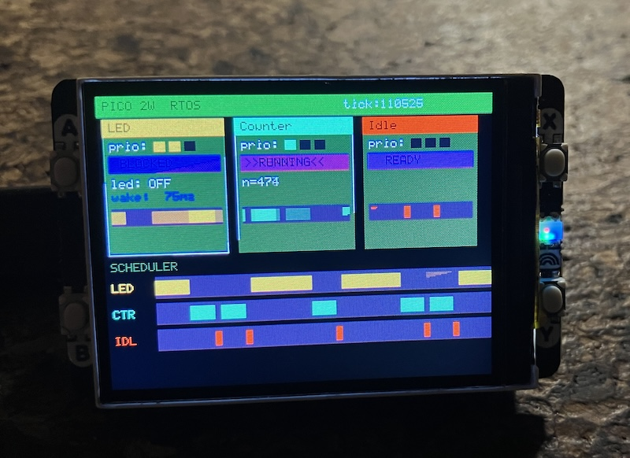

## Pico 2W RTOS Visual Demo

A from-scratch, preemptive Real-Time Operating System running on the
Raspberry Pi Pico 2W (RP2350 / Cortex-M33), with a live visual display
that makes the scheduler's decisions visible in real time.

The goal is *educational*: every RTOS concept--context switching, priority
preemption, task blocking, and round-robin scheduling--can be watched
happening on screen rather than inferred from blinking LEDs or serial
logs.


### What You See on the Display



*Top — Task cards (one per task):*
- Name bar in the task's accent colour
- Priority dots (filled = has that priority level)
- State badge: `>>RUNNING<<` (green), `READY` (yellow), `BLOCKED` (orange)
- Live data: LED on/off, counter value, or WFI indicator
- Wake countdown in ms when the task is blocked
- Mini activity bar — last ~350 ms of execution history

*Bottom — Scheduler timeline:*
- Three rows, one per task, scrolling left continuously
- Coloured pixel = that task owned the CPU at that moment
- Dark gap = task was not running (blocked or preempted)
- Window: 280 samples × 4 ms/sample = *1120 ms of history*


### What Is an RTOS?

A conventional program runs one thing at a time, top to bottom.
A *Real-Time Operating System* gives the illusion — and sometimes the
reality — of multiple things running simultaneously on a single CPU by
switching between them fast enough that each appears continuous.

The key properties this demo illustrates:


#### Priority-based preemption

Each task has a numeric priority. When a higher-priority task becomes
ready to run, it immediately displaces whatever is currently running.
You can watch this on the timeline: the LED row pushes the Counter row
dark the moment the LED task wakes up.


#### Context switching

Switching between tasks requires saving the complete CPU state (all
registers) of the task being paused and restoring the state of the task
being resumed — so each task continues exactly where it left off, with
its own stack and registers, unaware anything happened.

On Cortex-M33, a hardware interrupt called *PendSV* (Pendable Service
Call) is used for this. The CPU automatically saves `R0–R3`, `R12`,
`LR`, `PC`, and `xPSR` on the stack when the interrupt fires. The RTOS
handler manually saves and restores `R4–R11`, the remaining
callee-saved registers.


#### SysTick — the heartbeat

The *SysTick* peripheral fires an interrupt every 1 ms. This is the
RTOS's heartbeat: it increments the tick counter, checks whether any
sleeping task's wake-up time has arrived, and then pends PendSV to
trigger a possible context switch.


#### Task states

```
        task_create()
              │
              v
          [ READY ] <-----------------------------------------+
              │                                               │
   PendSV selects this task                         SysTick wakes task
              │                                    (tick_count ≥ wake_time)
              v                                               │
          [RUNNING] ---- task_delay(ms) ----> [ BLOCKED ]-----+
              │
         task_yield()
    (pends PendSV, may stay
     RUNNING if highest prio)
```

#### The idle task

When no other task is ready, the idle task runs. It executes the
`WFI` (Wait For Interrupt) instruction, which halts the CPU clock until
the next SysTick fires--saving power rather than spinning.


### Demo Tasks

All three tasks run on Core 0 under the RTOS scheduler.

| Task    | Priority | Behaviour |
|---------|----------|-----------|
| LED     | 2 (high) | Holds the CPU actively for 200 ms (`active_ms`), then blocks for 200 ms, then active 200 ms again, then blocks 100 ms. Toggles `g_led_on` each cycle. |
| Counter | 1 (med)  | Increments `g_count`, holds the CPU for 80 ms, blocks for 20 ms. Repeats every 100 ms. |
| Idle    | 0 (low)  | Executes `WFI` forever. Runs only when both higher-priority tasks are blocked. |

#### `active_ms(ms)` — the key concept

Instead of sleeping (`task_delay`), tasks can *hold* the CPU for a
defined window by yielding on every tick but staying in the READY state:

```c
static void active_ms(uint32_t ms) {
    uint32_t end = tick_count + ms;
    while ((int32_t)(end - tick_count) > 0)
        task_yield();   /* re-schedule each tick, but stay READY */
}
```

A lower-priority task calling `active_ms` will be immediately
preempted the moment a higher-priority task becomes READY.  This makes
the preemption effect clearly visible: the LED (priority 2) pushes the
Counter (priority 1) off the CPU for its entire 200 ms active window,
even if Counter is mid-work.

#### What the timeline reveals

```
time ──────────────────────────────────────────────────────────►

LED  ████████████████████░░░░░░░░░░░░░░░░░░░░░░████████████████
CTR  ░░░░░░░░░░░░░░░░░░░░████░░░░████░░░░████░░░░░░░░░░░░░░░░░░
IDL  ░░░░░░░░░░░░░░░░░░░░░░░░████░░░░████░░░░░░░░░░░░░░░░░░░░░░
     ◄────────────────────────────────────────────────────────►
                           1120 ms window
```

- The *solid LED block* = LED's 200 ms active window; Counter is
  starved despite being READY (preemption in action).
- *Counter and Idle alternate* in the gap where LED is blocked:
  Counter does its 80 ms active + 20 ms blocked, Idle fills the 20 ms.
- The whole pattern scrolls left at 4 ms/pixel, giving a real-time
  feel without being too fast to follow.


### Architecture

```
  Core 0                            Core 1
  ──────────────────────────────    ──────────────────────────────
  rtos_start()                      core1_display_main()
  │                                 │
  ├─ SysTick ISR (every 1 ms)       ├─ display_pack_init()
  │   ├─ tick_count++               │
  │   ├─ record timeline sample     └─ while (1):
  │   ├─ wake blocked tasks              fb_clear()
  │   └─ pend PendSV                     draw header
  │                                      draw 3 task cards
  ├─ PendSV ISR (context switch)         draw timeline
  │   ├─ save R4-R11 to PSP             display_blit_full()
  │   ├─ pendsv_switch()                display_wait_for_dma()
  │   │   └─ select_next_task()         sleep_ms(50)
  │   └─ restore R4-R11 from new PSP
  │
  ├─ led_task     (priority 2)
  ├─ counter_task (priority 1)
  └─ idle_task    (priority 0)
```

Core 0 runs the RTOS entirely. Core 1 owns all SPI and DMA — it never
interacts with the RTOS scheduler and never touches `tasks[]` in a
writing capacity. Shared state (`g_count`, `g_led_on`, `rtos_timeline`,
`tick_count`) is declared `volatile`; on RP2350's shared SRAM this is
sufficient for simple flag-style sharing between cores.


### RTOS API

```c
/* Lifecycle */
void rtos_init(void);
void rtos_start(void);                           /* never returns */

/* Tasks */
void task_create(task_function_t fn,
                 const char *name,
                 task_priority_t priority,       /* 0 = lowest */
                 void *param);
void task_yield(void);                           /* stay READY, reschedule */
void task_delay(uint32_t ms);                    /* block for N milliseconds */

/* Synchronisation */
void rtos_mutex_init(rtos_mutex_t *m);
void rtos_mutex_lock(rtos_mutex_t *m);
void rtos_mutex_unlock(rtos_mutex_t *m);

void rtos_semaphore_init(rtos_semaphore_t *s, uint32_t initial, uint32_t max);
void rtos_semaphore_wait(rtos_semaphore_t *s);   /* blocks if count == 0 */
void rtos_semaphore_signal(rtos_semaphore_t *s);

/* Queries */
uint32_t rtos_get_tick_count(void);
```


### Hardware

| Component | Detail |
|-----------|--------|
| Board | Raspberry Pi Pico 2W |
| MCU | RP2350, dual Cortex-M33 @ 150 MHz |
| Display | Pimoroni Display Pack 2.0 — 320×240 ST7789V2, SPI0 |
| Buttons | A/B/X/Y on GPIO 12–15 (pulled up, active low) |

#### Key RP2350 specifics

- The Pico SDK vector table uses `isr_systick` and `isr_pendsv` as the
  interrupt handler names — *not* the CMSIS standard `SysTick_Handler`
  / `PendSV_Handler`. Using the wrong names means the handlers compile
  silently but are never called.

- PendSV priority must be set to `0xFF` (8-bit field on Cortex-M33,
  vs 2-bit on Cortex-M0+).

- `DMA_IRQ_0` must be registered from Core 1 (the core that calls
  `display_pack_init`) — registering it from Core 0 would prevent the
  DMA completion interrupt from reaching Core 1.


### Build and Flash

Requires the [Pico SDK](https://github.com/raspberrypi/pico-sdk) 2.x
and the ARM GNU toolchain (`arm-none-eabi-gcc`).

```bash
mkdir build && cd build
cmake ..
make -j$(nproc)
```

To flash, hold the BOOTSEL button on the Pico while connecting USB,
then copy the UF2:

```bash
cp hello_usb.uf2 /Volumes/RP2350/      # macOS
# or
cp hello_usb.uf2 /media/$USER/RP2350/  # Linux
```

The board reboots automatically and the display comes to life within
half a second.


### Project Structure

```
.
├── main.c        — RTOS tasks, display loop, UI rendering
├── rtos.c        — Kernel: scheduler, PendSV/SysTick, sync primitives
├── rtos.h        — Public RTOS API and TCB definitions
├── display.c     — ST7789V2 driver + framebuffer rendering helpers
├── display.h     — Display API, color constants, framebuffer primitives
├── font.h        — 5×8 ASCII bitmap font + block graphics
└── CMakeLists.txt
```


### Known Limitations / Project Ideas

- *No floating-point in tasks.* The RP2350 FPU is enabled by default,
  but the context switch does not save/restore `S16–S31` or `FPSCR`. Any
  task using FP arithmetic will corrupt another task's FP state.

- *Fixed task count.* `MAX_TASKS` is 8 and stacks are statically
  allocated (256 words each). No dynamic creation or deletion.

- *No priority inheritance.* A high-priority task spinning on a mutex
  held by a low-priority task will starve mid-priority tasks (classic
  priority inversion). The mutex implementation uses `task_delay(1)` to
  yield, which mitigates but does not solve this.

- *Framebuffer byte order.* The display blit uses 8-bit DMA, which
  sends bytes in little-endian (low byte first). The ST7789V2 expects
  the high byte first, so RGB565 colour values in the framebuffer appear
  with their bytes swapped on screen. Colours are chosen to account for
  this. A future fix would be to switch to 16-bit DMA with the `BSWAP`
  flag enabled.

