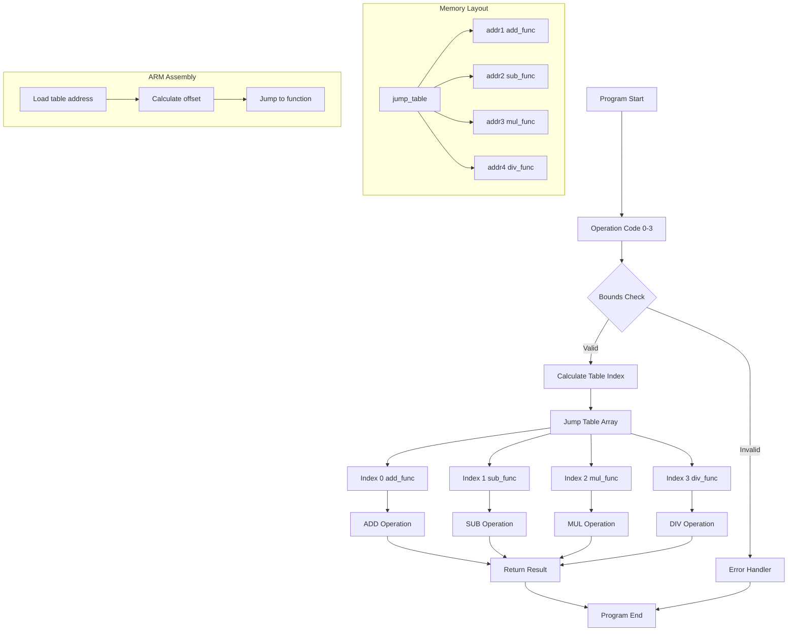

## Jump Tables

A *jump table* is a programming technique that uses an array of
function pointers or addresses to implement efficient multi-way
branching. Instead of using a series of if-else statements or
switch cases, you use an index to directly look up and jump to
the appropriate code segment.

Jump tables are fundamental to many systems. In interpreters and
virtual machines, they handle bytecode dispatch in Python and
Java JVM, as well as instruction decode in emulators. Operating
systems use them for system call dispatch tables and interrupt
vector tables. Embedded systems employ them for state machine
implementations, protocol handlers, and real-time event processing.


#### Why Use Jump Tables?

Jump tables offer several advantages over traditional conditional
branching. They provide direct lookup and jump performance, avoiding
multiple conditional checks, while maintaining predictable constant-time
operation selection. This eliminates long chains of conditional
statements and makes adding new operations as simple as extending
the table.

They're particularly valuable in interpreters and virtual machines,
state machines, embedded systems where performance matters, and any
scenario with multiple mutually exclusive code paths.


#### How Jump Tables Work

The basic concept involves three steps: index calculation using an
operation code or selector as an array index, table lookup to retrieve
the function pointer from the jump table, and indirect jump to call
or jump to the retrieved address.


### Implementation Analysis

The provided files demonstrate jump table implementation at both
high-level (C) and low-level (ARM assembly) perspectives, offering
insight into how this concept translates across abstraction layers.

More assembly and machine code can be studied in the [RISC-V](./riscv/)
folder. Here we find not only jump tables and dispatch, but
also a state machine example.


#### C Implementation

The C implementation shows a clean, idiomatic approach to jump tables:

```c
typedef int (*operation_fn)(int, int);

operation_fn jump_table[] = {
    add, subtract, multiply, divide
};
```

The C implementation demonstrates several key features. It uses
function pointer typedef for clarity and type checking, validates
operation codes before table lookup, properly handles edge cases
like division by zero, and allows the compiler to handle all low-level
details automatically.

The `perform_operation` function elegantly maps operation codes
(0-3) to arithmetic functions:

```c
if (operation_code >= 0 && operation_code < sizeof(jump_table) / sizeof(jump_table[0])) {
    return jump_table[operation_code](a, b);
}
```

This demonstrates how modern languages provide safety and readability
while maintaining the performance benefits of jump tables.


#### ARM Assembly Implementation

The ARM Thumb-2 assembly version reveals the underlying mechanics that
make jump tables efficient:

```asm
LDR     r3, =jump_table       // Load address of jump table
LDR     r3, [r3, r0, LSL #2]  // Load function pointer from table
BX      r3                    // Jump to selected function
```

The assembly implementation reveals several technical details.
The `LSL #2` (logical shift left by 2) multiplies the index by 4,
since ARM addresses are 4 bytes wide. The `BX r3` instruction performs
the actual jump to the computed address. The `.word` directives create
the actual jump table data structure in memory, while the code follows
ARM calling conventions with r0 for operation selector, r1/r2 for
operands, and r0 for return value.

The jump table itself is defined as:

```asm
.align 2
jump_table:
    .word add_func
    .word sub_func
    .word mul_func
    .word div_func
```

This creates an array of 32-bit addresses pointing to each function
implementation.


### High-Level vs Low-Level Implementation

| Aspect | C Version | ARM Assembly |
|--------|-----------|--------------|
| *Abstraction Level* | High-level, compiler handles details | Direct hardware control |
| *Safety Features* | Automatic bounds checking, type safety | Manual validation required |
| *Code Readability* | Very readable and maintainable | Requires assembly knowledge |
| *Performance Control* | Compiler-optimized | Hand-optimized, predictable timing |
| *Portability* | Cross-platform compatibility | Architecture-specific |
| *Development Speed* | Fast development and debugging | Slower, more error-prone |


Both implementations achieve the fundamental benefit of jump tables:
constant-time operation  selection. However, they differ in their
optimisation approaches. The C implementation relies on compiler optimisation,
may include additional safety checks, and remains portable across
different architectures. The assembly implementation is hand-tuned for specific hardware,
uses minimal instruction count, and provides predictable execution timing.

These implementations demonstrate several important concepts. The progression from C to
assembly illustrates how high-level language constructs map to underlying hardware operations,
with the C compiler essentially generating code similar to the assembly version. The C version
prioritises safety and maintainability, while the assembly version optimises for raw performance
and deterministic behaviour. The ARM implementation showcases Thumb-2's mixed 16-bit/32-bit
instruction encoding, efficient address calculation using barrel shifter (`LSL #2`), and
branch exchange instruction (`BX`) for mode switching. The assembly version also explicitly
shows data alignment requirements (`.align 2`), memory organization of the jump table, and
direct memory address manipulation.


### Conclusion

Jump tables represent an elegant solution to the multi-way branching problem, offering
both performance benefits and code organization advantages. The contrast between C and
ARM assembly implementations highlights the value of understanding both high-level
abstractions and underlying hardware mechanisms.

For systems programmers, embedded developers, and anyone working on performance-critical
applications, jump tables provide a powerful tool for efficient code organization and
execution. The technique demonstrates how careful data structure design can dramatically
improve both code clarity and runtime performance.


