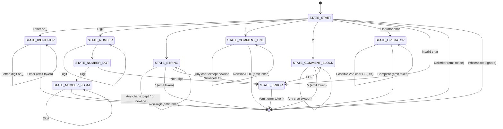
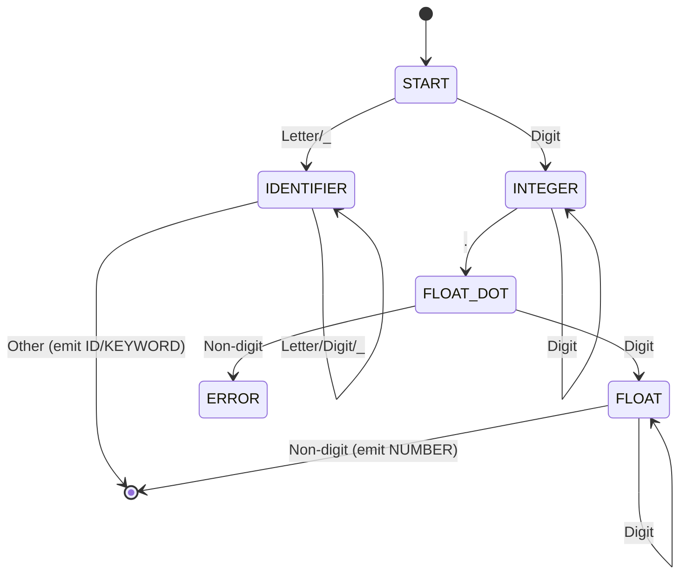
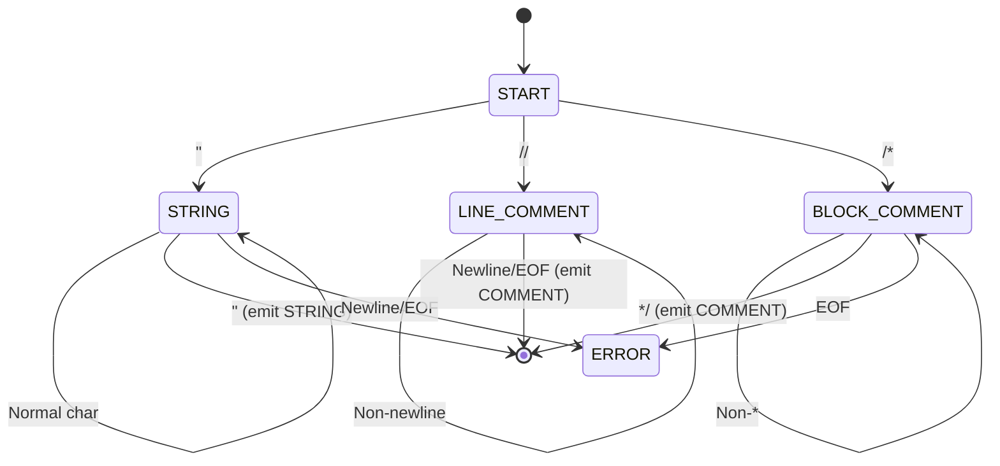
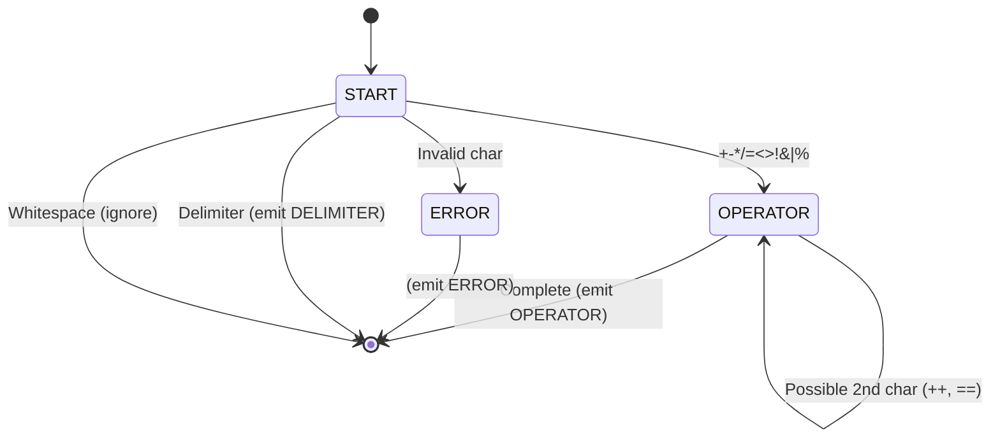

## Lexer State Machine

This repository provides an implementation and visualization of a lexical analyzer (lexer)
using a finite state machine (FSM) approach. The lexer is designed to tokenise input source
code in a C-like language, recognizing tokens such as keywords, identifiers, numbers,
strings, operators, delimiters, and comments.


### State Machines in Lexical Analysis

At a low-level, a lexical analyzer operates as a *finite state machine (FSM)*, which is a
computational model that processes input character by character, transitioning between
discrete states based on the current input. This is a fundamental concept in compiler
design and parsing, where the FSM acts as a recognizer for patterns in the input stream.


#### Concepts
- *States*: Represent the current context of the lexer
  (e.g., starting a new token, inside a number, or handling a comment).
- *Transitions*: Rules that dictate how the lexer moves from one state
  to another based on the input character class (e.g., digit, letter, operator).
- *Actions*: Performed during transitions, such as accumulating characters
  into a token buffer or emitting a completed token.
- *Terminal States*: Points where a token is recognized and emitted
  (e.g., end of an identifier) or an error is detected.

The FSM is "finite" because it has a limited number of states, making it efficient
for scanning text without backtracking (in deterministic FSMs like the ones here).
This low-level mechanism avoids complex branching logic by relying on state transitions,
which can be implemented via switch statements (as in `lexstate.c`) or
lookup tables (as in `lexer.c` for even better performance).

In this project:
- The FSM handles common lexical elements, including edge cases like
  floating-point numbers, multi-character operators, and escaped strings.
- Errors are detected when invalid transitions occur (e.g., unclosed strings or invalid characters).
- Whitespace is typically ignored, and line/column tracking is included for debugging.


### Overall Lexer State Diagram



#### 1. Identifier & Number Recognition



#### 2. String & Comment Handling



#### 3. Operators & Error States



### Implementation Details

Two example implementations are provided in C:
- *`lexstate.c`*: A switch-based FSM lexer with explicit state transitions.
  It supports basic C-like tokens, including block comments (`/* */`) and line comments (`//`).
- *`lexer.c`*: A table-driven FSM lexer for efficiency. It uses a 2D transition
  table to handle states and input classes, supporting additional features
  like hex integers (`0x1A3F`), floats, and escaped strings.

Both lexers track line and column numbers for tokens and handle errors gracefully.

#### Sample Usage from `lexstate.c`

This example tokenizes a simple C-like function:

```c
int main() {
    const char *sourceCode = 
        "int main() {\n"
        "    int x = 42;\n"
        "    return x;\n"
        "}\n";
    
    Lexer lexer;
    initLexer(&lexer, sourceCode);
    
    printf("Tokens:\n");
    printf("%-15s %-25s %-10s %-10s\n", "TYPE", "TEXT", "LINE", "COLUMN");
    printf("---------------------------------------------------------------\n");
    
    Token token;
    do {
        token = getNextToken(&lexer);
        if (token.type != TOKEN_WHITESPACE) {
            printf("%-15s %-25s %-10d %-10d\n",
                tokenTypeToString(token.type),
                token.text,
                token.line,
                token.column);
        }
    } while (token.type != TOKEN_EOF);
    
    return 0;
}
```

*Sample Output:*

```
Tokens:
TYPE            TEXT                      LINE       COLUMN    
---------------------------------------------------------------
KEYWORD         int                       1          1         
IDENTIFIER      main                      1          5         
DELIMITER       (                         1          9         
DELIMITER       )                         1          10        
DELIMITER       {                         1          12        
KEYWORD         int                       2          5         
IDENTIFIER      x                         2          9         
OPERATOR        =                         2          11        
NUMBER          42                        2          13        
DELIMITER       ;                         2          15        
KEYWORD         return                    3          5         
IDENTIFIER      x                         3          12        
DELIMITER       ;                         3          13        
DELIMITER       }                         4          1         
EOF             EOF                       5          1         
```

#### Sample Usage from `lexer.c`

This table-driven lexer tokenizes a more complex expression, skipping comments:

```c
static const char SOURCE[] =
    "// compute discriminant\n"
    "disc = (b * b) - (4 * a * c)\n"
    "flag = (disc >= 0) && (a != 0)\n"
    "label = \"result: \\\"ok\\\"\"\n"
    "addr  = 0xFF3C + base\n"
    "ratio = 2.718 / scale\n";

int main(void) {
    Lexer lx = lexer_new(SOURCE);
    Token t;

    printf("LINE  %-8s  LEXEME\n", "KIND");
    printf("----  --------  ------\n");

    do {
        t = next_token(&lx);
        if (t.kind == TOK_COMMENT) continue;
        printf("%4d  %-8s  %.*s\n",
               t.line, TOK_NAME[t.kind], t.len, t.start);
    } while (t.kind != TOK_EOF && t.kind != TOK_ERROR);

    return 0;
}
```

*Sample Output:*

```
LINE  KIND      LEXEME
----  --------  ------
   2  IDENT     disc
   2  OP        =
   2  LPAREN    (
   2  IDENT     b
   2  OP        *
   2  IDENT     b
   2  RPAREN    )
   2  OP        -
   2  LPAREN    (
   2  INT       4
   2  OP        *
   2  IDENT     a
   2  OP        *
   2  IDENT     c
   2  RPAREN    )
   3  IDENT     flag
   3  OP        =
   3  LPAREN    (
   3  IDENT     disc
   3  OP2       >=
   3  INT       0
   3  RPAREN    )
   3  OP2       &&
   3  LPAREN    (
   3  IDENT     a
   3  OP2       !=
   3  INT       0
   3  RPAREN    )
   4  IDENT     label
   4  OP        =
   4  STRING    "result: \"ok\""
   5  IDENT     addr
   5  OP        =
   5  INT       0xFF3C
   5  OP        +
   5  IDENT     base
   6  IDENT     ratio
   6  OP        =
   6  FLOAT     2.718
   6  OP        /
   6  IDENT     scale
   7  EOF       
```


### Limitations
- No support for scientific notation in floats (e.g., `1e3`).
- Block comments are handled in `lexstate.c` but not in `lexer.c` (which focuses on line comments).
- Keywords are hardcoded; no symbol table integration.

This FSM approach can be extended for full compilers or adapted to other languages.

