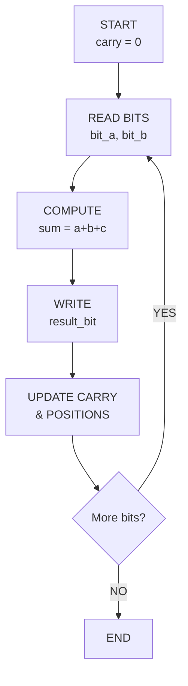
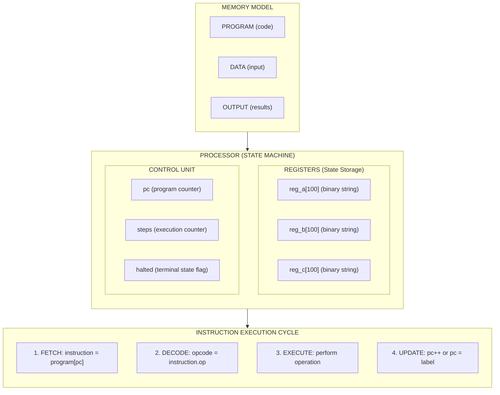
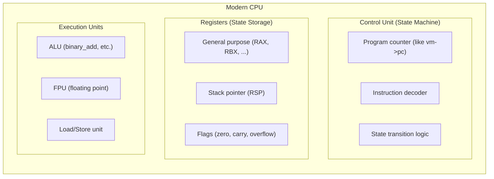

## State Machines: From Theory to Practice

*An exploration through Turing Machine implementations*

We connect back to the beginning of this book/repository.
But we also connect to the next chapter, where we will return to Turing machines
more abstractly.

This analysis focuses on:
- The fundamental nature of state machines as computational models
- How state transitions drive computation
- The progression from hardcoded to programmable state machines
- The bridge between theoretical computer science and practical system design

State machines are the *foundation of all computation*. Every computer,
from the simplest calculator to the most advanced supercomputer,
is fundamentally a state machine--a system that:
1. Exists in one of a finite (or conceptually infinite) number of *states*
2. Reads *input* from some source
3. *Transitions* to a new state based on current state and input
4. Produces *output* or performs actions during transitions

Two implementations we'll examine, represent a critical evolutionary step in computing:

*Implementation 1: Minimal ALU Turing Machine*
- Hardcoded operations: ADD, AND, NOT
- Fixed state transition logic
- Demonstrates basic computational principles

*Implementation 2: Turing-Complete Virtual Machine*
- Programmable instruction set (21 opcodes)
- Registers, program counter, conditional jumps
- Full Turing completeness (loops + conditionals)

This progression mirrors the historical evolution from
*special-purpose calculators* to *general-purpose computers*.


#### The Theoretical Foundations (1936)

The concept of state machines in computing traces back to
*Alan Turing's 1936 paper* "On Computable Numbers, with an
Application to the Entscheidungsproblem." Turing introduced
the *Turing machine* as a mathematical model to answer a
fundamental question: *What does it mean to compute something?*

1. *Computation is mechanical*: It can be broken down into
   discrete, mechanical steps
2. *State is sufficient*: A machine needs only:
   - A finite set of internal states
   - A tape for reading/writing symbols
   - A table of rules for state transitions
3. *Universality*: A single machine design can compute
   *anything computable* (the Universal Turing Machine)

#### Parallel Developments

At roughly the same time:
- *Alonzo Church* (1936) developed lambda calculus
- *Emil Post* (1936) created Post machines
- All three models proved to be *equivalent in computational power*
  (Church-Turing thesis)

#### From Theory to Hardware (1940s-1950s)

The theoretical work directly influenced early computer designers:

- *ENIAC* (1945): First general-purpose electronic computer,
  but essentially a hardwired state machine

- *Von Neumann Architecture* (1945): Introduced the
  *stored-program concept*--instructions as data,
  enabling programmable state machines

- *Manchester Baby* (1948): First stored-program computer,
  implementing von Neumann's ideas

The progression from ENIAC to stored-program computers mirrors
roughly our progression from the hardcoded ALU to the programmable VM.


### What is a State Machine?

#### Formal Definition

A *finite state machine (FSM)* is a mathematical model defined by a 5-tuple:

```
M = (Q, Σ, δ, q₀, F)

Where:
Q  = finite set of states
Σ  = finite input alphabet  
δ  = transition function: Q × Σ → Q
q₀ = initial state (q₀ ∈ Q)
F  = set of accept/final states (F ⊆ Q)
```

#### Informal Understanding

Think of a state machine as:
- A system with *memory* (its current state)
- A set of *rules* (transition function)
- *Deterministic behaviour* (same input + same state = same output)

#### Types of State Machines

*1. Finite State Machines (FSM)*
- Fixed, finite number of states
- Example: traffic light controller, regular expression matcher

*2. Pushdown Automata (PDA)*
- FSM + stack memory
- Can recognize context-free languages
- Example: parsing nested structures like `((()))` or HTML tags

*3. Turing Machines (TM)*
- FSM + unlimited tape memory
- Can compute anything computable
- *Our implementations are Turing machines*

#### The State Transition Model

Every state machine operates on the same principle:

```
LOOP:
  1. Read current state
  2. Read input
  3. Look up transition rule: (current_state, input) --> (next_state, action)
  4. Execute action
  5. Update state
  6. GOTO LOOP
```

This is *exactly* how both our implementations work,
just at different levels of abstraction.


### The Two Implementations

#### Implementation 1: Minimal ALU Turing Machine

*File*: `turing_alu.c`

*Purpose*: Demonstrate Turing machine principles
through three hardcoded arithmetic/logic operations.

*Features*:
- Tape format: `OPERATION|operand_a|operand_b|result`
- Operations: ADD, AND, NOT
- Processing: Right-to-left (LSB first)
- State: Implicit (carried in variables like `carry`, current position)

*Example*:
```
Input tape:  ADD|1011|110|
Processing:  Works right-to-left with carry propagation
Output:      ADD|1011|110|10001
Result:      10001 (binary for 17)
```

#### Implementation 2: Turing-Complete Virtual Machine

*File*: `turing_vm.c`

*Purpose*: Create a programmable, Turing-complete computer
with an instruction set architecture.

*Features*:
- 21 opcodes (LOAD, ADD, SUB, AND, OR, XOR, NOT, JMP, JZ, JNZ, JEQ, HALT, etc.)
- 3 registers (A, B, C) for binary numbers
- Program counter for sequential execution
- Label-based jumps for control flow
- Turing-complete (has loops + conditionals)

*Example Program* (Countdown):
```c
LOAD_A         // A = 101 (5 in binary)
LOOP:
  STORE        // Output current value
  LOAD_B       // B = 1
  SUB          // A = A - 1
  JNZ LOOP     // Jump to LOOP if A != 0
STORE          // Output final 0
HALT

Output: 101, 100, 11, 10, 1, 0  (5, 4, 3, 2, 1, 0)
```


### State Machine Concepts

#### 1. State Representation

*In the ALU*:
States are *implicit*--embedded in the program counter,
position on tape, and local variables:

```c
typedef struct {
    char tape[MAX_TAPE];  // The tape is our memory
    int head;             // Current position (implicit state)
    int steps;            // Step counter
    char carry;           // State for ADD operation
    char bit_a, bit_b;    // Temporary state storage
    char operation[10];   // Which operation determines state machine behavior
} TuringMachine;
```

The "state" includes:
- Where we are on the tape (`head`)
- What operation we're performing (`operation`)
- Intermediate computation values (`carry`, `bit_a`, `bit_b`)

*In the VM*:
States are *explicit*--represented by the combination of:

```c
typedef struct {
    // Registers = part of state
    char reg_a[100];
    char reg_b[100];
    char reg_c[100];
    
    // Program counter = which state we're in
    int pc;
    
    // Execution state
    bool halted;
    
    // The program defines state transitions
    Instruction program[MAX_PROGRAM];
} VM;
```

The VM state is:
- *Program counter*: Which instruction we're at
  (analogous to FSM state)
- *Register contents*: The data state
- *Halted flag*: Terminal state indicator

#### 2. Transition Functions

*In the ALU*:
Transition logic is *hardcoded* in functions:

```c
void tm_add(TuringMachine *tm, bool verbose) {
    // State transition: "reading bits" --> "computing sum" --> "writing result"
    while (pos_a > pipe1 || pos_b > pipe2 || tm->carry == '1') {
        tm->steps++;
        
        // Read state (bits from tape)
        char bit_a = (pos_a > pipe1) ? tm->tape[pos_a] : '0';
        char bit_b = (pos_b > pipe2) ? tm->tape[pos_b] : '0';
        
        // Compute new state
        int sum = (bit_a - '0') + (bit_b - '0') + (tm->carry - '0');
        char result_bit = (sum % 2) + '0';
        tm->carry = (sum >= 2) ? '1' : '0';
        
        // Write output and transition
        tm->tape[write_pos++] = result_bit;
        pos_a--;
        pos_b--;
    }
}
```

This is a *Mealy machine* pattern: outputs depend on current state AND input.

*In the VM*:
Transition function is the *instruction execution*:

```c
void vm_step(VM *vm) {
    Instruction *inst = &vm->program[vm->pc];
    
    // Current state = (PC, registers)
    // Transition function = switch on opcode
    switch (inst->op) {
        case OP_ADD:
            // δ(state, ADD) = state' where reg_a = reg_a + reg_b
            binary_add(vm->reg_a, vm->reg_b, temp);
            strcpy(vm->reg_a, temp);
            vm->pc++;  // Sequential state transition
            break;
            
        case OP_JNZ:
            // Conditional state transition (branching)
            if (strcmp(vm->reg_a, "0") != 0) {
                vm->pc = vm_find_label(vm, inst->label);  // Non-sequential!
            } else {
                vm->pc++;  // Sequential
            }
            break;
    }
}
```

This demonstrates *conditional transitions*--the next state
depends on data (register values), not just the current instruction.

#### 3. Determinism vs Non-Determinism

Both implementations are *deterministic*:
- Same input + same initial state = same output, always
- No randomness, no ambiguity in transitions

This is critical for:
- *Debugging*: Behavior is reproducible
- *Verification*: We can prove correctness
- *Reliability*: Computers must be predictable

#### 4. Acceptance/Halting

*In the ALU*:
"Acceptance" means successfully completing the operation:
- For ADD: All bits processed, no more carry
- For AND/NOT: All bits processed

```c
void tm_and(TuringMachine *tm, bool verbose) {
    while (pos_a > pipe1 || pos_b > pipe2) {
        // Process bits..
    }
    // Implicit acceptance: loop exits when done
}
```

*In the VM*:
Explicit *HALT state*:

```c
case OP_HALT:
    vm->halted = true;  // Enter terminal state
    break;
```

The VM also has a *timeout mechanism* (max steps) to prevent infinite loops:

```c
void vm_run(VM *vm, int max_steps) {
    while (!vm->halted && vm->steps < max_steps) {
        vm_step(vm);
    }
}
```

This addresses (hacks) the *Halting Problem*: we can't always
determine if a program will halt, so we impose a limit.


### Code Analysis: The ALU Implementation

#### Architecture Overview

```
            TAPE MEMORY
      ADD|1011|110|
          ^
          HEAD (moves left/right)

                 │
                 v

       STATE MACHINE CONTROLLER
     - Operation type (ADD/AND/NOT)
     - Carry flag (for ADD)
     - Bit registers (temporary storage)
     - Position counters

                  │
                  v

          TRANSITION LOGIC
     - tm_add()   -> ADD state machine
     - tm_and()   -> AND state machine
     - tm_not()   -> NOT state machine
```

#### State Machine for ADD Operation

The ADD operation implements a *sequential state machine*
for binary addition with carry:

```c
void tm_add(TuringMachine *tm, bool verbose) {
    // INIT STATE
    int pos_a = pipe2 - 1;            // Rightmost bit of operand A
    int pos_b = strlen(tm->tape) - 2; // Rightmost bit of operand B
    int write_pos = strlen(tm->tape); // Where to write result
    tm->carry = '0';                  // Initial carry state
    
    // STATE TRANSITION LOOP
    while (pos_a > pipe1 || pos_b > pipe2 || tm->carry == '1') {
        // READ STATE (fetch bits from tape)
        char bit_a = (pos_a > pipe1) ? tm->tape[pos_a] : '0';
        char bit_b = (pos_b > pipe2) ? tm->tape[pos_b] : '0';
        
        // COMPUTE NEXT STATE (full adder logic)
        int sum = (bit_a - '0') + (bit_b - '0') + (tm->carry - '0');
        char result_bit = (sum % 2) + '0';      // Sum output
        tm->carry = (sum >= 2) ? '1' : '0';     // Carry output
        
        // WRITE OUTPUT (to tape)
        tm->tape[write_pos++] = result_bit;
        
        // TRANSITION TO NEXT BIT POSITION
        pos_a--;
        pos_b--;
        tm->steps++;
    }
}
```

##### State Diagram for ADD



#### State Machine for AND Operation

AND is simpler--no carry state needed:

```c
void tm_and(TuringMachine *tm, bool verbose) {
    while (pos_a > pipe1 || pos_b > pipe2) {
        // STATE: Reading bit position
        char bit_a = (pos_a > pipe1) ? tm->tape[pos_a] : '0';
        char bit_b = (pos_b > pipe2) ? tm->tape[pos_b] : '0';
        
        // TRANSITION: Compute AND
        char result_bit = ((bit_a == '1') && (bit_b == '1')) ? '1' : '0';
        
        // OUTPUT: Write result
        tm->tape[write_pos++] = result_bit;
        
        // NEXT STATE: Move to next bit
        pos_a--;
        pos_b--;
        tm->steps++;
    }
}
```

##### Key Insight: Combinational vs Sequential

- *AND* is *combinational*: output depends only on current inputs
- *ADD* is *sequential*: output depends on current inputs AND previous state (carry)

This mirrors hardware design:
- Combinational logic (AND gates) has no memory
- Sequential logic (adders) requires state storage (flip-flops for carry)

#### Right-to-Left Processing: Why?

Both operations process bits *right-to-left* (LSB first):

```
  1011  (11 in decimal)
+  110  (6 in decimal)
------
 10001  (17 in decimal)

Processing order:
Step 1: 1 + 0 = 1, carry = 0
Step 2: 1 + 1 = 0, carry = 1  <- Carry propagates left
Step 3: 0 + 1 + carry(1) = 0, carry = 1
Step 4: 1 + 0 + carry(1) = 0, carry = 1
Step 5: 0 + 0 + carry(1) = 1, carry = 0
```

*Why LSB first?*
- Carry propagates from right to left in binary addition
- Lower-order bits must be computed before higher-order bits
- This is how *real hardware adders* work (ripple-carry adder)

#### The Tape as Memory

The tape serves multiple roles:

1. *Input storage*: Original operands
2. *Output storage*: Result appended after final `|`
3. *State indicator*: Position on tape = implicit state

```
Initial:  ADD|1011|110|
          ^   ^    ^   ^
          op  a    b   result (empty)

After:    ADD|1011|110|10001
          ^   ^    ^   ^
          op  a    b   result (written backwards, then reversed)
```

The tape is *unbounded* (in theory)--we can always add more bits.
This is what makes it a *Turing machine* rather than just a finite state machine.


### Code Analysis: The Virtual Machine

#### Architecture Overview



#### The Instruction Set Architecture

The VM defines *21 opcodes*:

```c
typedef enum {
    // Data Movement (6 opcodes)
    OP_LOAD_A,   OP_LOAD_B,   OP_LOAD_C,   // Load from data section
    OP_STORE,                              // Store to output
    OP_COPY_AB,  OP_COPY_BA,  OP_COPY_AC,  // Inter-register transfer
    OP_SWAP_AB,                            // Exchange registers
    
    // Arithmetic & Logic (8 opcodes)
    OP_ADD,      // A = A + B
    OP_SUB,      // A = A - B (saturating)
    OP_AND,      // A = A & B
    OP_OR,       // A = A | B
    OP_XOR,      // A = A ^ B
    OP_NOT_A,    // A = ~A
    OP_NOT_B,    // B = ~B
    
    // Control Flow (5 opcodes)
    OP_JMP,      // Unconditional jump
    OP_JZ,       // Jump if A == 0
    OP_JNZ,      // Jump if A != 0
    OP_JEQ,      // Jump if A == B
    OP_HALT,     // Stop execution
    
    // Other (2 opcodes)
    OP_NOP,      // No operation
    OP_INVALID   // Error state
} Opcode;
```

This is a *minimal but Turing-complete instruction set*. Why? Because it has:
1. *Arithmetic*: Can perform calculations
2. *Conditional branching*: Can make decisions (JZ, JNZ, JEQ)
3. *Loops*: Conditional jumps enable iteration
4. *Memory*: Registers provide storage

#### The Fetch-Decode-Execute Cycle

This is the *core state machine loop*:

```c
void vm_step(VM *vm) {
    // FETCH: Get instruction at program counter
    Instruction *inst = &vm->program[vm->pc];
    
    // DECODE & EXECUTE: Switch on opcode
    switch (inst->op) {
        case OP_ADD:
            // Execute: Add registers
            binary_add(vm->reg_a, vm->reg_b, temp);
            strcpy(vm->reg_a, temp);
            break;
            
        case OP_JNZ:
            // Execute: Conditional jump
            if (strcmp(vm->reg_a, "0") != 0) {
                int addr = vm_find_label(vm, inst->label);
                if (addr >= 0) {
                    vm->pc = addr;  // Jump!
                    return;  // Don't increment PC
                }
            }
            break;
            
        case OP_HALT:
            // Execute: Enter terminal state
            vm->halted = true;
            break;
    }
    
    // UPDATE: Increment program counter (if not jumped)
    vm->pc++;
}

void vm_run(VM *vm, int max_steps) {
    // Main execution loop
    while (!vm->halted && vm->steps < max_steps) {
        vm_step(vm);  // Execute one state transition
    }
}
```

#### State Transitions in Detail

Let's trace a countdown program's state transitions:

*Program*:
```
[0] LOAD_A      // A = 101 (5)
[1] STORE       // LOOP: output A
[2] LOAD_B      // B = 1
[3] SUB         // A = A - 1
[4] JNZ LOOP    // if A != 0, jump to [1]
[5] STORE       // output final 0
[6] HALT
```

*State Trace*:

| Step | PC | Instruction | A before | B before | A after | B after | Output | Action |
|------|----|-------------|----------|----------|---------|---------|--------|--------|
| 0 | 0 | LOAD_A | 0 | 0 | 101 | 0 | - | Load 5 into A |
| 1 | 1 | STORE | 101 | 0 | 101 | 0 | [101] | Write A to output |
| 2 | 2 | LOAD_B | 101 | 0 | 101 | 1 | - | Load 1 into B |
| 3 | 3 | SUB | 101 | 1 | 100 | 1 | - | A = 5 - 1 = 4 |
| 4 | 4 | JNZ | 100 | 1 | 100 | 1 | - | A != 0, jump to 1 |
| 5 | 1 | STORE | 100 | 1 | 100 | 1 | [101,100] | Write 4 |
| 6 | 2 | LOAD_B | 100 | 1 | 100 | 1 | - | Load 1 |
| 7 | 3 | SUB | 100 | 1 | 11 | 1 | - | A = 4 - 1 = 3 |
| 8 | 4 | JNZ | 11 | 1 | 11 | 1 | - | Jump to 1 |
| .. | .. | .. | .. | .. | .. | .. | .. | .. |
| 28 | 3 | SUB | 1 | 1 | 0 | 1 | - | A = 1 - 1 = 0 |
| 29 | 4 | JNZ | 0 | 1 | 0 | 1 | - | A == 0, DON'T jump |
| 30 | 5 | STORE | 0 | 1 | 0 | 1 | [101,100,11,10,1,0] | Write 0 |
| 31 | 6 | HALT | 0 | 1 | 0 | 1 | - | Enter halted state |

*Key observations*:
- *State* = (PC, A, B, C) tuple
- *Transition function* = instruction execution
- *Conditional transitions* enable loops
- *Halted flag* = accepting/terminal state

#### Control Flow: The Key to Turing Completeness

The VM achieves *Turing completeness* through conditional jumps:

```c
case OP_JNZ:
    if (strcmp(vm->reg_a, "0") != 0) {
        // Conditional state transition
        int addr = vm_find_label(vm, inst->label);
        if (addr >= 0) {
            vm->pc = addr;  // Non-sequential transition!
            return;
        }
    }
    // Otherwise fall through (sequential)
    break;
```

*Why this matters*:
- *Sequential execution alone* = Can only compute straight-line programs
- *Unconditional jumps alone* = Can repeat forever, but can't make decisions
- *Conditional jumps* = Can implement:
  - Loops (with termination conditions)
  - If-then-else branches
  - While loops, for loops, etc.

This gives us the *power of arbitrary computation*!

#### Label Resolution

Labels provide *symbolic addresses* for jump targets:

```c
typedef struct {
    char name[MAX_LABEL];  // e.g., "LOOP"
    int address;           // e.g., 1
} Label;

int vm_find_label(VM *vm, const char *name) {
    for (int i = 0; i < vm->label_count; i++) {
        if (strcmp(vm->labels[i].name, name) == 0) {
            return vm->labels[i].address;
        }
    }
    return -1;  // Label not found
}
```

This enables *readable, maintainable code*:
- Instead of: `JNZ 1` (jump to instruction 1)
- We write: `JNZ LOOP` (jump to the label named "LOOP")

This is analogous to *assembly language labels* in real CPUs!


### Comparing State Machine Architectures

#### Architectural Comparison

| Aspect | ALU (turing_alu.c) | VM (turing_vm.c) |
|--------|--------------------|------------------|
| *Computational Model* | Hardcoded operations | Programmable ISA |
| *State Representation* | Implicit (tape position, carry) | Explicit (PC, registers) |
| *Transition Function* | Hardcoded C functions | Instruction dispatch (switch) |
| *Control Flow* | Sequential only | Sequential + jumps |
| *Turing Complete?* | No (limited operations) | *Yes* (loops + conditionals) |
| *Memory Model* | Single tape | Separate program/data/output |
| *Programmability* | None (operations fixed) | Full (write programs) |
| *Instruction Set Size* | 3 operations | 21 opcodes |
| *Branching* | None | 4 types (JMP, JZ, JNZ, JEQ) |
| *Registers* | None (implicit temporaries) | 3 (A, B, C) |
| *Code Size* | ~400 LOC | ~800 LOC |

#### Evolution: From Hardcoded to Programmable

The progression from ALU to VM demonstrates a fundamental shift in computing:

*ALU (Special-Purpose Machine)*:
```
Fixed operations → Process input → Produce output
         v
   No flexibility!
```

*VM (General-Purpose Machine)*:
```
Load program → Execute instructions → Produce output
      v                v
Programmable!    Turing Complete!
```

This mirrors real computing history:
- *1940s*: Special-purpose calculators (ballistics tables, code breaking)
- *1950s*: Stored-program computers (von Neumann architecture)
- *Modern*: Universal computation (every computer can run any program)

#### Complexity vs Power

*More complex ≠ More powerful* (in terms of computability):

- The ALU is *simpler* (400 LOC vs 800 LOC)
- But the VM is *more powerful* (Turing-complete)
- Both can compute the same *specific operations* (ADD, AND, NOT)
- But only the VM can compute *arbitrary programs*

This illustrates the *Church-Turing thesis*:
Any computable function can be computed by a Turing machine,
but some machines are more *practical* than others.


### Theoretical Implications

#### 1. Turing Completeness

*Definition*: A system is Turing-complete if it can simulate any Turing machine.

*Requirements*:
1. Conditional branching (if-then-else)
2. Arbitrary memory (unbounded in principle)
3. Ability to read and write memory

*The VM is Turing-complete* because:
- Has conditional jumps (JZ, JNZ, JEQ)
- Has unbounded tape memory (registers store arbitrary-length binary strings)
- Can read (LOAD) and write (STORE) memory

*The ALU is NOT Turing-complete* because:
- No conditional branching
- No loops
- Fixed, hardcoded operations

#### 2. The Halting Problem

*Turing's 1936 proof*: No algorithm can determine
whether an arbitrary program will halt or run forever.

*Evidence in our code*:

```c
void vm_run(VM *vm, int max_steps) {
    while (!vm->halted && vm->steps < max_steps) {
        vm_step(vm);
    }
}
```

We impose a *max_steps limit* because:
- We *cannot* determine if the program will halt
- We *must* prevent infinite loops from freezing the system
- This is a *practical compromise* (sacrifice completeness for practicality)

*Example of undecidable program*:
```
LOAD_A      // A = 1
LOOP:
  JMP LOOP  // Infinite loop!
```

Does this halt? *No*.
But we can't algorithmically determine this for all programs!

#### 3. Universal Computation

The VM demonstrates *universality*:
- It can execute *any program* in its instruction set
- It could even *simulate another VM* (given enough memory)
- This is the essence of a *stored-program computer*

*Von Neumann's insight* (1945): Instructions are just data ..
- Programs stored in memory
- Can be modified, loaded, saved
- One machine can run any program

Our VM implements this:
- Programs are stored in the `program[]` array
- Data is stored in the `data[]` array
- Both are just *bytes in memory*


### Practical Applications

#### 1. Real-World State Machines

State machines aren't just theoretical--they're in practice *everywhere*:

*Embedded Systems*:
- Traffic light controllers (you know!)
- Washing machine logic
- Elevator control systems
- ATM transaction processing

*Software*:
- Regular expression engines (finite automata)
- Parser generators (pushdown automata)
- Protocol implementations (TCP state machine)
- Game AI (behavior trees are state machines)

*Hardware*:
- CPU control units (exactly like our VM!)
- Memory controllers
- DMA engines
- Cache coherency protocols

#### 2. How CPUs Actually Work

*Modern CPUs are state machines* almost identical to our VM:



*Key parallels*:

| Our VM | Real CPU (x86-64) |
|--------|-------------------|
| `vm->pc` | RIP (instruction pointer) |
| `vm->reg_a, reg_b, reg_c` | RAX, RBX, RCX, ... |
| `OP_ADD, OP_SUB` | ADD, SUB instructions |
| `OP_JNZ` | JNZ instruction |
| `vm->halted` | HLT instruction / interrupt |
| `vm_step()` | Fetch-decode-execute cycle |

#### 3. Compiler Targets

Our VM instruction set could be a *compiler target*:

```c
// High-level code
int countdown(int n) {
    while (n > 0) {
        printf("%d\n", n);
        n--;
    }
    return 0;
}
```

*Compiles to our VM*:
```
LOAD_A          // A = n
LOOP:
  STORE         // printf("%d\n", A)
  LOAD_B        // B = 1
  SUB           // A = A - 1
  JNZ LOOP      // while (A > 0)
HALT            // return 0
```

This is what compilers do--translate
high-level languages to low-level
instructions, as we hae already observed.

#### 4. Virtual Machines in Practice

Our VM is a *simple version* of real VMs:

*Java Virtual Machine (JVM)*:
- Bytecode instruction set (like our opcodes)
- Stack-based (vs our register-based)
- Garbage collection, exception handling (not in our VM)

*WebAssembly (WASM)*:
- Stack-based VM for web browsers
- Compiles from C/C++/Rust
- Runs at near-native speed

*Python VM*:
- Interprets Python bytecode
- Dynamic typing (our VM is untyped--all binary strings)

*Difference*: Real VMs have:
- Larger instruction sets (hundreds of opcodes)
- Type systems
- Advanced memory management
- Optimizations (JIT compilation)

But the *core concept* is very much similar: fetch-decode-execute loop over a program.


### Conclusion

1. *State machines are fundamental* to all computation
   - Every computer is a state machine at its core
   - States + transitions + rules = computation

2. *Two paradigms of state machines*:
   - *Hardcoded* (ALU): Fixed behavior, simple to understand
   - *Programmable* (VM): Flexible behavior, Turing-complete

3. *Turing completeness requires*:
   - Conditional branching
   - Loops (enabled by jumps)
   - Sufficient memory

4. *Theory meets practice*:
   - Abstract Turing machines → Real CPU architectures
   - Mathematical models → Working C code
   - Theoretical CS → Practical engineering


These implementations demonstrate that:

- *Theoretical models* (Turing machines) are *implementable*
- *Abstract concepts* (state transitions) have *concrete realizations*
- *Mathematical foundations* of CS lead to *real systems*

*Alan Turing's 1936 paper* was a *blueprint for computing*.
Every modern computer, from smartphones to supercomputers,
is a descendant of his theoretical work.

#### From Simple to Universal

The progression from ALU to VM shows:

```
Hardcoded Operations (ALU)
         v
  Add instruction set
         v
  Add control flow (jumps)
         v
Universal Computation (VM)
         v
   Modern Computers
```


State machines are the *core of computation itself*:

- *Every program* is a state machine
- *Every algorithm* defines state transitions
- *Every computer* executes a state machine

Understanding state machines means understanding:
- How computers work (at the lowest level)
- How programs execute (step by step)
- How to design systems (state-based thinking)
- The limits of computation (halting problem)
- The power of programmability (Turing completeness)


### References & Further Reading

#### Historical Papers
- Turing, A. M. (1936). "On Computable Numbers, with an Application to the Entscheidungsproblem"
- Church, A. (1936). "An Unsolvable Problem of Elementary Number Theory"
- Von Neumann, J. (1945). "First Draft of a Report on the EDVAC"


#### Code
- `turing_alu.c` - Minimal ALU Turing Machine (this repository)
- `turing_vm.c` - Turing-Complete Virtual Machine (this repository)
