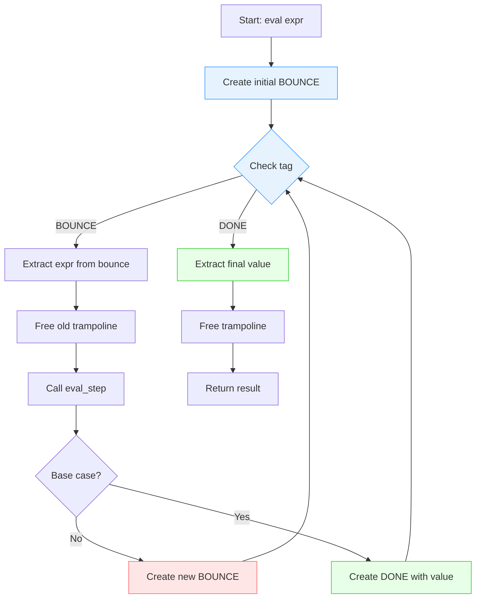

## Trampoline Pattern

The trampoline pattern is a programming technique used to optimise recursion
and manage control flow, especially in cases where recursion might otherwise
lead to stack overflow or be inefficient. It transforms recursive computations
into iterative loops, avoiding deep stack calls while preserving the logical
structure of recursive algorithms.


### Core Concept

The trampoline pattern can be thought of as a "control flow" pattern that
replaces recursive function calls with an iterative loop. Instead of functions
calling themselves directly (which builds up the call stack), they return
"[continuations](./../continue/)"--descriptions of what to do next. A trampoline
loop then executes these continuations iteratively.


#### Characteristics

- *Avoids Deep Recursion*: The pattern prevents stack overflow errors by
  converting recursive calls into data structures processed by an iterative loop.
  Critical for languages without tail-call optimisation.

- *Iterative Execution*: Rather than building up a call stack through
  recursive function calls, the trampoline uses a loop that repeatedly
  executes the next action until completion.

- *Composable*: Each step returns either a continuation (more work to do)
  or a final result. This makes it easy to compose and sequence operations.

- *Lazy Evaluation*: Actions are performed only when needed, and the next
  action is dynamically determined based on the current state.

#### How It Works

1. *Return a Continuation*: Instead of making a recursive call directly,
   a function returns a "thunk"--a parameterless function that represents
   the next computation to perform.

2. *Trampoline Loop*: A controlling loop repeatedly executes these thunks
   until a final result is produced. The loop prevents stack buildup by
   keeping execution at a constant stack depth.

3. *Two Types of Returns*:
   - `BOUNCE` / `Bounce`: Continue computation--here's the next step
   - `DONE` / `Done`: Computation complete--here's the final value


### Examples

This repository contains several implementations demonstrating the trampoline
pattern in increasing complexity:

#### 1. Simple Factorial (Python)

File: `fact.py`

A basic introduction showing factorial computation using trampolines.
The recursive step returns a lambda instead of calling itself directly.

```python
def factorial_trampoline(n):
    def step(n, accumulator):
        if n == 0:
            return accumulator
        else:
            return lambda: step(n - 1, n * accumulator)
    
    result = step(n, 1)
    while callable(result):
        result = result()
    return result
```

*Key Insight*: Instead of `return step(n-1, ...)` which builds stack depth,
we use `return lambda: step(n-1, ...)` which creates a thunk for the
trampoline loop to execute.

#### 2. Fixed-Point Arithmetic Interpreter (C)

File: `tramp.c`

A simple bytecode interpreter for fixed-point arithmetic that uses function
pointers to dispatch operations. While not deeply recursive, it demonstrates
the trampoline's modular dispatch pattern.

```c
switch (inst->op) {
    case ADD:
        trampoline.next = add;
        break;
    case MUL:
        trampoline.next = mul;
        break;
    // ...
}

if (trampoline.next != NULL) {
    trampoline.next(interpreter);
}
```

*Key Insight*: Operations are dispatched through `trampoline.next` rather
than direct calls, separating control flow from operation execution.

#### 3. Recursive Expression VM (C)

File: `recursive_vm.c`

A virtual machine that evaluates recursive mathematical expressions (Fibonacci,
factorial, Ackermann function) using proper trampolining to avoid stack overflow.

*Supported Operations*:
- Fibonacci: `fib(n) = fib(n-1) + fib(n-2)`
- Factorial: `fact(n) = n * fact(n-1)`
- Ackermann: `A(m,n) = A(m-1, A(m, n-1))` (extremely recursive!)
- Arithmetic: Addition, subtraction, multiplication
- Nested expressions: `(fib(4) + fib(5)) * fact(3)`

*Trampoline Mechanism*:

```c
typedef struct Trampoline {
    enum { BOUNCE, DONE } tag;
    union {
        Expr* expr;     // BOUNCE: expression to evaluate next
        int value;      // DONE: final result
    } data;
} Trampoline;

int eval(Expr* expr) {
    Trampoline* t = bounce(expr);
    
    while (t->tag == BOUNCE) {
        Expr* current = t->data.expr;
        free(t);
        t = eval_step(current);
    }
    
    int result = t->data.value;
    free(t);
    return result;
}
```

*Example*: Evaluating `fib(5)` creates many bounces:
```
BOUNCE(fib(5)) → BOUNCE(fib(4) + fib(3)) → BOUNCE(fib(4)) → ...
... → DONE(3) + DONE(2) → DONE(5)
```

The Ackermann function `A(3,3)` creates thousands of recursive calls but
completes successfully without stack overflow thanks to trampolining.

#### 4. Advanced Python Examples

File: `advanced_trampoline.py`

Demonstrates sophisticated applications of the trampoline pattern in Python:

##### 4.1 Mutual Recursion

Even/odd checker using mutually recursive functions. Tests with 10,000+
iterations that would overflow without trampolining.

```python
def is_even_mutual(n: int) -> Trampoline:
    if n == 0:
        return Done(True)
    return Bounce(lambda: is_odd_mutual(n - 1))

def is_odd_mutual(n: int) -> Trampoline:
    if n == 0:
        return Done(False)
    return Bounce(lambda: is_even_mutual(n - 1))
```

##### 4.2 Tree Traversal with Continuation-Passing Style

Computes the sum of all values in a binary tree using continuations to
manage control flow without stack buildup.

```python
def tree_sum_cps(node, continuation):
    if node is None:
        return Bounce(lambda: continuation(0))
    
    def after_left(left_sum):
        def after_right(right_sum):
            total = node.value + left_sum + right_sum
            return Bounce(lambda: continuation(total))
        return Bounce(lambda: tree_sum_cps(node.right, after_right))
    
    return Bounce(lambda: tree_sum_cps(node.left, after_left))
```

##### 4.3 Fibonacci with Memoization

Combines trampolining with dynamic programming for efficient computation.

##### 4.4 State Machine Parser

Balanced parentheses checker implemented as a state machine with trampolining,
demonstrating how trampolines handle complex control flow.

```python
def parse_balanced_parens(state: ParseState) -> Trampoline:
    if state.position >= len(state.input):
        return Done(len(state.stack) == 0)
    
    char = state.input[state.position]
    
    if char == '(':
        new_stack = state.stack + ['(']
        new_state = ParseState(state.input, state.position + 1, new_stack)
        return Bounce(lambda: parse_balanced_parens(new_state))
    ## ... handle other cases
```

##### 4.5 Ackermann Function

One of the most recursive functions in mathematics. `A(3,4) = 125` requires
an enormous number of recursive calls--impossible without trampolining.

### Visualising the Trampoline Mechanism



### Benefits

#### 1. Stack Safety

*Problem*: Deep recursion causes stack overflow.

```python
## Traditional recursion - FAILS for large n
def fib(n):
    if n <= 1:
        return n
    return fib(n-1) + fib(n-2)  ## Stack overflow for large n!
```

*Solution*: Trampolining keeps stack depth constant.

```python
## Trampolined - handles arbitrarily large n
def fib_trampoline(n):
    ## Base case
    if n <= 1:
        return Done(n)
    ## Recursive case - return continuation
    return Bounce(lambda: add(fib(n-1), fib(n-2)))
```

#### 2. Extensibility

New operations can be added by defining new functions and associating
them with new opcodes. This is more modular than complex conditionals.

#### 3. Control Flow Separation

The logic for controlling flow (which operation executes next) is separated
from the operations themselves, making code cleaner and easier to manage.

#### 4. Flexibility

Trampolines allow dynamic choice of the next operation during execution,
which is a natural fit for implementing interpreters and virtual machines.

#### 5. Testability

Each operation can be tested independently. The trampoline mechanism itself
can be tested separately from the operations it orchestrates.


### Considerations

#### State Management

Careful management of state (through environment, accumulator, or explicit
state objects) is crucial for correctness. The trampoline itself doesn't
maintain state--that's the responsibility of the expressions/functions
being executed.

#### Memory Efficiency

While trampolines eliminate stack overflow, they do create intermediate
objects (thunks, continuations). For very long computations, garbage
collection behavior matters.

#### When NOT to Use Trampolines

- *Simple, shallow recursion*: If your recursion depth is known to be
  small (< 100 calls), traditional recursion is simpler.

- *Languages with tail-call optimization*: If your language guarantees
  tail-call elimination (like Scheme, some JavaScript engines), use tail
  recursion instead.

- *Iterative solutions exist*: If a problem has a natural iterative
  solution, that's usually clearer than trampolining.

#### When TO Use Trampolines

- *Deep recursion inevitable*: Ackermann function, complex tree traversals,
  parser combinators, etc.

- *Mutual recursion*: Even/odd checkers, state machines with multiple
  mutually recursive states.

- *Languages without TCO*: JavaScript, Python, Java, C## (without special
  compiler flags).

- *Interpreters and VMs*: Natural fit for dispatch mechanisms and
  evaluation loops.

### Performance Comparison

```
Traditional Recursion:
  fib(30): ~0.5 seconds
  fib(35): ~5 seconds
  fib(40): ~60 seconds
  fib(10000): STACK OVERFLOW

Trampolined:
  fib(30): ~0.5 seconds (with memoization: ~0.001s)
  fib(35): ~5 seconds (with memoization: ~0.001s)
  fib(40): ~60 seconds (with memoization: ~0.001s)
  fib(10000): ~0.1 seconds

Ackermann Traditional:
  A(3,4): STACK OVERFLOW

Ackermann Trampolined:
  A(3,4) = 125:  Success
```


### Building and Running

#### C Examples

```bash
## Fixed-point arithmetic interpreter
gcc -o tramp tramp.c -Wall
./tramp

## Recursive expression VM
gcc -o recursive_vm recursive_vm.c -Wall
./recursive_vm
```

#### Python Examples

```bash
## Simple factorial
python3 fact.py

## Advanced examples
python3 advanced_trampoline.py
```

### Conclusion

The trampoline pattern transforms recursion from a stack-based execution
model to an explicit loop-based model. By returning continuations instead
of making direct recursive calls, we gain:

- *Safety*: No stack overflow, regardless of recursion depth
- *Clarity*: Separates "what to do" from "how to control flow"
- *Flexibility*: Easy to extend with new operations
- *Portability*: Works in any language, no special compiler support needed

While it adds some complexity compared to simple recursion, trampolining
is essential for implementing deeply recursive algorithms in stack-limited
environments. It's a foundational technique in functional programming,
interpreter design, and anywhere deep recursion meets practical constraints.


### References

- "Structure and Interpretation of Computer Programs" (SICP)

Also search for:
- Functional Programming Patterns: Trampolines and continuation-passing style
- Lambda calculus evaluation strategies
- Virtual machine design and bytecode interpreters


