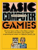

## Basic Computer Games

Original programs from the book "BASIC Computer Games"

This is an unofficial mirror of the source code provided inside the book
*"Basic Computer Games"*, aka *"101 BASIC Computer Games"*, by David H. Ahl, published in 1978.

Origin: http://vintage-basic.net/games.html

*As with many people of my generation who became interested in computers in the late 1970s and early 1980s, one of the first computer books I bought was exactly this book ..*
