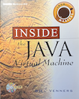

## Architectural Decision: Native vs Custom Classes

This is not a proper JVM. It probably could not even be called one,
but it does illustrate some decisions on architecture, which
is the real purpose. So we have to add some clarifications.


### Real JVMs vs This Implementation

*Real Production JVMs (HotSpot, OpenJDK):*
- Everything is bytecode initially
- Native methods are marked with `native` keyword in Java
- JNI (Java Native Interface) bridges to C/C++ code
- JIT compiler optimizes hot paths to machine code
- No "check if native first"--which we use here

*This is an Educational Implementation:*
- *Native = Python implementations* of Java stdlib
- *Custom = Bytecode* from your .class files
- *Explicit registry check* before execution
- Trade-off: Simplicity vs accuracy

### The Architectural Decision

```
┌----------------------------------------┐
│  When method is called (invokevirtual) │
└----------------------------------------┘
                  │
                  v
         ┌-----------------┐
         │ Is it in native │
         │ registry?       │
         └-----------------┘
                  │
         ┌-----------------┐
         │                 │
    YES  │                 │  NO
         v                 v
┌-------------┐    ┌------------------┐
│ Call Python │    │ Load bytecode    │
│ directly    │    │ Create sub-      │
│ (fast!)     │    │ interpreter      │
│             │    │ Execute bytecode │
└-------------┘    └------------------┘
```

### Why This Decision Makes Sense (here)

*Pros:*´
1. *Clarity* - You can SEE the difference: "This is Python, this is bytecode"
2. *Simplicity* - Don't need JNI, don't need to compile C code
3. *Extensibility* - Add new stdlib in minutes, not hours
4. *Performance* - Native calls are fast (no bytecode interpretation)
5. *Learning* - Shows the CONCEPT of native vs interpreted

*Cons:*
1. *Not accurate* - Real JVMs don't work this way
2. *Manual classification* - You decide what's native vs bytecode
3. *Mixing paradigms* - Python objects vs JavaObjects
4. *No JNI* - Can't use real native methods


### What Real JVMs Do

```java
// In Java source
public class System {
    public static native void arraycopy(...);  // <-- native keyword
    public static PrintStream out;
}
```

The `native` keyword tells the JVM:
"This method's implementation is in C/C++, not bytecode."

The JVM then:
1. Loads the method metadata from .class file
2. Sees it's marked `native`
3. Uses JNI to find the corresponding C function
4. Links it at runtime

*No registry needed* .. the bytecode itself contains the metadata!


### Alternative Architectures

*Option 1: The Current Approach (Registry-based)*
```python
if native_registry.has_native_method(...):
    call_python()
else:
    interpret_bytecode()
```
- Pro: Simple, explicit, educational
- Con: Not how real JVMs work

*Option 2: Metadata-based (More Accurate)*
```python
method_info = class_file.get_method(...)
if method_info.is_native():
    call_python()
else:
    interpret_bytecode()
```
- Pro: Closer to real JVMs
- Con: Need to mark methods as native in .class files or separately

*Option 3: Lazy Resolution (Most Accurate)*
```python
# Try to load bytecode
if class_file.has_bytecode_for(method):
    interpret_bytecode()
else:
    # Must be native or abstract
    call_python_or_fail()
```
- Pro: Most like real JVMs
- Con: More complex error handling

*What could benefit from change?*

If you want a more "JVM-like":
- Mark native methods explicitly in a config file
- Load that metadata instead of hardcoding
- Still call Python implementations


### Quick Start Guide

```
your-project/
├── jvm_interpreter/  # The JVM interpreter package
│   ├── api/
│   ├── constants/
│   ├── models/
│   ├── native/
│   ├── parser/
│   ├── runtime/
│   └── utils/
├── debug_test.py     # Test to understand System.out behaviour
├── main.py           # Entry point for running Java classes
├── quick_test.py     # Some internal check, no need for Java
├── verify_setup.py   # Some checks on installations
└── README.md         # This

```

Before diving into Java:

```bash
python verify_setup.py
```

### Running Your First Java Program

#### Step 1: Create a Java file

```java
// Hello.java
public class Hello {
    public static void main(String[] args) {
        System.out.println("Hello from JVM Interpreter!");
    }
}
```

#### Step 2: Compile it

```bash
javac Hello.java
```

This creates `Hello.class`


#### Step 3: Run it with the interpreter

```bash
python main.py Hello . -v
```

Arguments:
- `Hello` - class name (without .class)
- `.` - classpath (current directory)
- `-v` - verbose mode (optional)


### More Examples

#### Example 1: Using StringBuilder

```java
public class StringBuilderExample {
    public static void main(String[] args) {
        StringBuilder sb = new StringBuilder();
        sb.append("Hello ");
        sb.append("World");
        System.out.println(sb.toString());
    }
}
```

Run: `python main.py StringBuilderExample . -v`

#### Example 2: Custom Class

```java
public class Counter {
    private int count;
    
    public Counter() {
        this.count = 0;
    }
    
    public void increment() {
        this.count++;
    }
    
    public int getCount() {
        return this.count;
    }
    
    public static void main(String[] args) {
        Counter c = new Counter();
        c.increment();
        c.increment();
        c.increment();
        System.out.println(c.getCount());
    }
}
```

Compile: `javac Counter.java`
Run: `python main.py Counter . -v`


#### Example 3: Using Multiple Directories

If your classes are in different directories:

```bash
python main.py MyClass ./bin:./lib -v
```

Use `:` on Unix/Mac, `;` on Windows to separate paths.


### Adding Your Own Native Class

Let's say you want to add `java.util.Random`:

1. Open `jvm_interpreter/native/native_registry.py`

2. Add the class:

```python
class JavaUtilRandom(NativeObject):
    def __init__(self):
        super().__init__("java.util.Random")
        import random
        self.random = random
    
    def nextInt(self, bound=None):
        if bound:
            return self.random.randint(0, bound - 1)
        return self.random.randint(0, 2**31 - 1)
```

3. Register it in `_register_natives()`:

```python
self.register_constructor("java.util.Random", 
                         lambda: JavaUtilRandom())
self.register_method("java.util.Random", "nextInt",
                    lambda self, bound=None: self.nextInt(bound))
self.register_method("java.util.Random", "<init>",
                    lambda self: None)
```

4. Now use it in Java:

```java
import java.util.Random;

public class RandomExample {
    public static void main(String[] args) {
        Random r = new Random();
        System.out.println(r.nextInt(100));
    }
}
```


### Currently Supported Features

Supported Instructions:
- Load/store variables
- Arithmetic operations
- Control flow (if, goto)
- Method invocation (all types)
- Object creation
- Field access (instance and static)
- Return statements

Native Java Classes:
- `java.lang.Object`
- `java.lang.StringBuilder`
- `java.io.PrintStream`
- `java.lang.System`

Java Features:
- Classes and objects
- Instance and static methods
- Instance and static fields
- Constructors
- Basic control flow
- Arithmetic
- String operations (via StringBuilder)
- Console output (via System.out)


### Limitations

This is an educational interpreter with limitations:
- No arrays (yet)
- No exceptions
- No threads
- No garbage collection
- Limited stdlib (only basic classes)
- No reflection
- No generics
- No lambdas


### Troubleshooting

"Class X not found":
- Make sure the .class file exists in the classpath
- Check that you're using the class name without .class extension
- Verify the classpath is correct (use absolute paths if needed)


"Method Y not found":
- Make sure your Java class has a `main` method (or the method you're trying to run)
- Check that the method signature matches


Import errors:
- Make sure you're running from the directory containing `jvm_interpreter/`
- Verify Python 3.7+ is installed: `python --version`


### Reference

- Venners, B. (1998). Inside the Java Virtual Machine. McGraw-Hill.


