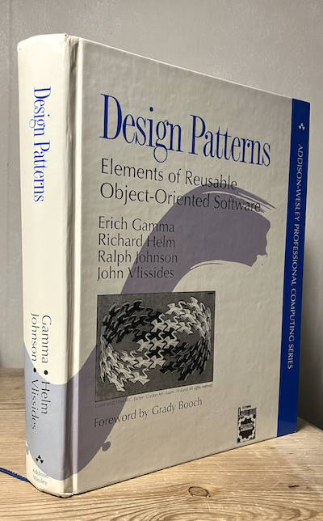

[JHotDraw5.1](./../../ch06/addition/documentation/JHotDraw5.1/)

*There was a moment, roughly the mid-to-late 1990s into the early 2000s, when software engineering
felt like it had finally discovered its "architecture." Its golden calf. Not just code that worked,
but code that *made sense*. That moment revolved around three ideas that became deeply intertwined:
object-oriented programming, Java, and design patterns.*

*Object-oriented programming (OO) didn’t begin there, of course. Its roots go back to languages like
Simula and later Smalltalk, where the idea was almost philosophical: model software as a collection
of interacting "objects," each with its own state and behaviour. But for years, this was more of an
academic curiosity than an industry standard.*

__Then the world changed.__

*As software systems grew, from small utilities into sprawling applications, developers began to struggle
with complexity. Codebases became tangled. Fixing one thing broke another. The promise of OO suddenly
felt practical: if you could model your system as cooperating objects, each responsible for its own
piece of the puzzle, maybe you could keep things understandable.*

__Enter Java.__

*When Java appeared in the mid-90s, it didn’t just bring a new syntax. It arrived with a message:
write once, run anywhere. It offered a cleaner, safer alternative to C++, enforced object-oriented
structure more strictly, and removed many of the sharp edges that had made large systems fragile.
For many developers, Java was their first real immersion into OO thinking--not as theory,
but as daily practice.*

*And importantly, Java hit at exactly the right time. The web was exploding. Enterprises were investing
heavily in software. Suddenly, there was a massive demand for building large, maintainable systems--and
Java became one of the primary tools for doing it.**

*But even with OO and Java, a question remained*: how do you design systems well?

__That’s where design patterns entered the story.__

*In 1994, four authors, often referred to as the "Gang of Four", published a book that would quietly
reshape how developers think: *Design Patterns: Elements of Reusable Object-Oriented Software*. What
they did was deceptively simple. They didn’t invent new features or languages. Instead, they named
recurring solutions.*

__They gave developers a vocabulary.__

*Instead of vaguely describing "some object that creates other objects in a flexible way," you could
say *Factory*. Instead of explaining a complex subscription mechanism, you could say *Observer*.
These patterns captured hard-won experience and made it transferable.*

__And in the Java world, they spread like wildfire.__

*By the early 2000s, design patterns were everywhere. Books, conference talks, job interviews. Entire
frameworks were built around them. Learning Java often meant learning patterns alongside it--sometimes
even overusing them, as if every problem deserved a named solution.*

*Looking back, that era had a certain optimism. There was a belief that with the right abstractions,
the right patterns, and disciplined object-oriented design, software complexity could be tamed.*

*Reality, of course, turned out to be messier. Some patterns became overapplied. New paradigms--functional
programming, simpler architectures—pushed back against the heaviness that OO systems could accumulate.*

__But that doesn’t diminish what that period achieved.__

* It gave developers a shared language for design.
* It made large-scale software development more systematic.
* And it shaped how we still think about structure, responsibility, and abstraction in code.

*Even today, when you see a well-factored class, a clean interface, or a familiar pattern quietly
doing its job, you’re seeing echoes of that moment--when software engineering first felt like it
was becoming a true craft.*


## 1. Historical Origins of Design Patterns

### Architecture -> Software

The concept of a *pattern* did *not originate in software engineering*.

It comes from the architect *Christopher Alexander*, who wrote *A Pattern Language* in 1977. His idea:

> recurring problems in architecture can be solved with recurring design solutions.

A "pattern" was therefore:

```
problem -> context -> solution
```

Software researchers realized that *software design had similar recurring problems*.

Typical examples:

* object creation
* decoupling components
* structuring communication
* representing hierarchies

By the late 1980s, object-oriented programming (OOP) was spreading, but developers repeatedly encountered the same structural problems.

Patterns started appearing informally in research groups.


## 2. The Gang of Four

The famous book was written by:

* Erich Gamma
* Richard Helm
* Ralph Johnson
* John Vlissides

They became known as the *Gang of Four (GoF)*.

Their book:

```
Design Patterns: Elements of Reusable Object-Oriented Software
```

published in *1994*. ([Wikipedia][1])

The book catalogued *23 design patterns* for object-oriented systems. ([Software Patterns Lexicon][2])


## 3. Why the Book Was a Breakthrough

The importance of the book was *not that it invented patterns*.

Instead, it did three crucial things.

#### 1. Cataloguing

It collected common design solutions into a *structured catalog*.

Before the book:

```
knowledge was tacit and scattered
```

After the book:

```
knowledge became explicit and reusable
```


#### 2. Vocabulary

One of the most profound effects:

It gave programmers a *shared language*.

Example conversation:

Before:

```
We need some object that notifies many observers when state changes.
```

After:

```
Use an Observer pattern.
```

A single word represented an entire design structure.


#### 3. Design over coding

The book emphasized:

```
software architecture matters more than syntax
```

It encouraged thinking about:

* object relationships
* extensibility
* reuse
* decoupling

This helped push *software engineering toward architectural thinking*. ([Software Patterns Lexicon][2])


## 4. Structure of the Book

The book is organized into:

```
Part I   Principles of object-oriented design
Part II  Pattern catalog (23 patterns)
```

The examples were mainly written in:

```
C++
Smalltalk
```

These were dominant OO languages at the time.


## 5. The 23 GoF Design Patterns

They are grouped into *three categories*.


## 5.1 Creational Patterns

Concerned with *object creation*.

They hide or abstract the creation process.

#### Patterns

```
Abstract Factory
Builder
Factory Method
Prototype
Singleton
```

#### Example: Factory Method

Problem:

```
Create objects without specifying exact class.
```

Solution:

```
Subclass decides what object is created.
```

([Wikipedia][3])


## 5.2 Structural Patterns

Concerned with *how classes and objects are composed*.

#### Patterns

```
Adapter
Bridge
Composite
Decorator
Facade
Flyweight
Proxy
```

Example:

```
Decorator -> add behavior without modifying class
```


## 5.3 Behavioral Patterns

Concerned with *object communication and responsibilities*.

#### Patterns

```
Chain of Responsibility
Command
Interpreter
Iterator
Mediator
Memento
Observer
State
Strategy
Template Method
Visitor
```

Example:

```
Observer
  subject -> notifies observers when state changes
```

Widely used in UI frameworks.


## 6. Design Philosophy of the GoF

The book promoted several important principles.

#### Program to interfaces

```
depend on abstractions
not concrete classes
```

#### Favor composition over inheritance

Instead of:

```
class A extends B
```

prefer:

```
A has a B
```

#### Encapsulate variation

Hide parts likely to change.


## 7. Immediate Impact (1990s)

The impact was massive.

The book:

* sold over 100,000 copies
* quickly became a classic
* helped bring patterns into mainstream programming. ([Wikipedia][4])

At the same time, the software industry was transitioning to:

```
object-oriented programming
```

Languages rising during this period:

* Java
* C++
* Smalltalk
* Objective-C

The GoF patterns became *standard teaching material*.


## 8. Institutional Influence

The book led to an entire ecosystem:

#### Pattern conferences

PLoP:

```
Pattern Languages of Programs
```

Researchers and practitioners shared new patterns.


#### Pattern literature

Hundreds of books followed:

Examples:

```
Enterprise patterns
Concurrency patterns
Distributed systems patterns
Agile patterns
Microservice patterns
```


#### Framework design

Many frameworks embed GoF patterns.

Examples:

```
MVC frameworks
GUI toolkits
dependency injection frameworks
```


## 9. Influence on Programming Languages

One of the most interesting consequences:

*many design patterns later became language features.*

Examples:

| Pattern   | Modern language feature  |
|  |  |
| Iterator  | foreach loops            |
| Strategy  | higher-order functions   |
| Singleton | modules / static objects |
| Visitor   | pattern matching         |
| Builder   | named parameters         |

So patterns often reveal:

```
missing language features
```

When languages evolve, some patterns disappear.


## 10. Criticisms

Despite its importance, the GoF book also received criticism.


### 10.1 Pattern obsession

Some developers began writing code like:

```
pattern-first programming
```

Meaning:

```
"I must use a pattern"
```

Instead of:

```
"I must solve the problem simply"
```

This produced *over-engineered systems*.


### 10.2 OOP bias

The book assumes:

```
class-based object-oriented programming
```

Functional languages often don't need many patterns.

Example:

```
Visitor pattern
```

In functional languages:

```
algebraic data types + pattern matching
```

replace it naturally.


### 10.3 Language limitations

Many patterns exist only because languages lacked features.

Example:

```
Singleton
```

In modern languages:

```
module or static object
```

makes it unnecessary.


## 11. Influence on Software Engineering Thinking

Despite criticisms, the intellectual influence is enormous.

The book helped establish several ideas.


#### Software architecture as a discipline

Before:

```
coding dominated thinking
```

After:

```
architecture became a first-class concept
```


#### Knowledge sharing

Patterns capture *expert knowledge*.

Instead of reinventing solutions.


#### Design vocabulary

Today terms like:

```
Observer
Factory
Strategy
Decorator
```

are universal.


## 12. Evolution After GoF

After 1994 the pattern idea expanded.

Important domains include:

#### Enterprise architecture

Martin Fowler:

```
Patterns of Enterprise Application Architecture
```

Examples:

```
Repository
Unit of Work
Data Mapper
```


#### Distributed systems

Examples:

```
Circuit Breaker
Saga
Event Sourcing
CQRS
```


#### Microservices

Modern architecture patterns for cloud systems.


## 13. Where GoF Stands Today

The GoF book is now *historically foundational but not always practical*.

Think of it like:

```
Euclid's Elements for software architecture
```

Important for understanding concepts.

But not necessarily used literally every day.


### What remains essential

The *principles* remain crucial:

```
decoupling
abstraction
composition
extensibility
```

These ideas underpin modern architecture.


### What changed

Modern languages reduce the need for explicit patterns.

Examples:

```
Scala
Rust
Haskell
Kotlin
Swift
```

They integrate many concepts directly.


## 14. The Deepest Insight of the Book

The most important idea is actually philosophical:

```
design knowledge can be reusable
```

Not just code.

Patterns encode:

```
experience
```

from thousands of systems.


## 15. The Legacy

Today the GoF book is considered one of the *most influential software engineering books ever written*.

Its legacy includes:

```
pattern-based thinking
software architecture culture
shared design vocabulary
framework architecture
```

Even if specific patterns are sometimes obsolete, the *conceptual shift remains permanent*.


That comparison is quite revealing about the evolution of programming.

[1]: https://en.wikipedia.org/wiki/Design_Patterns?utm_source=chatgpt.com "Design Patterns"
[2]: https://softwarepatternslexicon.com/python/introduction-to-design-patterns-in-python/history-and-evolution-of-design-patterns/?utm_source=chatgpt.com "History and Evolution of Design Patterns | Introduction to Design Patterns in Python | Python | Software Patterns Lexicon"
[3]: https://en.wikipedia.org/wiki/Factory_method_pattern?utm_source=chatgpt.com "Factory method pattern"
[4]: https://en.wikipedia.org/wiki/Dr._Dobb%27s_Excellence_in_Programming_Award?utm_source=chatgpt.com "Dr. Dobb's Excellence in Programming Award"

