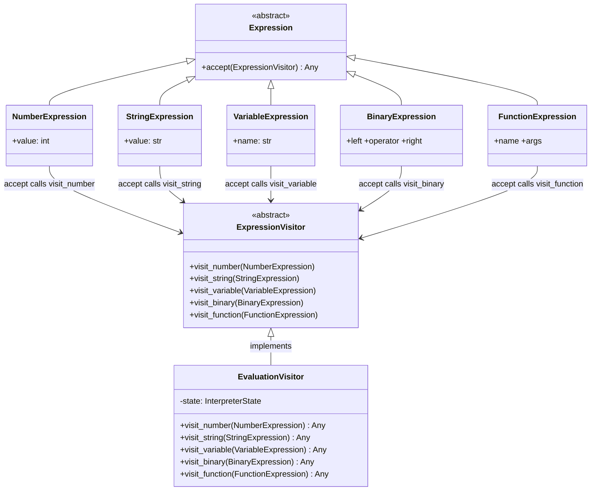
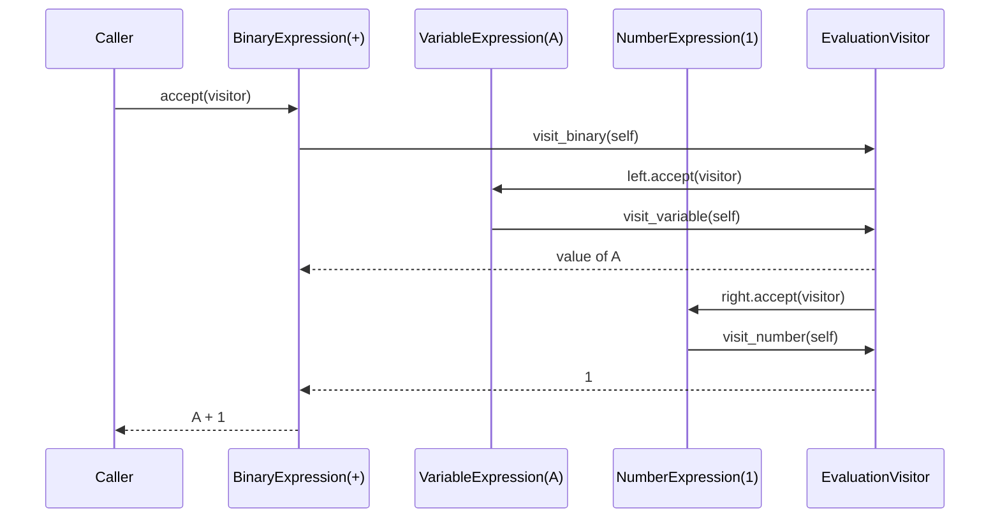

## BASIC Interpreter — Visitor Pattern Illustration

A small but complete BASIC interpreter implemented in both *Python* (`basic.py`)
and *C* (`basic.c`). The project exists primarily as a worked example of the
*Visitor Pattern* applied to a real AST evaluator, rather than a toy shape
hierarchy.


### Visitor Pattern — Core Concepts

The Visitor Pattern is a behavioral design pattern that lets you add new
operations to an existing object structure without modifying the structure itself.
This codebase demonstrates three of its defining characteristics:

*Separation of Concerns* — the AST node classes (`NumberExpression`,
`BinaryExpression`, etc.) contain no evaluation logic. All computation lives in
visitor classes that are layered on top.

*Double Dispatch* — when a node's `accept(visitor)` method is called, it
immediately calls back `visitor.visit_<node_type>(self)`. This second virtual
call selects the correct operation for the specific combination of node type and
visitor type, which is the heart of the pattern.

*Extensibility* — a new operation (e.g. a pretty-printer, a type-checker, or
an optimiser) is added by writing a new visitor subclass. The node classes are
never touched.


### Architecture

#### Class Diagram



#### Sequence Diagram — evaluating `A + 1`




### Python code excerpt — the visitor interface and its evaluation implementation

```python
class ExpressionVisitor(ABC):
    @abstractmethod
    def visit_number(self, expr: NumberExpression) -> Any: ...
    @abstractmethod
    def visit_string(self, expr: StringExpression) -> Any: ...
    @abstractmethod
    def visit_variable(self, expr: VariableExpression) -> Any: ...
    @abstractmethod
    def visit_binary(self, expr: BinaryExpression) -> Any: ...
    @abstractmethod
    def visit_function(self, expr: FunctionExpression) -> Any: ...


class EvaluationVisitor(ExpressionVisitor):
    def visit_binary(self, expr: BinaryExpression) -> Any:
        left  = expr.left.accept(self)
        right = expr.right.accept(self)
        op    = expr.operator
        try:
            if op == "/":
                if right == 0:
                    raise ExecutionError("Division by zero")
                return left / right
            ## … other operators …
        except TypeError as exc:
            raise ExecutionError(
                f"Type error for '{op}' on "
                f"{type(left).__name__} and {type(right).__name__}"
            ) from exc
```

#### Running

```sh
## Interactive REPL
python3 basic.py

## Load and run a program file
python3 basic.py program.bas
```


### C Implementation (`basic.c`)

The C port maps the Python class hierarchy onto C structs and function pointers.
There are no C++ virtual tables — the Visitor Pattern is assembled manually,
which makes the double-dispatch mechanism visible and explicit.

#### How the Visitor Pattern is expressed in C

*Element interface* — every `Expr` node contains an `accept` function pointer
as its second field. Calling `expr->accept(expr, visitor)` is the first dispatch.

```c
typedef struct Expr {
    ExprKind kind;
    AcceptFn accept;   /* double-dispatch entry point */
    union { … };       /* node-specific data */
} Expr;
```

*Visitor interface* — the visitor is a struct of five function pointers, one
per node kind. This mirrors the abstract `ExpressionVisitor` in Python.

```c
typedef struct ExprVisitor {
    Value (*visit_number)  (struct ExprVisitor *self, Expr *e);
    Value (*visit_string)  (struct ExprVisitor *self, Expr *e);
    Value (*visit_variable)(struct ExprVisitor *self, Expr *e);
    Value (*visit_binary)  (struct ExprVisitor *self, Expr *e);
    Value (*visit_function)(struct ExprVisitor *self, Expr *e);
} ExprVisitor;
```

*Accept functions* — each node kind has a thin static function that performs
the second dispatch into the visitor.

```c
static Value accept_binary(Expr *e, ExprVisitor *v) {
    return v->visit_binary(v, e);   /* second dispatch */
}
```

*Concrete visitor* — `g_eval_visitor` is a statically initialised instance of
`ExprVisitor` with all five slots populated. New visitors (e.g. a
pretty-printer) can be added without touching `Expr` at all.

```c
static ExprVisitor g_eval_visitor = {
    .visit_number   = eval_visit_number,
    .visit_string   = eval_visit_string,
    .visit_variable = eval_visit_variable,
    .visit_binary   = eval_visit_binary,
    .visit_function = eval_visit_function,
};
```

*Double dispatch in full* — a call to `evaluate(e)` triggers the following chain:

```
evaluate(e)
  -> e->accept(e, &g_eval_visitor)         // first dispatch on node type
    -> g_eval_visitor.visit_binary(v, e)   // second dispatch on visitor type
      -> recurse on left and right children
```

#### Error handling

Python raises exceptions; C uses `setjmp`/`longjmp`. A `raise_error()` helper
sets a global error kind and message then calls `longjmp`. The run loop wraps
each line in `setjmp` and prints a located diagnostic on any jump, mirroring the
Python `try/except` structure at the engine level.

#### Memory management

Expressions are allocated from a fixed-size bump arena (`g_arena`). The arena is
reset before each expression is parsed, so there are no heap allocations and no
memory leaks. All other program state (lines, variables, call stack, loops) lives
in a single global struct `G` that is cleared by `state_reset()`.

#### Build and run

```sh
## Build
cc -std=c11 -Wall -Wextra -o basic basic.c -lm

## Interactive REPL
./basic

## Load and run a program file
./basic program.bas
```

#### Example session

```
> 10 LET X = 5
> 20 FOR I = 1 TO X
> 30 PRINT "Line "; I
> 40 NEXT I
> 50 END
> RUN
Line 1
Line 2
Line 3
Line 4
Line 5
Program stopped.
```


### Supported BASIC Commands

| Command   | Syntax                          | Notes                                   |
|-----------|---------------------------------|-----------------------------------------|
| `PRINT`   | `PRINT expr ; expr …`           | Semicolons separate values              |
| `INPUT`   | `INPUT [prompt ;] var`          | String vars end with `$`                |
| `LET`     | `LET var = expr` or `var = expr`| Implicit LET accepted                   |
| `IF`      | `IF cond THEN stmt`             | Single-line only                        |
| `GOTO`    | `GOTO lineno`                   | Error if line does not exist            |
| `GOSUB`   | `GOSUB lineno`                  | Stack depth limit: 256                  |
| `RETURN`  | `RETURN`                        | Error if stack is empty                 |
| `FOR`     | `FOR var = start TO end`        | Loop depth limit: 64 (C) / 128 (Python) |
| `NEXT`    | `NEXT var`                      | Error if no matching FOR                |
| `LIST`    | `LIST`                          | Print stored program                    |
| `REN`     | `REN`                           | Renumber lines in steps of 10           |
| `RUN`     | `RUN`                           | Execute from first line                 |
| `STOP/END`| `STOP` or `END`                 | Halt execution                          |
| `BYE`     | `BYE`                           | Exit interpreter                        |

### Supported Built-in Functions

| Function     | Description                                              |
|--------------|----------------------------------------------------------|
| `LEFT$(s,n)` | First *n* characters of *s*                              |
| `RIGHT$(s,n)`| Last *n* characters of *s*                               |
| `MID$(s,i,n)`| *n* characters of *s* starting at position *i* (1-based) |
| `LEN$(s)`    | Length of *s*                                            |
| `STR$(x)`    | Convert number *x* to string                             |


### Adding a New Visitor (Python example)

The node classes never change. To add a new operation — say, an AST pretty-printer:

```python
class PrettyPrintVisitor(ExpressionVisitor):
    def visit_number(self, expr: NumberExpression) -> str:
        return str(expr.value)

    def visit_string(self, expr: StringExpression) -> str:
        return f'"{expr.value}"'

    def visit_variable(self, expr: VariableExpression) -> str:
        return expr.name

    def visit_binary(self, expr: BinaryExpression) -> str:
        left  = expr.left.accept(self)
        right = expr.right.accept(self)
        return f"({left} {expr.operator} {right})"

    def visit_function(self, expr: FunctionExpression) -> str:
        args = ", ".join(a.accept(self) for a in expr.args)
        return f"{expr.name}$({args})"
```

Usage:

```python
tree = ExpressionParser("A + LEFT$(X$, 3)").parse()
print(tree.accept(PrettyPrintVisitor()))
## → (A + LEFT$(X$, 3))
```

The equivalent in C is equally mechanical: define five new functions, fill a new
`ExprVisitor` struct, and pass it to `evaluate()`.


### Verdict

The C implementation demonstrates that the Visitor Pattern is ultimately a matter
of structure rather than language features. It can be reproduced faithfully using
disciplined composition of structs and function pointers, without relying on native
object-oriented support. At the same time, the manual assembly of double dispatch
makes its mechanics explicit and significantly more verbose than in languages
with built-in dynamic dispatch.

This example therefore illustrates both the portability and the cost of the pattern.
While it preserves architectural separation and extensibility, it also introduces
additional indirection and boilerplate that may be disproportionate for a small
interpreter. In C, the pattern is defensible when the set of node types is stable
and new operations are expected to grow; otherwise, a simpler direct-evaluation
design may be more appropriate.

