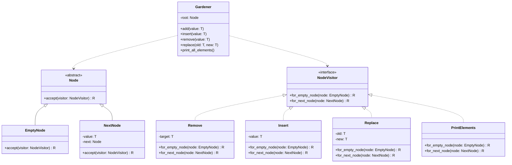

## The Visitor Pattern

The Visitor pattern is a behavioral design pattern that allows
you to define new operations on an object structure (like a
linked list or tree) without changing the classes of the elements
in that structure. It achieves this through *double dispatch*:
the object (node) accepts a visitor, and based on the node's
concrete type, it calls the appropriate method on the visitor,
which then performs the operation. This separates the data
structure (nodes) from the algorithms (operations like remove,
insert, etc.), making the code more extensible and adhering
to the Open-Closed Principle (classes are open for extension
but closed for modification).

Besides illustrating the Visitor pattern through examples in
several programming languages, extending its use to arbitrary
algorithms can miss the intended purpose and may appear somewhat
forced. How do you find the samples in this case? A bit stretched?
Design patterns should not be applied for their own sake;
they do not automatically improve software quality.
Rather, they provide structured solutions to recurring design
problems and should be used only when the situation genuinely
matches the pattern's intent. The Visitor pattern, in particular,
is useful when operations on a stable object structure need to
evolve independently from the objects themselves. In such cases
it allows new behaviour to be introduced without modifying the
underlying classes. However, if the object structure itself
changes frequently, the pattern can introduce unnecessary
complexity and maintenance overhead. Its value therefore lies
not in demonstration alone, but in its careful and justified
application.


#### Elements

- *Node Hierarchy*: All Visitor-based implementations (e.g.,
  Python files like `main_gen_strict.py`, `main_gen.py`,
  `main.py`; Java files like `Main.java`, `MainGen.java`)
  define an abstract `Node` class/interface with concrete
  subclasses:
  - `EmptyNode`: Represents the end of the list (similar
    to a null terminator). It handles base cases for operations.
  - `NextNode`: Holds a value and a reference to the next node,
    forming the recursive structure of the list.
  - The `accept` method is the entry point for visitors,
    dispatching based on the node type.

- *Visitor Interface*: Defined as `NodeVisitor` (with generics
  in typed versions). It declares methods for each node type
  (e.g., `for_empty_node`/`forEmptyNode`, `for_next_node`/`forNextNode`).
  This allows operations to handle different node types polymorphically.

- *Concrete Visitors for Operations*:

  - *Remove*: Recursively traverses the list, skipping nodes
    that match the target value. In `for_next_node`, it checks
    if the current value matches and returns the next node's
    result if so; otherwise, it builds a new `NextNode`
    with the recursed tail.

  - *Insert*: Typically appends to the end by recursing to
    the `EmptyNode` (where it creates a new `NextNode`)
    and rebuilding the list on the way back.

  - *Replace*: Similar to Remove, but replaces matching values
    instead of skipping them, rebuilding the list with updated values.

  - *PrintElements*: A side-effect visitor that prints
    values during recursion, without returning a modified
    structure (often returns `None` or the node itself).

  - These visitors build *new lists* immutably during recursion,
    avoiding in-place mutations. This is functional-style and
    avoids side effects but can be less efficient (O(n)
    space/time for each operation).

- *Gardener Class*: Acts as a facade or manager for the list:
  - Holds the root node (starting as `EmptyNode`).
  - Provides methods like `add`, `insert`, `remove`, `replace`,
    which create visitors and apply them via `root.accept(visitor)`.
  - `add` often prepends directly (mutable), while `insert`
    appends via visitor (immutable recursion).
  - This hides the Visitor complexity from users, making the API simple.

- *Generic vs. Non-Generic Versions*:
  - Generic implementations (e.g., `main_gen_strict.py` with `TypeVar`,
    `MainGen.java` with `<T>`, `main_gen.cpp` with templates) use type
    parameters for flexibility (e.g., `Gardener<int>` or `Gardener<String>`).
  - Non-generic ones (e.g., `main.py`, `Main.java`) hardcode types
    like strings or objects, limiting reuse.
  - C/C++ versions like `main_void.c` (void pointers), `main_gen.cpp`
    (templates), and `main_macro.c` (macros via `DEFINE_LIST`) achieve
    generics differently: void* for type erasure, templates for
    compile-time safety, macros for code generation.

- *Comparison to Non-Visitor Implementations*:
  - Traditional implementations (e.g., `main_fun.cpp` for trees,
    `main_gen.cpp` for lists, `main_void.c`, `main_macro.c`, `main.c`)
    use direct methods on nodes or lists (e.g., `push_front`, `remove`
    as member functions). These mutate in-place, which is more
    efficient (O(1) for prepend, O(n) for append/remove) but
    couples operations to the structure.
  - Visitor versions decouple operations, allowing easy addition
    of new ones (e.g., add a `CountVisitor` without touching `Node`).
    However, they incur recursion overhead and immutable rebuilding,
    which could cause stack overflows for very long lists.
  - The tree in `main_fun.cpp` uses a similar recursive search/remove
    but isn't Visitor-based at all; it highlights how Visitor
    could be extended to trees (e.g., for DFS/BFS traversals).

- *Advantages in These Codes*:
  - *Extensibility*: Adding a new operation (e.g., `ReverseVisitor`)
    requires only a new visitor class, not modifying `Node`.
  - *Separation of Concerns*: Nodes focus on structure; visitors on
    behaviour. This is evident in how `PrintElements` handles
    printing without altering the list.
  - *Immutability*: Operations return new structures, enabling
    functional programming styles (safer in concurrent scenarios).
  - *Polymorphism*: Handles heterogeneous node types
    (Empty vs. Next) cleanly.

- *Disadvantages*:
  - *Performance*: Recursive rebuilding creates O(n) copies per
    operation, vs. O(1)/O(n) mutations in traditional lists.
  - *Complexity*: More boilerplate (abstract classes, interfaces).
    Traditional C/C++ versions are simpler and more efficient.
  - *Language Fit*: Works well in OO languages like Python/Java,
    but C macros (`generic_list.h`) provide a lightweight generic
    alternative without Visitor overhead.

- *Edge Cases Handled*:
  - Empty lists: `EmptyNode` provides base cases.
  - Non-existent values: Visitors like Remove/Replace traverse
    fully without changes.
  - Multiple matches: Remove skips all (in some impls; others
    remove first).
  - Printing: Handles empty lists by printing nothing.

- *Variations Across Languages*:
  - *Python*: Uses ABC for abstracts, TypeVar for generics.
    Dynamic typing simplifies but generics add safety.
  - *Java*: Strict interfaces and generics; overrides explicit.
  - *C/C++*: No built-in Visitor; `main_void.c` uses function
    pointers for similar flexibility (e.g., `CompareFn`, `PrintFn`).
    Macros in `main_macro.c` generate type-specific code,
    avoiding runtime dispatch.

### The Expression Problem

The Visitor pattern trades extensibility in one dimension for rigidity in
another. This tradeoff has a name: the *Expression Problem*.

|                      | Add a new *operation*       | Add a new *node type*       |
|----------------------|-----------------------------|-----------------------------|
| OOP (open subclass)  | Hard - touch all classes    | Easy - add one subclass     |
| Visitor              | Easy - add one visitor      | Hard - modify every visitor |
| `switch` on enum (C) | Hard - touch every function | Easy - add one `case`       |

When the `RemoveVisitor`, `InsertVisitor`, `ReplaceVisitor`, and
`PrintVisitor` are all written and the list is declared stable,
adding a new operation is trivial. But if a new node type must be added -
say, a `LazyNode` that defers evaluation - every existing visitor must
be extended. In Python this is caught at runtime when the abstract method
is not implemented. In Java the compiler flags it. In C there is no
check: the function pointer slot is simply missing from the struct
initializer, and the resulting `NULL` call is a crash.

```c
/* Adding UnaryNode to ExprKind requires:
   1. A new field in the Expr union
   2. A new accept_unary() function
   3. A new visit_unary slot in ExprVisitor
   4. An implementation in g_eval_visitor
   5. An implementation in every other visitor (printer, checker, ...)
   - and the compiler will not tell you which visitors you missed. */
```

The brittleness of Visitor is therefore not in the operations dimension
but in the data dimension. The pattern is a good fit when node types are
fixed and operations are expected to grow; it is the wrong tool when the
opposite is true.

In summary, the Visitor pattern here transforms a simple linked list
into a flexible, extensible system. It's overkill for basic lists but
shines when operations need to evolve independently. The provided
codes demonstrate a spectrum: pure Visitor for design purity, traditional
for practicality, and hybrids (e.g., function pointers) for low-level efficiency.





#### Node Hierarchy

- `Abstract Node` class that defines an interface
- `EmptyNode` represents the end of the list (null terminator)
- `NextNode` contains data and a reference to the next node


#### Visitor Pattern

- The `NodeVisitor` interface allows operations to be performed on nodes
- Each node type has an accept method that delegates to the appropriate visitor method
- Visitors provide different implementations for each node type


#### Operations as Visitors

- `Remove`: Removes specified elements from the list
- `Insert`: Adds elements to the end of the list
- `Replace`: Substitutes specified elements with others
- `PrintElements`: Displays all elements in the list


#### Gardener Class

- Manages the linked list and provides a high-level interface
- Implements TreeDuties interface for standard operations
- Maintains a reference to the head node
- Delegates operations to appropriate visitors


