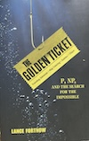

* Davis, M. (Ed.). (1965). *The undecidable: Basic papers on undecidable propositions, unsolvable problems and computable functions*. Raven Press. (*Papers by Gödel, Church, Turing, Rosser, Kleene, and Post: Including Gödel's On Formally Undecidable Propositions, Church's An Unsolvable Problem of Elementary Number Theory, and Turing's On Computable Numbers.*)

* Fortnow, L. (2013). *The golden ticket: P, NP, and the search for the impossible.* Princeton University Press.

