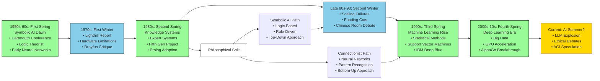

## The Seasons of AI: Winters of Disillusionment and Springs of Innovation

AI development has often been described in terms of "winters"--periods when the hype
and expectations around artificial intelligence failed to align with reality, leading
to disillusionment and reduced funding. Some now caution that we might be on the brink
of another such winter, where once again, the promises may outpace what can actually
be delivered.

| Period       | Event                                | Description                                                                           |
|--------------|--------------------------------------|---------------------------------------------------------------------------------------|
| 1950s-1960s  | Early AI & Symbolic AI               | Initial exploration of AI, including Turing Test.                                     |
| 1970s        | AI Winter (1st)                      | Reduced funding and interest in AI after overhyped expectations.                      |
| 1980s        | AI Spring (Expert Systems)           | Resurgence with expert systems and knowledge-based systems.                           |
| Late 1980s   | AI Winter (2nd)                      | Decline after expert systems' limited success.                                        |
| 1990s        | Revival (Machine Learning)           | Rise of statistical methods and machine learning.                                     |
| 2000s-2010s  | AI Spring (Deep Learning & Big Data) | Deep learning gains momentum with large datasets and computing power.                 |
| 2010s-Present| AI Boom                              | Widespread adoption of AI in various industries, including self-driving cars and NLP. |


### The Second Spring and Winter

The second international conference on logic programming was held in Uppsala in 1984.[^0]
It took place at a time when logic programming was viewed as a promising fusion between
the logic of philosophy and the programming of computer science. The conference received
widespread attention, including even from national media such as "Sveriges Television"
(Swedish Television). And I was there.  

At this time, Japan's ambitious "Fifth Generation Computer" project was underway. The
Japanese Ministry of International Trade and Industry (MITI) invested vast sums into
the development of knowledge systems, expert systems, and artificial intelligence, all
grounded in logic programming. The aim was to build computers capable of conversing,
reasoning, translating languages, and interpreting images. Japan's success in electronics
and the automotive industry had sparked concern in the U.S. that they might also take
the lead in computer development.  

AI researcher Edward A. Feigenbaum and journalist Pamela McCorduck warned in their book
*The Fifth Generation*[^1] that the U.S. needed to respond to the Japanese challenge:
*"In the end, we have no choice. We can decide when we shall participate, not if."*[^2]
Despite high expectations, the Japanese project became a costly failure, partly due
to the parallel development of cheaper hardware in line with Moore's law.[^3] [^4] [^5]
The U.S. equivalent, the "Strategic Computing Initiative" from DARPA, met a similar
fate and saw substantial funding cuts by the late 1980s.[^6]  

During the 1980s, there were two main directions within AI: the *classical*, symbol-based
AI and the emerging *connectionism*. Classical AI focused on building computers that
could represent and reason about their environment using formal logic rules, while
connectionism attempted to mimic the brain's neural networks:
"*Whereas classical AI sees intelligence primarily as symbolic thinking, the connectionists emphasize learning and adaptive behavior.*"

The period from 1987 to 1993 is referred to as "the second AI winter," when expectations
for AI technology collided with reality, resulting in a decline in interest and funding.
During this time, AI researchers became more receptive to philosophical critique.  

In *Scientific American* in 1990, two contrasting articles were published. Philosopher
John Searle argued, through his famous "Chinese Room" thought experiment, that computers
could never achieve true understanding but only execute operations according to rules.[^11][^12]
The couple Patricia and Paul Churchland, neurophilosophers, maintained that while
classical AI might not be able to produce conscious machines, systems that mimicked
the brain could.[^13] However, Searle also criticised connectionism for failing to
address his fundamental objection.[^14]  


### The First Spring and Winter

So let's go back in time to the first aspirations and failures. The first "AI winter"
occurred approximately between 1974 and 1980, following another period of exaggerated
expectations. AI had gained momentum when John McCarthy, Herbert A. Simon, Marvin Minsky,
Claude Shannon, and Nathan Rochester organised a conference in the summer of 1956,
where the term "artificial intelligence" was coined.[^19] The conference covered several
areas that would become central to AI, including neural networks:
*"How can a set of (hypothetical) neurons be arranged so as to form concepts."*[^20]  

Earlier that same year, 1956, Simon, along with Allen Newell, had developed the program
"Logic Theorist," which could prove theorems from Whitehead and Russell's
*Principia Mathematica*.[^22] They later created the "General Problem Solver" in
1959.[^23] These successes led to great expectations--Simon declared in 1957 that within
ten years, a computer would become world chess champion.[^15] In reality, it took forty
years before IBM's Deep Blue defeated Garry Kasparov in 1997.[^16]  

Sweden contributed early to the AI field. Stig Kanger wrote about mechanistic approach
in proof in his dissertation *Provability in Logic* in 1957.[^24] That same year,
Dag Prawitz worked on a method for automatic proofs, which he programmed with help
from his father, Håkan Prawitz, resulting in
*"the first experiments with general theorem provers for first-order logic were performed in Stockholm in 1958."*[^26]
Thus, and this is important, The General Problem Solver came later in 1959. This is
rarely noticed in general accounts of AI history.  

A significant advancement for the field was J.A. Robinson's "unification algorithm"
from 1965,[^28] which later became central to the development of the logic programming
language Prolog. Prolog and the functional programming language LISP became standard
tools within symbolic AI.  

Between the late 1950s and the mid-1970s, AI made major strides in areas such as
search, planning, pattern recognition, and learning.[^29] In parallel, an alternative
path developed with the perceptron, an early form of
neural network, which was, however, criticised by, among others, Marvin Minsky.  

The theoretical limitations of symbolic AI were well known among
researchers. Many, but not all, mathematical theories can be expressed in
first-order predicate logic and automated. A theory needs to be "decidable"
(*Entscheidung*)[^27] for an algorithm to be able to prove all its theorems,
which is not the case for, for instance, Peano arithmetic.  

Despite these limitations, researchers continued trying to formulate everyday knowledge
as logical propositions. The syllogism example with Socrates illustrates how symbolic
reasoning became dominant in AI for a long time:

```
1. human(Socrates)                      (Premise)
2. ∀x (human(x) → mortal(x))            (Premise)
3. human(Socrates) → mortal(Socrates)   (From 2, Universal Instantiation)
4. mortal(Socrates)                     (From 1 and 3, Modus Ponens)
```

Criticism of AI came from many directions. Philosopher Hubert Dreyfus argued against Simon's
assumptions that computers could think,[^30] and the influential Lighthill Report from 1973[^31]
led to reduced funding for AI research in the UK. The AI winter began to set in ..



[^0]: Proceedings content: https://dblp.org/db/conf/iclp/iclp84.html.
[^1]: From the back cover text of the paperback edition of Edward A. Feigenbaum, & Pamela McCorduck, *The fifth generation: artificial intelligence and Japan's computer challenge to the world*, Rev. & upd. ed., Pan Books, London, 1984.
[^2]: Ibid, s. 290.
[^3]: Wikipedia, "Fifth generation computer,", https://en.wikipedia.org/w/index.php?title=Fifth_generation_computer&oldid=891491126 (retrieved 2019-04-09).
[^4]: Wikipedia, "Moore's law", https://en.wikipedia.org/w/index.php?title=Moore%27s_law&oldid=891671193 (retrieved 2019-04-11)
[^5]: Wikipedia, "Lisp Machines", https://en.wikipedia.org/w/index.php?title=Lisp_Machines&oldid=871717316 (retrieved 2019-04-13)
[^6]: Wikipedia, "AI winter", https://en.wikipedia.org/w/index.php?title=AI_winter&oldid=891874138 (retrieved 2019-04-11)
[^8]: Robert Kowalski, Logic for problem solving, North-Holland, New York, 1979.
[^9]: Rudolf, Carnap, Meaning and necessity: a study in semantics and modal logic, 2. enl. ed., University of Chicago Press, Chicago, 1956.
[^10]: Föreläsningsanteckningar av Sten Lindström (Notes by Sten Lindström), Filosofi och artificiell intelligens, VI, Uppsala VT92, Uppsala 1992.
[^11]: Searle, John. (1980). "Minds, Brains, and Programs." The Behavioral and Brain Sciences, 3(3), 417–457.
[^12]: John R. Searle (1990), "Is the brain's mind a computer program?" Scientific American 262 (1):26-31.
[^13]: Patricia Smith Churchland & Paul Churchland, (1990). "Could a Machine Think?", Scientific American. 262 (1, January).
[^14]: Wikipedia, "Chinese room", https://en.wikipedia.org/w/index.php?title=Chinese_room&oldid=891604484 (retrieved 2019-04-11).
Internet Encyclopedia of Philosophy, "Chinese Room Argument", https://www.iep.utm.edu/chineser/ (retrieved 2019-04-11)
[^15]: Hubert L. Dreyfus, "Why Computers Must Have Bodies in Order to Be Intelligent", The Review of Metaphysics, Vol. 21, No. 1 (Sep., 1967), s. 13.
[^16]: Wikipedia, "Deep Blue versus Garry Kasparov", https://en.wikipedia.org/w/index.php?title=Deep_Blue_versus_Garry_Kasparov&oldid=890023632 (retrieved 2019-04-11).
[^17]: Wikipedia, "AlphaZero", https://en.wikipedia.org/w/index.php?title=AlphaZero&oldid=888383616 (retrieved 2019-04-11).
[^18]: Wikipedia, "Deep Blue (chess computer)", https://en.wikipedia.org/w/index.php?title=Deep_Blue_(chess_computer)&oldid=890155044 (retrieved 2019-04-11)
[^19]: Wikipedia, "Logic Theorist", https://en.wikipedia.org/w/index.php?title=Logic_Theorist&oldid=875003976 (retrieved 2019-04-11). Wikipedia, "Dartmouth workshop", https://en.wikipedia.org/w/index.php?title=Dartmouth_workshop&oldid=878151960 (retrieved 2019-04-11). John McCarthy, et. al. "A proposal for the Dartmouth summer research project on artificial intelligence", August 31 1955, http://www-formal.stanford.edu/jmc/history/dartmouth/dartmouth.html (retrieved 2019-04-11)
[^20]: John McCarthy, et. al. "A proposal for the Dartmouth summer research project on artificial intelligence", August 31 1955, http://www-formal.stanford.edu/jmc/history/dartmouth/dartmouth.html (retrieved 2019-04-11)
[^21]: Wikipedia, "Chinese room", https://en.wikipedia.org/w/index.php?title=Chinese_room&oldid=891604484 (retrieved 2019-04-11).
[^22]: Wikipedia, "Logic Theorist", https://en.wikipedia.org/w/index.php?title=Logic_Theorist&oldid=875003976 (retrieved 2019-04-11)
[^23]: Wikipedia, "General Problem Solver", https://en.wikipedia.org/w/index.php?title=General_Problem_Solver&oldid=856579631 (retrieved 2019-04-11)
[^24]: Stig Kanger, Provability in Logic, Vol. 1 of Studies in Philosophy, Almqvist & WIksell, Stockholm 1957.
[^25]: Degtyarev, Anatoli & Voronkov, Andrei. (2011). "Kanger's Choices in Automated Reasoning". 10.1007/978-94-010-0630-9_4. In Holmström-Hintikka, Ghita & Lindström, Sten & Sliwinski, Rysiek. (2001). Collected Papers of Stig Kanger with Essays on His Life and Work: Vol. II. 10.1007/978-94-010-0630-9. Sidan 53.
[^26]: Wolfgang Bibel, "Early History and Perspectives of Automated Deduction," in J. Hertzberg, M. Beetz, and R. Englert (eds.), Proceedings of the 30th Annual German Conference on Artificial Intelligence (KI-2007), Lecture Notes on Artificial Intelligence, s. 2--18, Berlin: Springer-Verlag, 2007. [Osnabrück, Germany, September 10-13, 2007, Proceedings. 10.1007/978-3-540-74565-5.] Sidan 4.
[^27]: Wikipedia "Entscheidungsproblem", https://en.wikipedia.org/w/index.php?title=Entscheidungsproblem&oldid=891473082 (retrieved 2019-04-13). Wikipedia "Peano axioms" https://en.wikipedia.org/w/index.php?title=Peano_axioms&oldid=889686557 (retrieved 2019-04-13). Wikipedia "Hilbert's program", https://en.wikipedia.org/w/index.php?title=Hilbert%27s_program&oldid=845845650. Wikipedia, "Gödel's incompleteness theorems", https://en.wikipedia.org/w/index.php?title=G%C3%B6del%27s_incompleteness_theorems&oldid=889223206 (retrieved 2019-04-13)
[^28]: J. A. Robinson, "A machine-oriented logic based on the resolution principle", Journal of the Association for Computing Machinery, vol. 12 (1965), s. 23--41.
[^29]: Marvin Minsky, "Steps toward Artificial Intelligence," i Proceedings of the IRE, vol. 49, no. 1, s. 8-30, Jan. 1961. doi: 10.1109/JRPROC.1961.287775.
[^30]: Hubert L. Dreyfus, "Why Computers Must Have Bodies in Order to Be Intelligent", The Review of Metaphysics, Vol. 21, No. 1 (Sep., 1967), s. 13-32
[^31]: Lighthill, "Artificial Intelligence: A General Survey", Artificial Intelligence: a paper symposium, Science Research Council 1973. http://www.chilton-computing.org.uk/inf/literature/reports/lighthill_report/p001.htm (retrieved 2019-04-13)


### Personal Remarks

This might seem a bit strange, but even though I only witnessed this history from the outside and
wasn't directly involved, I'd still like to allow myself one instance of speculation. Perhaps some
of what I suggest will hold true--perhaps not.

It is Monday morning, July 2, 1984, and the second international conference on logic programming is
about to begin in Uppsala. I walk up the stairs outside the building, step through the large door,
and am met by a sharp contrast to the blinding light outside. It is dark inside, but my eyes soon
adjust. Publishers have set up their small stands in the hall outside the grand auditorium. Some
participants are chatting with each other, others are browsing the new books on the tables. There
is also a registration desk. I walk up to the table and nervously pick up my name tag to pin to my
shirt. This is my very first conference, where I proudly receive a printed collection of lecture
abstracts directly in my hand. I am filled with extreme anticipation for the coming days. This is
exactly what I had wished for and waited for since arriving at the university!

When I began my studies at the university in the spring of 1982, I had an idea that philosophy could
somehow be combined with computer science and programming. Ignorant as I was, I had no idea how they
could be united. The conference, however, clearly declared in its title that logic--historically linked
to philosophy--and programming, tied to computing, were part of a fusion: logic + programming.

At the time, there was still a distinct sense of optimism. The second AI winter had not begun yet.
Quite the opposite--funding was flowing, expectations were high, and symbolic AI still held promise
in the minds of researchers and institutions. Logic programming, especially in the form of Prolog,
was championed as a key to intelligent systems. But the enthusiasm would soon falter. By the late 1980s,
it had become clear that the grand ambitions of expert systems, knowledge representation, and rule-based
reasoning couldn't scale. The brittleness of systems that couldn't learn, their dependence on handcrafted
rules, and the mismatch between logical elegance and messy real-world data all contributed to disappointment.
The promises of AI had once again outpaced the reality of what the machines could deliver--and the funding
dried up accordingly. Another AI winter had arrived, disillusionment following a period of inflated hope.

Perhaps my professor in theoretical philosophy, Stig Kanger, had already foreseen the problems, or perhaps
he simply wasn't interested? Kanger didn't want to call himself an analytic philosopher, but he was undoubtedly
a very accomplished logician. He was warm, kind, but a bit austere. As a matter of principle, all of his
work had been within the field of formal logic. He usually had a very clear sense of what he liked
and didn't like.

In 1984, I had only been a student for two years when I cautiously walked up the stairs to his office to
ask how I should approach my D thesis. I knocked, still convinced that there ought to be some connection
between the technical side of computing and philosophy, and I dared to suggest that I might read *Logic
for Problem Solving* by Robert Kowalski.[^8] In his textbook, Kowalski shows the connection between logic
and programming through things like a particular formulation of logical statements in Horn clauses,
inferences, matches between statements, or interpreting negation as failure of proof. Everything seemed
practically programmable in the language Prolog.

Kanger replied that he had never heard of the author and walked over to the bookshelf to quickly pull
out a book that I should read instead. He suggested Rudolf Carnap's *Meaning and Necessity*.[^9] Somewhat
disappointed, I nonetheless fully trusted Kanger's recommendations. In hindsight, I can add that he
was right. I read Carnap, who was a phenomenal thinker, but I couldn't say that I had anything to
contribute.

Later, however, I ended up writing about the medieval philosopher William of Ockham and assertions
(*assertio*), also at Kanger's suggestion. Apparently he seemed to like my ideas at the time.
Even though I received the prestigious offer to begin doctoral studies with Professor Jaakko Hintikka
at Stanford after Kanger seemed to appreciate my efforts, my interests had by then begun to lean
more toward history and the history of philosophy--partly as an effect of having read texts by Ockham.

As noticed above, Kanger was really into something that could be interpreted as a sort of computer
interest in the 50s, a logic system that had mechanical rules which could be programmed. Actually,
in the archive notes from 1948-1963, we can see that the "Matematikmaskinnämnden" or The Committee
for Mathematical Machines, as it could be translated (the group that controlled and built the first
computers in Sweden) had Stig Kanger's "Handbok i Logik, del I. Logisk konsekvens"
(Handbook in Logic, part I. Logic consequence) published in 1959.
From what can be seen they didn't have really anything else close to philosophy.[^32]

BARK (Binär Aritmetisk Relä-Kalkylator) was Sweden's first computer, completed in 28th of April
1950 under the Committee, MMN. It was an electromechanical machine, inspired by early American
designs like the Harvard Mark I. BARK was fully built with relays and was relatively slow but a
major step for Swedish computing. After the war and due to blockade of Berlin, to buy a computer
from U.S.A. wasn't possible. BESK (Binär Elektronisk Sekvens-Kalkylator) followed in 1955 and was
briefly one of the fastest computers in the world at the time. It was electronic (using vacuum tubes)
and heavily inspired by the IAS machine from the U.S. BESK marked Sweden's entrance into
high-performance computing and was used for e.g. weather prediction, nuclear research, and 
military applications such as decrypting telecommunications, at night.[^33]

So did Kanger see something that the AI researchers did not? He had actually been first with some
particular ideas on computers and logic. But the divide, which becomes quite clear when you try to
combine logic with computers further, as was the attempt with classic AI, did he already see that
at the height of Logic Programming? I never asked. So I never got an answer. He died in 1988.

[^32]: https://sok.riksarkivet.se/nad?Sokord=matematikmaskinn%c3%a4mnden&EndastDigitaliserat=false&BegransaPaTitelEllerNamn=false&AvanceradSok=False&typAvLista=Standard&page=1&postid=Arkis+4a6ef5cd-9b89-11d5-a701-0002440207bb&tab=post&prependUrl=%2fnad&vol=n%2cn%2cn%2cn&s=Balder (retrieved 2025-04-06).
In a review Lars Svenonius writes: "[...] The usual model-theoretic concepts are introduced,
and some main results are stated and explained, among them the Gödel and Henkin completeness
theorems. With use of the Gentzen-type axiomatizations, a mechanical procedure ("the dummy method")
is worked out for seeking a proof for an arbitrary given formula. This method is thought
to be more efficient than previously known methods." Lars Svenonius review on "Handbok i Logik" in
*The Journal of Symbolic Logic*, Vol. 25, No. 3 (Sep., 1960), p. 276.

[^33]: Wikipedia, "Swedish Board for Computing Machinery", https://en.wikipedia.org/wiki/Swedish_Board_for_Computing_Machinery (retrieved 2025-04-07)


#### The Renaissance of Modern AI

By the late 1980s and early 1990s, dissatisfaction with the limitations of the strictly logical, rule-based paradigm
of traditional AI—often referred to as "Good Old-Fashioned AI" ([GOFAI](../README.md))--led researchers to explore
alternative approaches. One such line of inquiry was [non-monotonic reasoning](./NONMONOTONIC.md), which attempted
to better model human-like commonsense inference by allowing conclusions to be withdrawn in light of new information,
a capability missing from classical logic.

In parallel, a revival of interest occurred in [connectionism](./LINDSTROM.md), particularly in neural networks, which
had largely been set aside after the limitations of single-layer perceptrons were highlighted in the late 1960s. Key
to this revival was the rediscovery and popularisation of *backpropagation* as a viable method for training multi-layer
neural networks. This work--especially the influential 1986 paper[^34] by Rumelhart, Hinton, and Williams--provided a new
foundation for learning distributed representations and re-established neural networks as a serious approach to AI.

This period marked the beginning of what would eventually grow into modern machine learning, with an emphasis on
data-driven models, statistical inference, and learning from experience, rather than relying solely on handcrafted
rules and logic.

The limitations of early neural networks starting from 1957, particularly exposed by the [XOR](./XOR.md) problem
in 1969, led to significant pushback in the 1970s. At the time, single-layer perceptrons were shown to be incapable
of solving even simple non-linearly separable problems, as highlighted in Minsky and Papert’s influential 1969 book
*Perceptrons*[^35]. This contributed to a period of disillusionment and reduced funding for connectionist approaches.

At the same time, the promises of symbolic AI—based on formal logic, rule-based systems, and structured
representations--were also overstated. While early systems showed impressive results in narrow domains, they
struggled with scalability, brittleness, and an inability to handle ambiguity, learning, or perception in the
way humans do. These dual disappointments led researchers to question the dominant paradigms and seek new or
hybrid approaches to artificial intelligence.


[^34]: Rumelhart, D. E., Hinton, G. E., & Williams, R. J. (1986). *Learning representations by back-propagating errors.*
Nature, 323, 533–536. DOI: 10.1038/323533a0

[^35]: Minsky, M., & Papert, S. (1969). *Perceptrons: An introduction to computational geometry.* Cambridge, MA: MIT Press.

