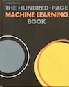

## Machine Learning

Machine learning is the practice of building systems that improve their performance on a task through
experience rather than through explicitly coded rules. A model is trained on data, adjusting its
internal parameters to minimise a loss function, and then applied to new data it has not seen before.
What makes the field coherent is not a single algorithm but a shared set of ideas: generalisation,
optimisation, representation, and the statistical relationship between training and deployment.

The folders here span the main families of algorithms and learning paradigms.

### Supervised Learning

Models trained on labelled data, where each example carries a ground-truth output.

| Folder | Algorithm |
|--------|-----------|
| [linear](./linear/) | Linear Regression -- fits a hyperplane to minimise squared error |
| [logistic](./logistic/) | Logistic Regression -- linear model for binary and multi-class classification |
| [dtree](./dtree/) | Decision Trees -- axis-aligned splits selected by Gini impurity or entropy |
| [forest](./forest/) | Random Forest -- ensemble of decorrelated trees via bootstrap sampling |
| [boost](./boost/) | Gradient Boosting -- sequential ensemble correcting residuals; includes XGBoost and LightGBM |
| [knn](./knn/) | K-Nearest Neighbours -- classify by majority vote among the $k$ closest training points |
| [svm](./svm/) | Support Vector Machine -- maximum-margin classifier; kernel trick for non-linear boundaries |
| [bayes](./bayes/) | Naive Bayes -- generative classifier assuming conditional feature independence |
| [mlp](./mlp/) | Multilayer Perceptron -- feedforward network; compared against linear regression on temperature data |

### Unsupervised Learning

Models that find structure in unlabelled data.

| Folder | Algorithm |
|--------|-----------|
| [kmeans](./kmeans/) | K-Means -- partition data into $K$ clusters by iterating assignment and centroid update |
| [apriori](./apriori/) | Association Rules -- Apriori and FP-Growth for frequent itemset mining |
| [dbscan](./dbscan/) | DBSCAN -- density-based clustering; discovers arbitrary shapes and labels noise explicitly |
| [pca](./pca/) | PCA -- linear dimensionality reduction by projecting onto maximum-variance directions |
| [tsne](./tsne/) | t-SNE -- non-linear embedding preserving local structure for 2D/3D visualisation |
| [umap](./umap/) | UMAP -- faster non-linear embedding with better global structure preservation than t-SNE |

### Sequence and Language Models

Models for ordered data: text, time series, and audio.

| Folder | Algorithm |
|--------|-----------|
| [lm](./lm/) | Feedforward Language Model -- $n$-gram context window, cross-entropy training, perplexity |
| [rnn](./rnn/) | Recurrent Neural Networks -- vanilla RNN, LSTM, and GRU for character-level generation |
| [transformer](./transformer/) | Transformer -- scaled dot-product attention, multi-head attention, positional encoding |
| [word](./word/) | Word Embeddings -- Skip-gram Word2Vec trained on Homer's *Iliad* |

### Deep Learning and Generative Models

| Folder | Algorithm |
|--------|-----------|
| [mnist](./mnist/) | Neural Network on MNIST -- feedforward network for handwritten digit classification |
| [cnn](./cnn/) | Convolutional Neural Network -- three-block CNN trained on CIFAR-10 with TensorFlow/Keras |
| [gan](./gan/) | Generative Adversarial Network -- minimax game between generator and discriminator |

### Reinforcement Learning

| Folder | Algorithm |
|--------|-----------|
| [rl](./rl/) | Q-Learning -- tabular value-based RL; agent learns from reward signals |
| [mdp](./mdp/) | MDP and POMDP -- Markov Decision Processes and partially observable extensions |
| [game](./game/) | Game Theory -- Nash equilibrium and Q-learning on the Battle of the Sexes |

### Robustness and Adaptation

| Folder | Algorithm |
|--------|-----------|
| [tta](./tta/) | Test-Time Adaptation -- entropy and consistency losses for handling distribution shift in language models |

### Concepts Across Algorithms

A few ideas recur in almost every folder and are worth holding in mind throughout:

* *Bias--variance trade-off:* Simple models underfit (high bias); complex models overfit (high variance).
  Regularisation, ensembling, and early stopping all navigate this trade-off.
* *The i.i.d. assumption:* Most training procedures assume training and test data are drawn from the same
  distribution. Real deployments frequently violate this -- see [tta](./tta/) and [mdp](./mdp/).
* *Gradient descent:* The optimiser behind nearly all parametric models. Variants (SGD, Adam, RMSprop,
  AdamW) differ in how they adapt the step size and use momentum.
* *Representation:* What the model sees matters as much as the model itself. Feature engineering
  (see [mlp](./mlp/)), embeddings (see [word](./word/)), and kernels (see [svm](./svm/)) all shape
  what patterns are learnable.
* *Evaluation:* Accuracy is rarely enough. Precision, recall, AUC, perplexity, WCSS, and calibration
  each measure a different aspect of model quality.

### Reference

* Burkov, A. (2019). *The hundred-page machine learning book*. Andriy Burkov.

